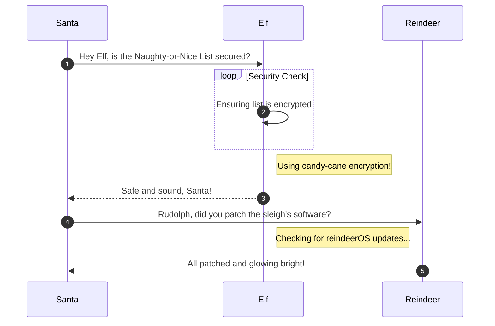

# Holiday Hack Orientation

**Difficulty**: :fontawesome-solid-snowflake:{ .red }:fontawesome-regular-snowflake::fontawesome-regular-snowflake::fontawesome-regular-snowflake::fontawesome-regular-snowflake:<br/>

## Objective

!!! question "Request"
    Meet Lynn Schifano on the train for a warm welcome and get ready for your journey around the Dosis Neighborhood.

??? quote "Lynn Schifano"
    Welcome to the 2025 SANS Holiday Hack Challenge! We're on a train heading… NOT to the North Pole, but instead to The Neighborhood. Your cybersecurity skills are needed there this year! I'm here to help orient you to this year's exciting challenge. I'm the Chief of Staff at Counter Hack, making sure the right people are doing the right thing at the right place at the right time -- Herding cats, in other words. I love sports, especially college basketball. My favorite teams are Monmouth University, Louisville, and Syracuse. I'm a Queens Girl living my best life at the beautiful Jersey Shore. I'm a proud Mom of three and Grandma of one (so far!! 🙏).<br/>
    You can use `<br/>` to ensure each sentence starts on a new line.

## Hints

??? tip "Insert Hint 1 Title"
    Along the way you will receive different hints. Insert them here.

??? tip "Insert Hint 2 Title"
    Along the way you will receive different hints. Insert them here.

## Solution

This section explains the different steps taken to solve the challenge. Try to find a good balance between providing sufficient detail and not overloading the reader with too much information. Use [admonitions](https://squidfunk.github.io/mkdocs-material/reference/admonitions/), [images](https://squidfunk.github.io/mkdocs-material/reference/images/), [diagrams](https://squidfunk.github.io/mkdocs-material/reference/diagrams/), [code blocks](https://squidfunk.github.io/mkdocs-material/reference/code-blocks/), and [tables](https://squidfunk.github.io/mkdocs-material/reference/data-tables/) to highlight and structure important information or provide additional clarification.

### Admonitions

!!! warning "Anchor the decorations"
    Ensure that all festive decorations, especially electrical ones, are securely anchored. We don’t want them floating off into the tropical sunset!

!!! info "Palm tree lighting tip"
    While on the island, make sure to hang your Christmas lights on a palm tree. It’s not only festive but also a great beacon for Santa to find you!

### Images


### Diagrams



### Code blocks

```bash linenums="1" hl_lines="7" title="Countdown script (with line 7 highlighted)"
#!/bin/bash
echo "Christmas Holiday Countdown"

days_until_xmas=$(($(date -d "Dec 25" +%j) - $(date +%j)))

if [ $days_until_xmas -ge 0 ]; then
  echo "Only $days_until_xmas days until Christmas!"
else
  echo "Christmas has passed! Hope you had a great time!"
fi
```

### Tables

| Activity             | Santa's Verdict       | Elf Comments                    |
| :------------------- | :-------------------- | :------------------------------ |
| Iceberg Surfing      | Risky Business        | "Lost three surfboards!"        |
| Polar Bear Hugs      | Approach with Caution | "Fluffy but... brisk."          |
| Snow Fort Building   | Highly Recommended    | "Elf-sized doorways only."      |
| Aurora Light Chasing | Magical Experience    | "Better than Christmas lights!" |
| Penguin Parade       | Absolute Must-See     | "They're oddly organized!"      |

!!! success "Answer"
    Insert the answer to the objective here.

## Response

!!! quote "Insert Character Name"
    Copy the final part of the conversation.
