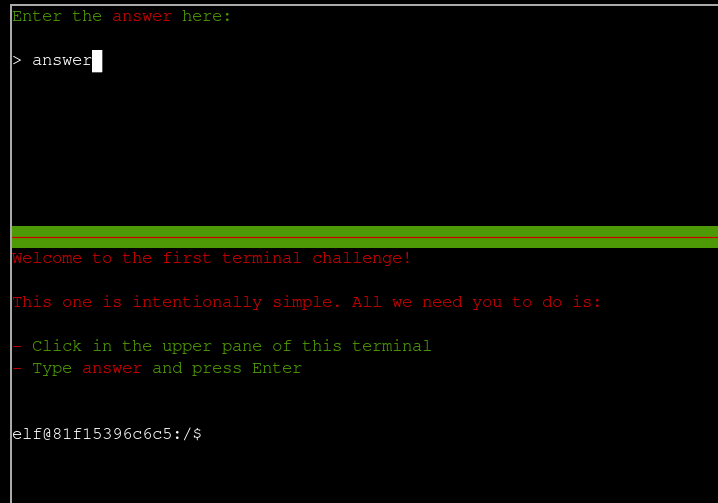

# Holiday Hack Orientation

**Difficulty**: :fontawesome-solid-snowflake:{ .red }:fontawesome-regular-snowflake::fontawesome-regular-snowflake::fontawesome-regular-snowflake::fontawesome-regular-snowflake: 

## Objective

!!! question "Request"
    Meet Lynn Schifano on the train for a warm welcome and get ready for your journey around the Dosis Neighborhood.

??? quote "Lynn Schifano"
    Welcome to the 2025 SANS Holiday Hack Challenge! We're on a train heading… NOT to the North Pole, but instead to The Neighborhood. Your cybersecurity skills are needed there this year! I'm here to help orient you to this year's exciting challenge. I'm the Chief of Staff at Counter Hack, making sure the right people are doing the right thing at the right place at the right time -- Herding cats, in other words. I love sports, especially college basketball. My favorite teams are Monmouth University, Louisville, and Syracuse. I'm a Queens Girl living my best life at the beautiful Jersey Shore. I'm a proud Mom of three and Grandma of one (so far!! 🙏). 

## Solution

We open in a train with Lynn Schifano and a terminal with the instructions to click the terminal and follow the instructions. The instructions are to type "answer" into the appropriate field. We then leave the train to enter the Dosis Neighborhood with a final navigation tip from Lynn. 

!!! success "Answer"
    Insert "answer" in the correct field.

## Response

!!! quote "Lynn Schifano"
    Great work! Please, hop off the train and explore the neighborhood. 
    We're so glad to have you here! 
     
    Oh, one more thing! You can press Q and E to rotate the map around. It gives you a nice semi-3D view of the area - really helps when you need to look around buildings and objects. Pretty neat, right? Give it a spin! 
