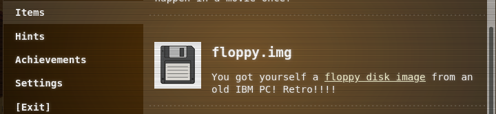
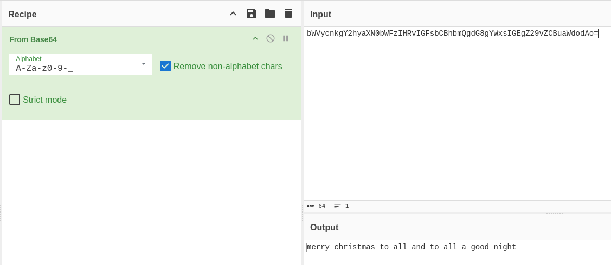

# Retro Recovery

**Difficulty**: :fontawesome-solid-snowflake:{ .red }:fontawesome-solid-snowflake:{ .red }:fontawesome-regular-snowflake::fontawesome-regular-snowflake::fontawesome-regular-snowflake:<br/>
**Direct link**: [Objective12.zip](../artifacts/objectives/o12/floppy.img)

## Objective

!!! question "Request"
    Join Mark in the retro shop. Analyze his disk image for a blast from the retro past and recover some classic treasures.

??? quote "Mark DiVito"
    While Kevin and I were cleaning up the Retro Store, we found this FAT12 floppy disk image, must have been under this arcade machine for years. These disks were the heart of machines like the Commodore 64. I am so glad you can still mount them on a modern PC.

    When I was a kid we shared warez by hiding things as deleted files.

    I remember writing programs in BASIC. So much fun! My favorite was Star Trek.

    The beauty of file systems is that 'deleted' doesn't always mean gone forever.

    Ready to dive into some digital archaeology and see what secrets this old disk is hiding?

    Go to Items in your badge, download the floppy disk image, and see what you can find!

## Hints

??? tip "Retro Recovery"
    I know there are still tools available that can help you find deleted files. Maybe that might help. Ya know, one of my favorite games was a Quick Basic game called Star Trek.

??? tip "Retro Recovery"
    I miss old school games. I wonder if there is anything on this disk? I remember, when kids would accidentlly delete things.......... it wasn't to hard to recover files. I wonder if you can still mount these disks?

??? tip "Retro Recovery"
    Wow! A disk from the 1980s! I remember delivering those computer disks to the good boys and girls. Games were their favorite, but they weren't like they are now. 

## Solution

If following the order that the challenges are listed, this challenge is the first of Act 2. This year, there was no delay between finishing an Act and moving on to the next one, which I appreciated as it meant I was able to spend more time on the harder challenges that it took me more time, or just naturally had more layers to it.<br/>
This challenge did not have a terminal; instead we are given the image of an old floppy disk. Our conversation with Mark gave us the goal; we want to find deleted files on this [FAT12 disk image](../artifacts/objectives/o12/floppy.img).



### Inspection

Start by mounting the image. If you are working with a Linux machine you will likely be familiar with this command. 

```bash title="Mount Image"
# Create a mount point for the floppy image
sudo mkdir -p /mnt/floppy 
# Mount the image as a loop and read-only image to the directory we just created
sudo mount -o loop,ro floppy.img /mnt/floppy/
```

With the floppy image mounted, we are now able to navigate the system with our command line. 


We can see a few executables, but that doesn't really help much. With nothing obvious to get, I pivoted to Sleuth Kit. 

### Forensics

Since this is not an entirely unknown disk, I did skip some steps that might be standard for forensics of an unknown, or potentially malicious, disk. Using `fls floppy.img` though, I found some interesting tidbits. 

```bash title="**fls**" hl_lines="1 3"
r/r * 6:        all_i-want_for_christmas.bas
d/d 8:  qb45
r/r * 10:       .all_i-want_f
v/v 45779:      $MBR
v/v 45780:      $FAT1
v/v 45781:      $FAT2
V/V 45782:      $OrphanFiles
```

I recognize `qb45` as the directory from mounting the image. The astrisk (*), however, represents a deleted file! One of these is likely what we are looking for, and since the one with the `.bas` extension is likely human readable, that's where I started.<bt/>

```bash title="Extract Deleted Files"
# use Sleuth Kit's icat to extract by inode despite being deleted
icat floppy.img 6 > all_i-want_for_christmas.bas
# read the extracted file
cat all_i-want_for_christmas.bas
```

The `.bas` [file](../artifacts/objectives/o12/all_i-want_for_christmas.bas) is a BASIC source code, seemingly for a StarTrek game! However, I noticed when reviewing the code that there was some encoded looking text that was tucked into the description kinda haphazardly.<br/>


As is my habit with CTFs, any time there is some potentially encoded string, plug it into CyberChef to find out what it is...

!!! success 
    

## Response

!!! quote "Mark DiVito"
    Excellent work! You've successfully recovered that deleted file and decoded the hidden message.

    Sometimes the old ways are the best ways. Vintage file systems never truly forget what they've seen. Play some Star Trek... it actually works.
