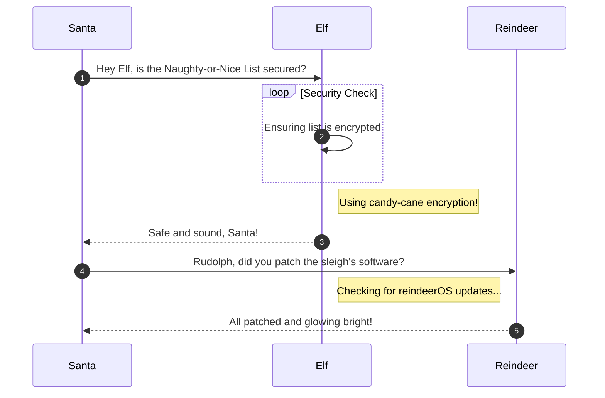

# Retro Recovery

**Difficulty**: :fontawesome-solid-snowflake:{ .red }:fontawesome-solid-snowflake:{ .red }:fontawesome-regular-snowflake::fontawesome-regular-snowflake::fontawesome-regular-snowflake:<br/>
**Direct link**: [Objective12.zip](../artifacts/objectives/o12/floppy.img)

## Objective

!!! question "Request"
    Join Mark in the retro shop. Analyze his disk image for a blast from the retro past and recover some classic treasures.

??? quote "Mark DiVito"
    While Kevin and I were cleaning up the Retro Store, we found this FAT12 floppy disk image, must have been under this arcade machine for years. These disks were the heart of machines like the Commodore 64. I am so glad you can still mount them on a modern PC.

    When I was a kid we shared warez by hiding things as deleted files.

    I remember writing programs in BASIC. So much fun! My favorite was Star Trek.

    The beauty of file systems is that 'deleted' doesn't always mean gone forever.

    Ready to dive into some digital archaeology and see what secrets this old disk is hiding?

    Go to Items in your badge, download the floppy disk image, and see what you can find!

## Hints

??? tip "Retro Recovery"
    I know there are still tools available that can help you find deleted files. Maybe that might help. Ya know, one of my favorite games was a Quick Basic game called Star Trek.

??? tip "Retro Recovery"
    I miss old school games. I wonder if there is anything on this disk? I remember, when kids would accidentlly delete things.......... it wasn't to hard to recover files. I wonder if you can still mount these disks?

??? tip "Retro Recovery"
    Wow! A disk from the 1980s! I remember delivering those computer disks to the good boys and girls. Games were their favorite, but they weren't like they are now. 

## Solution

This section explains the different steps taken to solve the challenge. Try to find a good balance between providing sufficient detail and not overloading the reader with too much information. Use [admonitions](https://squidfunk.github.io/mkdocs-material/reference/admonitions/), [images](https://squidfunk.github.io/mkdocs-material/reference/images/), [diagrams](https://squidfunk.github.io/mkdocs-material/reference/diagrams/), [code blocks](https://squidfunk.github.io/mkdocs-material/reference/code-blocks/), and [tables](https://squidfunk.github.io/mkdocs-material/reference/data-tables/) to highlight and structure important information or provide additional clarification.

### Admonitions

!!! warning "Anchor the decorations"
    Ensure that all festive decorations, especially electrical ones, are securely anchored. We don’t want them floating off into the tropical sunset!

!!! info "Palm tree lighting tip"
    While on the island, make sure to hang your Christmas lights on a palm tree. It’s not only festive but also a great beacon for Santa to find you!

### Images


### Diagrams



### Code blocks

```bash linenums="1" hl_lines="7" title="Countdown script (with line 7 highlighted)"
#!/bin/bash
echo "Christmas Holiday Countdown"

days_until_xmas=$(($(date -d "Dec 25" +%j) - $(date +%j)))

if [ $days_until_xmas -ge 0 ]; then
  echo "Only $days_until_xmas days until Christmas!"
else
  echo "Christmas has passed! Hope you had a great time!"
fi
```

### Tables

| Activity             | Santa's Verdict       | Elf Comments                    |
| :------------------- | :-------------------- | :------------------------------ |
| Iceberg Surfing      | Risky Business        | "Lost three surfboards!"        |
| Polar Bear Hugs      | Approach with Caution | "Fluffy but... brisk."          |
| Snow Fort Building   | Highly Recommended    | "Elf-sized doorways only."      |
| Aurora Light Chasing | Magical Experience    | "Better than Christmas lights!" |
| Penguin Parade       | Absolute Must-See     | "They're oddly organized!"      |

!!! success "Answer"
    Insert the answer to the objective here.

## Response

!!! quote "Mark DiVito"
    Excellent work! You've successfully recovered that deleted file and decoded the hidden message.

    Sometimes the old ways are the best ways. Vintage file systems never truly forget what they've seen. Play some Star Trek... it actually works.
