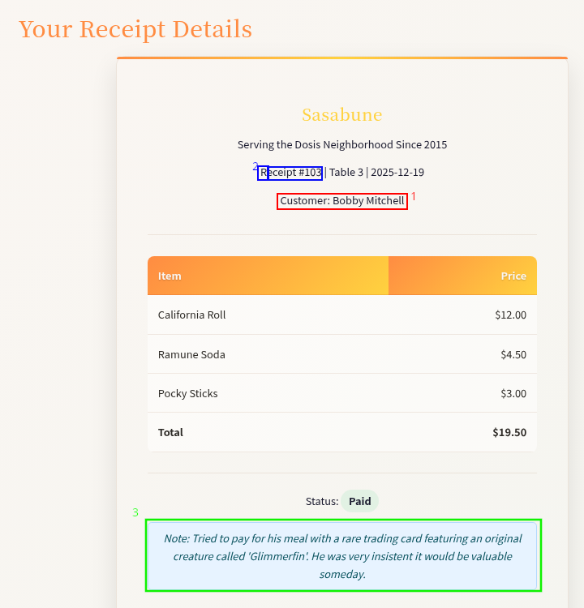

# IDORable Bistro

**Difficulty**: :fontawesome-solid-snowflake:{ .red }:fontawesome-solid-snowflake:{ .red }:fontawesome-regular-snowflake::fontawesome-regular-snowflake::fontawesome-regular-snowflake:<br/>
**Direct link**: [Receipt](https://www.holidayhackchallenge.com/2025/assets/receipt.png)

## Objective

!!! question "Request"
    Josh has a tasty IDOR treat for you—stop by Sasabune for a bite of vulnerability. What is the name of the gnome?

??? quote "Josh Wright"
    I need your help with something urgent.

    A gnome came through Sasabune today, poorly disguising itself as human - apparently asking for frozen sushi, which is almost as terrible as that fusion disaster I had to endure that one time.

    Based on my previous work finding IDOR bugs in restaurant payment systems, I suspect we can exploit a similar vulnerability here.

    I was [at a talk recently](https://www.youtube.com/watch?v=hzrhtHrhwno) and learned some interesting things about some of these payment systems. Let's use that receipt to dig deeper and unmask this gnome's true identity.

    Oh, you found that receipt? Perfect!

## Hints

??? tip "QR Codes"
    I have been seeing a lot of receipts lying around with some kind of QR code on them. I am pretty sure they are for Duke Dosis's Holiday Bistro. Interesting...see you if you can find one and see what they are all about...

??? tip "Will the Real ID Please..."
    Sometimes...developers put in a lot of effort to anonymyze information by using randomly generated identifiers...but...there are also times where the "real" ID is used in a separate Network request...

## Solution

### QR Decode

First thing we need to do is get the information from the QR code. Or get the receipt if you haven't already and then decode the QR information. I haven't done this before, but with a quick search I found this [website](https://zxing.org/w/decode.jspx) that I could use to decode QR codes by uploading an image or submitting a link. Using the [receipt link](https://www.holidayhackchallenge.com/2025/assets/receipt.png) the QR code is decoded successfully and we are given a link `hxxps[://]its-idorable[.]holidayhackchallenge[.]com/receipt/i9j0k1l2`<br/>

### IDOR

With the web address from the QR code we can hop into BurpSuite and check out what happens when we navigate to the site. 



There are a few things we can pickup on from the Sasabune site we land on. 

1. The receipt has the customer name. The name of gnome is our flag.
2. The receipt has a numerical appearing number associated with it. If the receipts are sequential, this may be our attack vector.
3. There are notes about the customer. We can confirm our flag with the staff note about 'frozen sushi'.

In BurpSuite, I sent the request to Repeater to verify my theory.


That confirms that the receipt number is the IDOR vulnerable attack vector! We are able to access another receipt by changing the receipt number. Now we just need to find the one we are looking for. There are methods for automating this, however I am not familiar with them. I made an educated guess that the number of valid receipts would not be excessive and manually started working from number 103 down to 100 which was the lowest number that did not return a receipt. Then I started working my way up from 103, changing the receipt number in Repeater, checking the receipt, and repeating until I found the correct gnome. 

!!! success "IDOR"
    ```title="Flag" hl_lines="11 16"
    HTTP/2 200 OK
    Content-Type: application/json
    X-Cloud-Trace-Context: 81304cbffdeedd7cb8f8595e7d5e9091
    Date: Mon, 29 Dec 2025 06:20:11 GMT
    Server: Google Frontend
    Content-Length: 438
    Via: 1.1 google
    Alt-Svc: h3=":443"; ma=2592000,h3-29=":443"; ma=2592000

    {
        "customer":"<REDACTED>",
        "date":"2025-12-20",
        "id":<REDACTED>,
        "items":[
            {
                "name":"Frozen Roll (waitress improvised: sorbet, a hint of dry ice)",
                "price":19.0
            }
        ],
        "note":"Insisted on increasingly bizarre rolls and demanded one be served frozen. The waitress invented a 'Frozen Roll' on the spot with sorbet and a puff of theatrical smoke. He nodded solemnly and asked if we could make these in bulk.",
        "paid":true,
        "table":14,
        "total":19.0
    }
    ```

## Response

!!! quote "Josh Wright"
    Excellent work exploiting that IDOR vulnerability - textbook execution.

    Now we know exactly which gnome tried to pass itself off as a sushi connoisseur. Frozen rolls... honestly, what's next?
