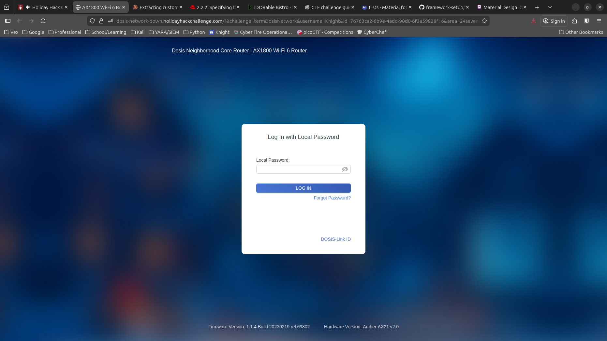
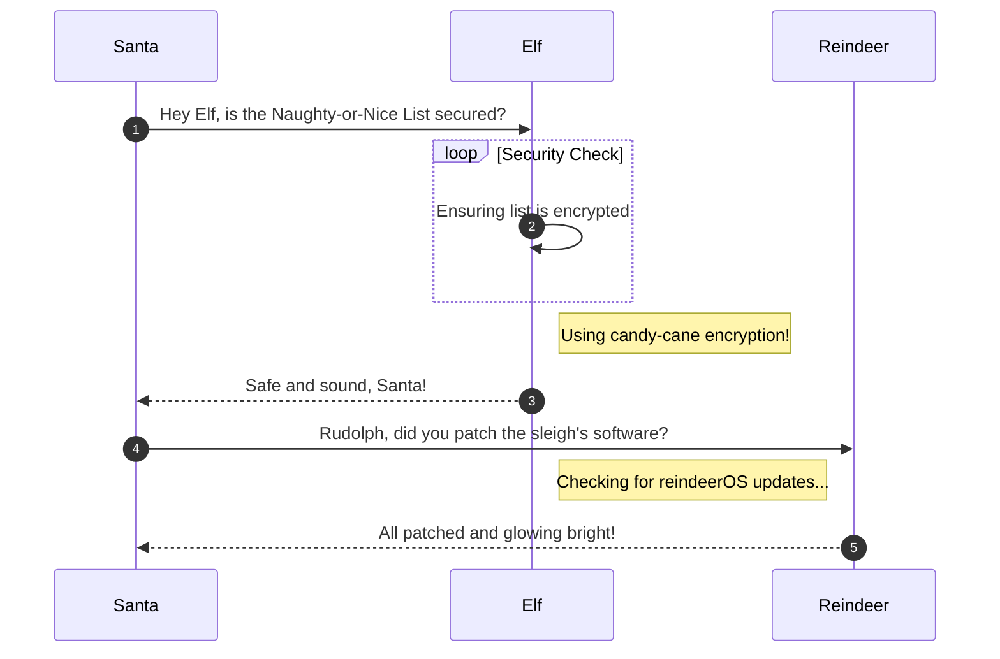

# Dosis Network Down

**Difficulty**: :fontawesome-solid-snowflake:{ .red }:fontawesome-solid-snowflake:{ .red }:fontawesome-regular-snowflake::fontawesome-regular-snowflake::fontawesome-regular-snowflake:<br/>
**Direct link**: [Objective 2 website](https://.../)

## Objective

!!! question "Request"
    Drop by JJ's 24-7 for a network rescue and help restore the holiday cheer. What is the WiFi password found in the router's config?

??? quote "Janusz Jasinski"
    Alright then. Those bloody gnomes 'ave proper messed about with the neighborhood's wifi - changed the admin password, probably mucked up all the settings, the lot.

    Now I can't get online and it's doing me 'ead in, innit?

    We own this router, so we're just takin' back what's ours, yeah?

    You reckon you can 'elp me 'ack past whatever chaos these little blighters left be'ind?

## Hints

??? tip "Version"
    I can't believe nobody created a backup account on our main router...the only thing I can think of is to check the version number of the router to see if there are any...ways around it...

??? tip "UCI"
    You know...if my memory serves me correctly...there was a lot of fuss going on about a UCI (I forgot the exact term...) for that router.

## Solution

This section explains the different steps taken to solve the challenge. Try to find a good balance between providing sufficient detail and not overloading the reader with too much information. Use [admonitions](https://squidfunk.github.io/mkdocs-material/reference/admonitions/), [images](https://squidfunk.github.io/mkdocs-material/reference/images/), [diagrams](https://squidfunk.github.io/mkdocs-material/reference/diagrams/), [code blocks](https://squidfunk.github.io/mkdocs-material/reference/code-blocks/), and [tables](https://squidfunk.github.io/mkdocs-material/reference/data-tables/) to highlight and structure important information or provide additional clarification.

### Admonitions

!!! warning "Anchor the decorations"
    Ensure that all festive decorations, especially electrical ones, are securely anchored. We don’t want them floating off into the tropical sunset!

!!! info "Palm tree lighting tip"
    While on the island, make sure to hang your Christmas lights on a palm tree. It’s not only festive but also a great beacon for Santa to find you!

### Images



### Diagrams



### Code blocks

```bash linenums="1" hl_lines="7" title="Countdown script (with line 7 highlighted)"
#!/bin/bash
echo "Christmas Holiday Countdown"

days_until_xmas=$(($(date -d "Dec 25" +%j) - $(date +%j)))

if [ $days_until_xmas -ge 0 ]; then
  echo "Only $days_until_xmas days until Christmas!"
else
  echo "Christmas has passed! Hope you had a great time!"
fi
```

### Tables

| Activity             | Santa's Verdict       | Elf Comments                    |
| :------------------- | :-------------------- | :------------------------------ |
| Iceberg Surfing      | Risky Business        | "Lost three surfboards!"        |
| Polar Bear Hugs      | Approach with Caution | "Fluffy but... brisk."          |
| Snow Fort Building   | Highly Recommended    | "Elf-sized doorways only."      |
| Aurora Light Chasing | Magical Experience    | "Better than Christmas lights!" |
| Penguin Parade       | Absolute Must-See     | "They're oddly organized!"      |

!!! success "Answer"
    Insert the answer to the objective here.

## Response

!!! quote "Janusz Jasinski"
    Brilliant work, mate! You've crushed every challenge like a proper metal anthem - Skeletor himself would be proud!
