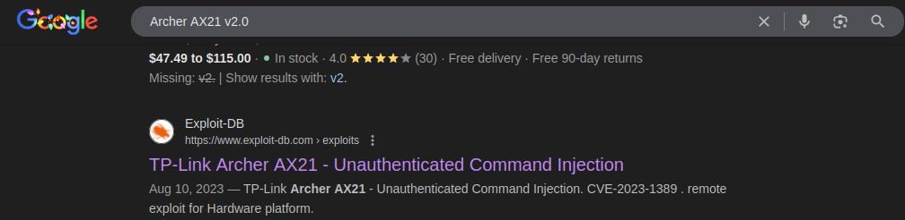
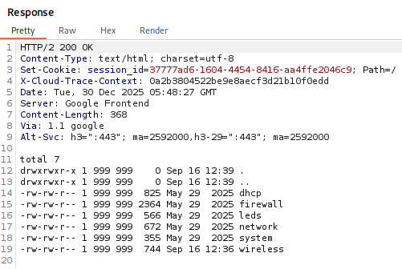
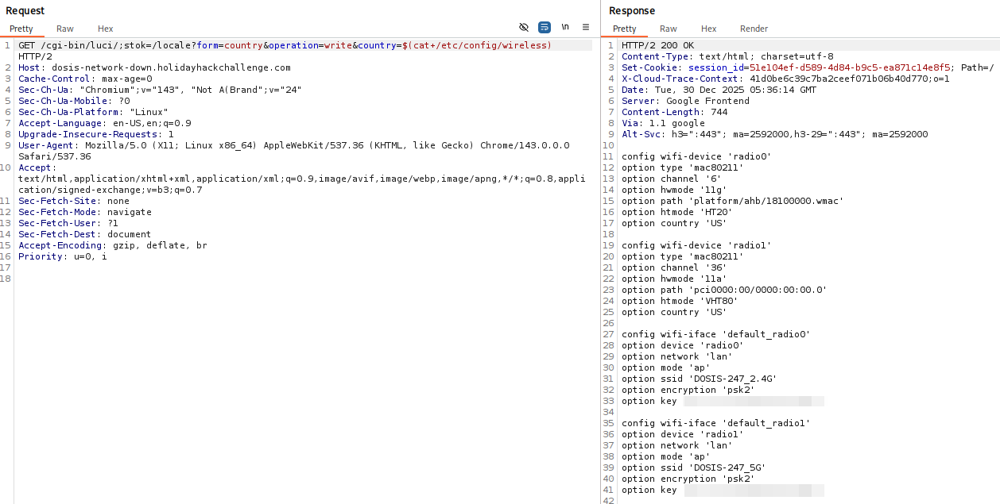
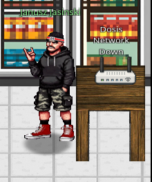

# Dosis Network Down

**Difficulty**: :fontawesome-solid-snowflake:{ .red }:fontawesome-solid-snowflake:{ .red }:fontawesome-regular-snowflake::fontawesome-regular-snowflake::fontawesome-regular-snowflake:<br/>
**Direct link**: [Dosis Network Router Login](https://dosis-network-down.holidayhackchallenge.com/)

## Objective

!!! question "Request"
    Drop by JJ's 24-7 for a network rescue and help restore the holiday cheer. What is the WiFi password found in the router's config?

??? quote "Janusz Jasinski"
    Alright then. Those bloody gnomes 'ave proper messed about with the neighborhood's wifi - changed the admin password, probably mucked up all the settings, the lot.

    Now I can't get online and it's doing me 'ead in, innit?

    We own this router, so we're just takin' back what's ours, yeah?

    You reckon you can 'elp me 'ack past whatever chaos these little blighters left be'ind?

## Hints

??? tip "Version"
    I can't believe nobody created a backup account on our main router...the only thing I can think of is to check the version number of the router to see if there are any...ways around it...

??? tip "UCI"
    You know...if my memory serves me correctly...there was a lot of fuss going on about a UCI (I forgot the exact term...) for that router.

## Solution


We start at a router log in page and I began some basic enumeration attempting a known bad password to check the response in BurpSuite, inspecting the page's index.html, and attempting the "Forgot Password?" and "DOSIS-Link ID". There was nothing happening in BurpSuite and the "links" were non-responsive but in the HTML, there were some clues left. 


I tried the first error prompt, which is below. The second is a prompt if working from the DevTools in the browser and using the console that would be returned. Either way, there is a hint pointing us to a debug endpoint and I tried a couple of enumeration tools to find it, namely Gobuster and FFuF.


```bash title="Enumeration - Gobuster"
gobuster dir -u https://dosis-network-down.holidayhackchallenge.com -w /usr/share/seclists/Discovery/Web-Content/common.txt -x html,php,js,png,jpg
===============================================================
Gobuster v3.8.2
by OJ Reeves (@TheColonial) & Christian Mehlmauer (@firefart)
===============================================================
[+] Url:                     https://dosis-network-down.holidayhackchallenge.com
[+] Method:                  GET
[+] Threads:                 10
[+] Wordlist:                /usr/share/seclists/Discovery/Web-Content/common.txt
[+] Negative Status codes:   404
[+] User Agent:              gobuster/3.8.2
[+] Extensions:              jpg,html,php,js,png
[+] Timeout:                 10s
===============================================================
Starting gobuster in directory enumeration mode
===============================================================
index.html           (Status: 200) [Size: 45816]
index.html           (Status: 200) [Size: 45816]
Progress: 28500 / 28500 (100.00%)
===============================================================
Finished
===============================================================
```

At this point I hit a dead end; I'm not sure the best way to find the obvious debug panel and went back to the in-game [hint](#hints) *Version*. The hint points to checking the version number of the router. Checking out the router's login page, we can see a Firmware Version and Hardware Version at the bottom of the page.


I took this to [Exploit DB](https://www.exploit-db.com/) and plugged in a few different search filters, but didn't hit on anything. When I plug it into a google search though, I finally got a hit!



After a few buying options, and the tp-link.com page, there is an Exploit DB link!

### Command Injection


This is promising! It's a Proof Of Concept (POC) for CVE-2023-1389.

!!!quote "CVE-2023-1389"
    CVE-2023-1389 is an unauthenticated command injection vulnerability in the web management interface of the TP-Link Archer AX21 (AX1800), specifically, in the *country* parameter of the *write* callback for the *country* form at the "/cgi-bin/luci/;stok=/locale" endpoint. By modifying the country parameter it is possible to run commands as root. Execution requires sending the request twice; the first request sets the command in the *country* value, and the second request (which can be identical or not) executes it.

I immediately attempted to execute the reverse shell script in [the POC](https://www.exploit-db.com/exploits/51677) and was disappointingly unsuccesfull. I did more research, this time reading the original write up for the POC [here](https://medium.com/@voyag3r-security/exploring-cve-2023-1389-rce-in-tp-link-archer-ax21-d7a60f259e94). Feeling better informed I once again attempted to pop a reverse shell...and failed. Well bummer.<br/>
It was at this point that I figured if I have command injection, maybe I don't need a reverse shell at all. I can just exfiltrate the config! After some fumbling, I was able to find `/etc/config/wireless`.



!!! success "Command Injection"
    ``` title="Request"
    GET /cgi-bin/luci/;stok=/locale?form=country&operation=write&country=$(cat+/etc/config/wireless)
    ```
    

## Response

!!! quote "Janusz Jasinski"
    Brilliant work, mate! You've crushed every challenge like a proper metal anthem - Skeletor himself would be proud!
    
    
