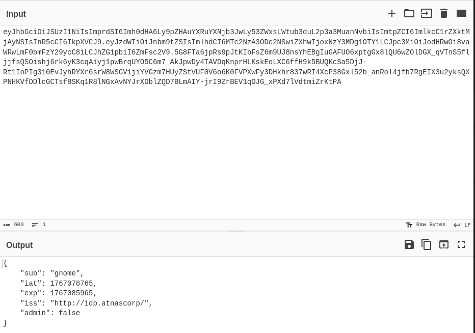
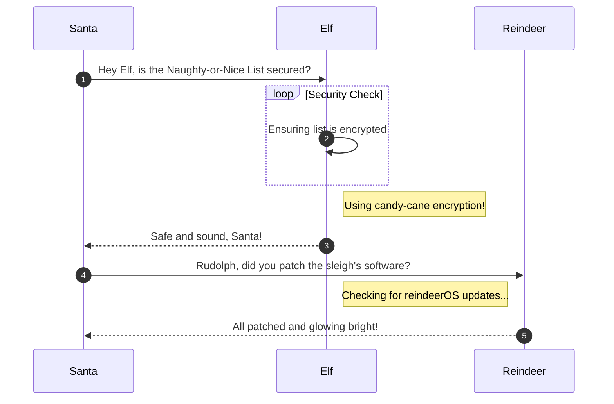

# Rogue Gnome Identity Provider 

**Difficulty**: :fontawesome-solid-snowflake:{ .red }:fontawesome-solid-snowflake:{ .red }:fontawesome-regular-snowflake::fontawesome-regular-snowflake::fontawesome-regular-snowflake:<br/>
**Direct link**: [Objective 3 terminal](https://.../)

## Objective

!!! question "Request"
    Hike over to Paul in the park for a gnomey authentication puzzle adventure. What malicious firmware image are the gnomes downloading?

??? quote "Paul Beckett"
    As a pentester, I proper love a good privilege escalation challenge, and that's exactly what we've got here.

    I've got access to a Gnome's Diagnostic Interface at gnome-48371.atnascorp with the creds `gnome:SittingOnAShelf`, but it's just a low-privilege account.

    The gnomes are getting some dodgy updates, and I need admin access to see what's actually going on.

    Ready to help me find a way to bump up our access level, yeah?

## Hints

??? tip "Rogue Gnome IDP"
    If you need to host any files for the attack, the server is running a webserver available locally at http://paulweb.neighborhood/ . The files for the site are stored in ~/www

??? tip "Rogue Gnome IDP"
    https://github.com/ticarpi/jwt_tool/wiki and https://portswigger.net/web-security/jwt have some great information on analyzing JWT's and performing JWT attacks.

?? tip "Rogue Gnome IDP"
    It looks like the JWT uses JWKS. Maybe a JWKS spoofing attack would work.

## Solution

Once again on the attack with this challenge, we start in a command line.

```bash title"Paul's Terminal"
Hi, Paul here. Welcome to my web-server. I've been using it for JWT analysis.

I've discovered the Gnomes have a diagnostic interface that authenticates to an Atnas identity provider.

Unfortunately the gnome:SittingOnAShelf credentials discovered in 2015 don't have sufficient access to view the gnome diagnostic interface.

I've kept some notes in ~/notes

Can you help me gain access to the Gnome diagnostic interface and discover the name of the file the Gnome downloaded? When you identify the filename, enter it in the badge.


paul@paulweb:~$ 
```

Start with the obvious, `ls -la` to find the notes, then cat to read it.

```bash title="notes"
# Sites

## Captured Gnome:
curl http://gnome-48371.atnascorp/

## ATNAS Identity Provider (IdP):
curl http://idp.atnascorp/

## My CyberChef website:
curl http://paulweb.neighborhood/
### My CyberChef site html files:
~/www/

# Credentials

## Gnome credentials (found on a post-it):
Gnome:SittingOnAShelf

# Curl Commands Used in Analysis of Gnome:

## Gnome Diagnostic Interface authentication required page:
curl http://gnome-48371.atnascorp

## Request IDP Login Page
curl http://idp.atnascorp/?return_uri=http%3A%2F%2Fgnome-48371.atnascorp%2Fauth

## Authenticate to IDP
curl -X POST --data-binary $'username=gnome&password=SittingOnAShelf&return_uri=http%3A%2F%2Fgnome-48371.atnascorp%2Fauth' http://idp.atnascorp/login

## Pass Auth Token to Gnome
curl -v http://gnome-48371.atnascorp/auth?token=<insert-JWT>

## Access Gnome Diagnostic Interface
curl -H 'Cookie: session=<insert-session>' http://gnome-48371.atnascorp/diagnostic-interface

## Analyze the JWT
jwt_tool.py <insert-JWT>
```

### Attack

Our attack vector is going to be JWT manipulation/privilege escalation so I start with authenticating and capturing the JWT

```bash title="JWT Capture"
curl -X POST --data-binary 'username=gnome&password=SittingOnAShelf&return_uri=http%3A%2F%2Fgnome-48371.atnascorp%2Fauth' http://idp.atnascorp/login
```


The JWT is Base64 encoded. We can use command line to decode in the terminal or navigate to CyberChef.



### Admonitions

!!! warning "Anchor the decorations"
    Ensure that all festive decorations, especially electrical ones, are securely anchored. We don’t want them floating off into the tropical sunset!

!!! info "Palm tree lighting tip"
    While on the island, make sure to hang your Christmas lights on a palm tree. It’s not only festive but also a great beacon for Santa to find you!

### Images


### Diagrams



### Code blocks

```bash linenums="1" hl_lines="7" title="Countdown script (with line 7 highlighted)"
#!/bin/bash
echo "Christmas Holiday Countdown"

days_until_xmas=$(($(date -d "Dec 25" +%j) - $(date +%j)))

if [ $days_until_xmas -ge 0 ]; then
  echo "Only $days_until_xmas days until Christmas!"
else
  echo "Christmas has passed! Hope you had a great time!"
fi
```

### Tables

| Activity             | Santa's Verdict       | Elf Comments                    |
| :------------------- | :-------------------- | :------------------------------ |
| Iceberg Surfing      | Risky Business        | "Lost three surfboards!"        |
| Polar Bear Hugs      | Approach with Caution | "Fluffy but... brisk."          |
| Snow Fort Building   | Highly Recommended    | "Elf-sized doorways only."      |
| Aurora Light Chasing | Magical Experience    | "Better than Christmas lights!" |
| Penguin Parade       | Absolute Must-See     | "They're oddly organized!"      |

!!! success "Answer"
    Insert the answer to the objective here.

## Response

!!! quote "Paul"
    Brilliant work on that privilege escalation! You've successfully gained admin access to the diagnostic interface.

    Now we finally know what updates the gnomes have been receiving - proper good pentesting skills in action!

    Brilliant! You've escalated your skills to admin-level across every challenge - proper pentesting at its finest, mate!
