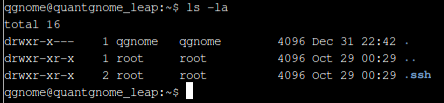
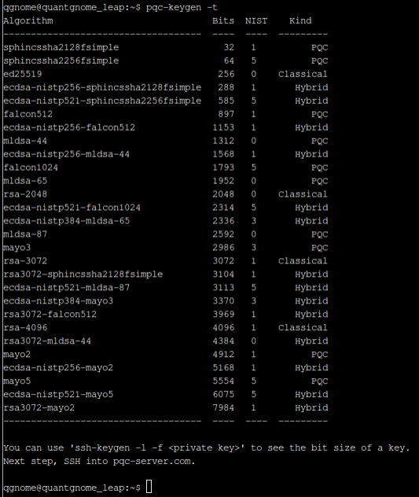
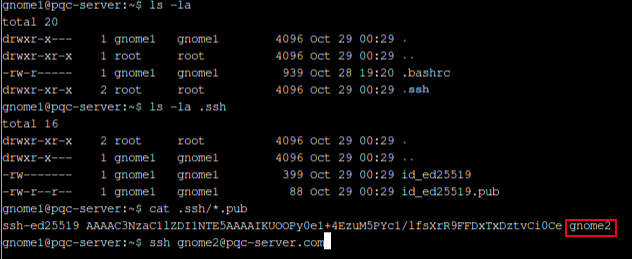
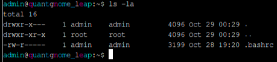

# Quantgnome Leap

**Difficulty**: :fontawesome-solid-snowflake:{ .red }:fontawesome-solid-snowflake:{ .red }:fontawesome-regular-snowflake::fontawesome-regular-snowflake::fontawesome-regular-snowflake:<br/>


## Objective

!!! question "Request"
    Charlie in the hotel has quantum gnome mysteries waiting to be solved. What is the flag that you find?

??? quote "Charlie Goldner"
    I just spotted a mysterious gnome - he winked and vanished, or maybe he's still here?

    Things are getting strange, and I think we've wandered into a quantum conundrum!

    If you help me unravel these riddles, we might just outsmart future quantum computers.

    Cryptic puzzles, quirky gnomes, and post-quantum secrets—will you leap with me?

## Hints

??? tip "Quantgnome Leap"
    When you give a present, you often put a label on it to let someone know that the present is for them. Sometimes you even say who the present is from. The label is always put on the outside of the present so the public knows the present is for a specific person. SSH keys have something similar called a comment. SSH keys sometimes have a comment that can help determine who and where the key can be used.

## Solution

This challenge was a fun introduction to post-quantum encryption. Once you get the hang of things, it is pretty straight forward progression of introducing progressively more advanced encryption in the anticipation of inevitable quantum computing, which would easily break currently sufficient encyrption methods. 


### Challenge

We start with the QuantGnome challenging us to find the *PQC* key generation program and execute it.

### PQC Keygen

There are some standard commands that it is typically a good idea to execute as a matter of course when finding one's self in a new terminal. These commands help us get an idea of the system we find ourself in, and of course some will be more useful than others in various situations. I typically start by trying to list the contents of the directory that I find myself in.



Well, that makes it easy. Use the ++"Up"++ arrow to repeat the last command, then add `.ssh`.


The hint for this challenge points us in the right direction. I use `cat` to check the public RSA key: `cat .ssh/id_rsa.pub`

```bash title="Public RSA Key with Comment"
ssh-rsa AAAAB3NzaC1yc2EAAAADAQABAAABgQCya6rjv+pf55l/EvEIZW+yhBdrpBrS0rmyysVhdR5Zn2aatLVDhRnNQrH+si6SOaDAOPhOhy037auUveLhEFaQBDQIDqisQ8JoTT/TKhyO97h1IUkl3zmsuw4Kcu1r24L2UJCIVStiJR8vQU8U0Kg5eWuDRev9j+2VMGqF2hmYqssTNbxHNeNbEr1R6/wciSAa3hNwksqE3dYjbr07veKAIcWcsaPMRHmjHrHXdLLwyweXhgzidd3AgzDskub9XdAiXs2B93mFNbQWel+nE2smxUVUY+SLsGXDTXAJu5AqYXrDEJtSuCOCHKXyPX7WCbmAllQo1FB/9K59pI552+K062SvGDCeLEPpcELozU52/awX2yeldNOj7Bn/xXdKpSPHLUrhsj8y/9gVTnS/0q6VLzO8qIwzxdGh7P0OtQqMrSRkTLEHtdOjojTmT70WUpUaVWXf65X8ymY72G49lJjFVAyM6AFBQK/K52f0UTl4XnvkSHwxYNFyk7wGkE07pWU= gnome1
```

At the end of the public key is the hinted at comment telling us that the key is for the `gnome1` profile. 
Lets find that key generation program.

```bash title="PQC Search"
$ find / -type f -executable -iname '*pqc*' 2>/dev/null
/usr/local/bin/pqc-keygen
```

Found it! Lets try a standard execution command of it's name, `pqc-keygen`.

??? tip "Tab"
    Something that can be really helpful on a new system is the tendency to allow tab-complete. If you're unsure what the command is, sometimes knowing some likely first options is all you need. In this case, typing "pqc" and then the ++"TAB"++ key will autocomplete the command for you.

Once we execute the key generation program, we are given next steps to follow. 

```bash
qgnome@quantgnome_leap:~$ pqc-keygen

— Summary -> Total algorithms = 28 | ✔ Keys generated = 28

Next, use -t to display key characteristics.
```

Use ++"UP"++ again and add the `-t` flag.



There is another command suggestion, but the next step is to SSH into the pqc-server.com.

!!! success "Key Generation"
    [x] Find and execute the `pqc-keygen`

### SSH

Now we can use the information we got from the public key to ssh into the server.

```bash
ssh gnome1@pqc-server.com
```


We are greated with a short blurb about the previous encryption (RSA in this case) and the prompt to login with the `gnome2` account. Lets look around real quick.



Read the public key from the `.ssh/` directory to confirm our username, then use the same command to ssh with the `gnome2` account.


At this point, I noticed a pattern and thought I would test it out. I figured if the pattern holds true, the next step will be the same server with the next gnome, `gnome3`. 

### Pattern Exploitation

```bash title="Pattern Recognition"
ssh gnome3@pqc-server.com
```

```bash title="Test Response"
#####################################################################################################################################################################################################################################################################################################

Welcome, gnome3 user! You made the third leap!

You authenticated with a MAYO post-quantum key. 
A post-quantum cryptographic algorithm with promising results for embedded systems. HOWEVER, use MAYO with caution! Wait for a standardized implementation (if/when that happens).

Take a look around and see if you can find a way to login to the gnome4 account.

#####################################################################################################################################################################################################################################################################################################
```

HA! It worked! We get logged in as `gnome3`, get some info about MAYO post-quantum cyrptography, and then the next username.

```bash title="Gnome4"
ssh gnome4@pqc-server.com
gnome3@pqc-server:~$ ssh gnome4@pqc-server.com
#####################################################################################################################################################################################################################################################################################################

Welcome, gnome4 user! You made the fourth leap!

You authenticated with a post-quantum hybrid key! What does that mean? A blended approach with proven classical cryptography and post-quantum cryptography.

In this case, you authenticated with a NIST P-256 ECDSA key (a classical elliptic curve) that also uses post-quantum SPHINCS+ (standardized by NIST in FIPS 205 as SLH-DSA). That makes this key extremely robust. According to NIST, this is a security level 1 key, which means this key is at 
least as strong as AES128.

Instead of a single exchange/signature (as with RSA or ED25519), this key produces two (one classical and one post-quantum) that are both checked together. If one fails, authentication fails. A hybrid approach is a great first step when testing and implementing post-quantum cryptography, 
giving organizations 'Quantum Agility'.

Take a look around and see if you can find a way to login to the admin account.

#####################################################################################################################################################################################################################################################################################################
```

We are given a new username, but the pattern holds true, and using `admin`, we can SSH to the same server: `ssh admin@pqc-server.com`.

```bash title="Admin Landing"
#####################################################################################################################################################################################################################################################################################################

You made the QuantGnome Leap! Your final stop.

You authenticated with another hybrid post-quantum key. What is different about this key? It uses the NIST P-521 elliptic curve (roughly equivalent to a 15360-bit RSA key) paired with ML-DSA-87. According to NIST, ML-DSA-87 is a security level 5 algorithm, which provides the highest security 
level and is meant for the most secure environments. NIST standardized CRYSTALS-Dilithium as ML-DSA in FIPS 204 with three defined security levels:

- ML-DSA-44: Security Level 2 - At least as strong as SHA256/SHA3-256
- ML-DSA-65: Security Level 3 - At least as strong as AES192
- ML-DSA-87: Security Level 5 - At least as strong as AES256

This is one of the strongest hybrid keys available in post-quantum cryptography. The other extremely strong security level 5 algorithms all use a combination of the NIST P-521 elliptic curve and one of the following PQC algorithms:

- falcon1024: Falcon (FN-DSA) with a 1024 lattice dimensional size
- sphincssha2256fsimple: SLH-DSA (SPHINCS+) using SHA2 256 and fast signature generation (hence the 'f' in the algorithm name)
- mayo5: MAYO-5 is the highest of the four MAYO security levels

This entire build/system is based off of the Linux Foundation's Open Quantum Safe (OQS) initiative. It uses the OQS liboqs library which provides PQC algorithm support.
You can find out more about the OQS initiative at https://openquantumsafe.org/.

Next Step: You now have access to a directory in the same location as the SSH daemon. Time to look around for your final flag.
#####################################################################################################################################################################################################################################################################################################
```

We have our final goal, looking around the admin profile to find the final flag.<br/>
We'll use our Linux-fu and the patterns of the last few profiles to begin poking around.

### Final Flag

I started as usual, with `ls -la` however this didn't return anything usefull.



I know I need to find the SSH daemon so lets look for that.

```bash title="SSH Search" hl_lines="22"
admin@quantgnome_leap:/$ find / -type f -iname '*ssh*' 2>/dev/null
/run/sshd.pid
/opt/oqs-ssh/sshd_config
/opt/oqs-ssh/ssh_config
/opt/oqs-ssh/share/man/man8/sshd.8
/opt/oqs-ssh/share/man/man8/ssh-keysign.8
/opt/oqs-ssh/share/man/man8/ssh-sk-helper.8
/opt/oqs-ssh/share/man/man8/ssh-pkcs11-helper.8
/opt/oqs-ssh/share/man/man5/ssh_config.5
/opt/oqs-ssh/share/man/man5/sshd_config.5
/opt/oqs-ssh/share/man/man1/ssh-add.1
/opt/oqs-ssh/share/man/man1/ssh-agent.1
/opt/oqs-ssh/share/man/man1/ssh.1
/opt/oqs-ssh/share/man/man1/ssh-keygen.1
/opt/oqs-ssh/share/man/man1/ssh-keyscan.1
/opt/oqs-ssh/bin/ssh
/opt/oqs-ssh/bin/ssh-add
/opt/oqs-ssh/bin/ssh-keygen
/opt/oqs-ssh/bin/ssh-agent
/opt/oqs-ssh/sbin/sshd
/opt/oqs-ssh/sshd_logfile.log
/opt/oqs-ssh/ssh_host_ecdsa_nistp521_mldsa-87_key.pub
/opt/oqs-ssh/ssh_known_hosts
/opt/oqs-ssh/ssh_host_ecdsa_nistp521_mldsa-87_key
```

Hey, a public key! That's where the challenge had us directed to verify the username. Seemed like a logical place to check for the flag:

```bash title="Public Key"
admin@quantgnome_leap:/$ cat /opt/oqs-ssh/ssh_host_ecdsa_nistp521_mldsa-87_key.pub
ssh-ecdsa-nistp521-mldsa-87 AAAAG3NzaC1lY2RzYS1uaXN0cDUyMS1tbGRzYS04NwAAAAhuaXN0cDUyMQAAAIUEAXPsEaHJ8h7S5xQuhKPJfgptO75hWt+gkv23QXJIndzqGL4e4BlSc0Rvm3m1TdqHiqyRxJV1AgCb+SqHFHxa2XxEAGd0yWkDaS+Dxqh4gN1WaUXe/IH0i/JfUXccEFhJn/8W8wK7ckNgONXPomOJTCn1LdsNkfRm030QqPgwkLFoIcKyAAAKIF8ZFI2CpVM1TYbiKC9/yCcdWXS/U39kMaMuxYYnjMK4bKxRRKkTomPCGDdt/9fNSJB3zWyiK9QpPwpRe8iyo6H/gSP6G9GbZL7lwXHNVj5OKiuHcBPQRec7Mo4XptHFBE4QHUpThVqM4YHCNLU8/USuL6qp9HGuJit/NsMERQB3R7gziloF1MIiGdM/cTTl87judabNyf0y+qyOGrF9IUj89pjHHV7IaCAyxMTeh/JqoU5sJNEbdhEIU/kqfC3V8aDCW7xnSyKMPuDg0TlErlmep0vayOTYaej9TOxR7/V9JKTfGO8GDzjP6QBFdIZAHNp8gKb0DsIN80pHamyD5iFWRBYlCcgLPmOHPVlzUWHzBcypTGVPt93mrcoRePXcsXNYJvNO1i2I/1xlI8sWYfx3mGhNB5QNcDXPjvJGfAR+1DMjMgP9ScY3r00+uhMmtJYliehCGX68M/7oyFVwj4NM3M37aq3XGtKu+X7ME9mlKqtdMzPJwPYOCPPpZ1GEbpbt0y0oP6RKUlnX6VaSsFMjFb/1dN84QsCIZpmkRd+sk5Eqqc6VFCvVPVrTHf9NuV3fohZsjxzJp/jItqij0M000fkGWjFBkLUVaHb2f8EcRpKt8HIdrYQPHhgRY46AxQaWviX01s4PiNAcRnOKZ8KegFiCNRLp6INXtJxOlkkst7cL+9S0TY2BiUYI3SyFieSKPwJF6VLW6kzBtle/sScrvNNgPJSEdTTI2mKBhxbdqYyNHHyz9Mvagz6lWJn09XA5cwY300pwtgUxox6HiUH4Ai1tCnjR7M8O+IC8gqthijgcXFJJ+L5rxl18p4qtlEYlgT7a4uVm4rbWEp69EOMgMUNdnPnlKjpyVVa2yBbbWM/h/mf8jmS6jFMgbZCsHHPHyIpJPKTRhtXFpXPxbZqIeDcJ2O6QIUuO/tWwxsouXeSwX+1f2rOmQJrrBz9TKGb+vMXs0TkEI1cV7GV1jF7zvrEpToFDhQNn+6YVA9DfZ4GelnHT8/EyFRVknccUt2B6VY3/1EGhCV5kth93BYq85aTF5PWjjzv9BkLCfyZwm9DLC93mnv2tzHGJbHQ6908zXXrdmbAtllmP1egxLOXtStondHtUBjELRZ1wdoFsouNkW1pF1TmNAahEqF96kQwiq7wCYTcmq29nDO48+9KbMVLgx7p4QdZgFGvCMQKsH2pNKcNOtDAM1Tjbljn2smIWFX3qczp1JNAnVYPPo+PiZunfJbqA8cn7ZHGD7IHpqXzU1KW9Z5p8N3jDBJ3Aybmt1F9YmeGspjKO8FrWp2hnFGpDWELzeJmEWJLEKsEh3+qnNWNfIGSWbA2GeFMWxtvaNcvW0qSiQevjyIoYNHXowC9fkeP3VC5w755bbS+3qtvOLcYMp2zD6bNez0OCk7XDzQfG5uwybXQCaYf7D1TY6HTaUuqPtufv7JNAR3EG15eXZonPo1+Vef1CGWoSOGauMakgvBJDw3mFrGsgVxXnkRVYquvo1m/BWolJvASkaev8RGZmoZFYUCgHkkR4/jl4x9BSTu29HaZGRN3JX7kDjrrjsLo6vrWDioMx4aWLOiEscZRCLNqYMKJet6tc9FSEFldBlPJZiiNXOxBaigqkC4YVz3rf1imjs5hHXkL8SUYYaJhT1v97M8kz/Vx/SoRx1s0mqB3mMWRr9+MB8J+BZAHROqiyu7rYJZ/w1BhUEcL29WKGlJ1FFicpw5KwyyHjcsYNsoA7CisTcfr2ZLyolB3Ob4Q4iWmQzkj01cZ6GfFYo8QWe7/vINYstNXTxXa2NHX/C7sSeYeb+S7iFCfQfof3KJcJb6AFz5ssdYu2I8466+GsDkciZDbezN+jIDPtgY/1wOsfSrD3UhtPifTxiG7AhsyFmpR8YzY1/jb4ErqGLiL1bKTtBU9nlPQzK9LPA8jEB7sexXuUTmWvzCmLLudJS2I6swGzdaMYBrzRYd0MgQMUZTLrIsRI/M9rHGPaC2BzzKH/b2jq1fxfwuypg1n1mBjOG4ZhUbxATbTn1s2Au9m9DqU8v65jm9uYegc8wMz8T8K8pcMI5iwvu6SK7nu60/ykR0GVp7bKUOkFnRycSmu6hBp+rKFUpcYauoxklVH9S/NSb4gj8hPzQuRRw75B8uM9yGb6+qBO/10wDY9m5GIrIUFINDoEniBDmvkLOBuZE23xZLr6jGcSnZ19EbVc9qjPYoRJ8qlq3aFOnqAKCpxanBynk/2QoLaxkQc7Xu6xO5sKoe3egJyfibVB1R+Rg4kKjHyBZhyuYc67Bjm8u5CCw3+ep/V0c+djrlaEDvsu9bJy5mP73LsidKrGLDWzGsrzMINh8tio56sFw0Bc2H5ODCrlkIk7ImT6m5ME9xqVHC5U1/7ggJUtRFjYP5WclKjOMw2r/OSVRGRu9g9I+5cGDHtm1ATYozVWwLN2rlq4gfOWjnII5uvnuwPVpPnAkhXU6g/cuDkD3/8U9JIIo0gxwP5++ULO+yFK5XSokzM6V2pBkEYlgtUftaCCAG69BElXkSS57U7Pp4jnzfnDKzJU36ko8+/3lLezvbTuSWVJ6cgiCQTTIuEu94HsM/wOI0hgYi8+hXsmmJQ8PfnN0r9opywX8pmq7CD0HxkLc97ozbjA69MZNbUeA+8Om70ae3vrJSxwT6B7vyik9u766DWsG9LYpL5vI3ggKzVP8VChUl1v+/1VledoKgFAfI+sTnux+8OLeM8k6keDdI7LSeUpx60cmgC2+/UuUg46zQW9MU58f9C29eC0VAgXNyRKmHGbZ/UjpO50runrE1jrfx4jzuklemUBBy/TEPV+TdkaaLvHbeOekaffgVdXQSSOGKLaZGD5sxcqaEX+NtWNTtGKa8Yl75gdfC3sJ2v63A+/nzpM3VhiKHc1Ny1NzCPfCmjQ9jAxz8xjkv5d9M7HtnvdZMv2+aauZ7RydbcX37VEaqW69kAhobEvXxFk0FS5IrWJw7rnDEKp4Ywh3T1kaJVdQH666ReTbM+e88MdN5+kcfsST2A4Dl/CXad7sUrnu31/BSQkdyhVI+4rT7v65eOwNuSVsPCuak2CNeN5AOveRIBYrrt2edpLqJIIkeYTP0JksThUfgiPDna82yzinCFn+8Sf/jee1jpDDJn/V4BkqDbVJMc8FAkL2LCA1pNctKeTaHP+Kf/EDkDRaVC++KhT/EgjgY332AkaFz15rCi2Dsam7Bza4ZPKqDidrDfa4OZzt3QoTBcg5A7QTy1ivoC0MaS47Vw1DDfPcrefQ2qAsZMYEtZHsU09r+Th3xQZ7tlST4QfVP3TSTppI0kG+fyoFAN80JVKyGD6SdhkL8NPcIlqZgNsbRH/QJ8bsPdOFkTe6L/lJIh1KBy7mGmG82XZrB6Cvu8GxhQEl5sKTK9dyF3CAqNy2saQXxl26E6i7zdBzUM9EzWqtIvzlnk7D+3fR5pvzT8CAPhS/Q==
```

No flag there...<br/>
I decided that it would be less cubersome to navigate to the directory and look around.

```bash
admin@quantgnome_leap:/$ cd /opt/oqs-ssh
admin@quantgnome_leap:/opt/oqs-ssh$ ls
bin                                       key-lookup.sh                             scripts                                   ssh_host_ecdsa_nistp521_mldsa-87_key      sshd_config
flag                                      moduli                                    share                                     ssh_host_ecdsa_nistp521_mldsa-87_key.pub  sshd_logfile.log
key-lookup.log                            sbin                                      ssh_config                                ssh_known_hosts                           user-keys
```

HA! There it is!

!!! success
    
    ??? tip "Shortcut"
        Had I paused to think about it a little more, I would have considered the pattern of suggesting looking for the next username as a clue and conducted a search for "flag" instead of `ssh`.<br/>
        

## Response

!!! quote "Charlie Goldner"
    That was wild—who knew quantum gnomes could hide so many secrets?

    Thanks for helping me leap into the future of cryptography!
