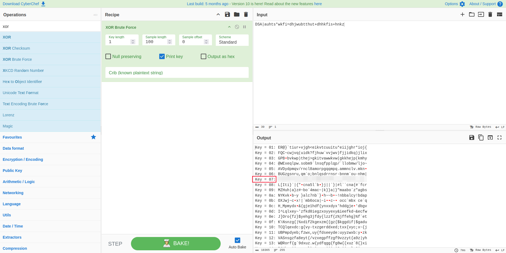

# Going in Reverse

**Difficulty**: :fontawesome-solid-snowflake:{ .red }:fontawesome-solid-snowflake:{ .red }:fontawesome-regular-snowflake::fontawesome-regular-snowflake::fontawesome-regular-snowflake:<br/>
**Direct link**: [Just a BASIC Program](https://www.holidayhackchallenge.com/2025/assets/login.bas)

## Objective

!!! question "Request"
    Kevin in the Retro Store needs help rewinding tech and going in reverse. Extract the flag and enter it here.

??? quote "Kevin"
    You know, there's something beautifully nostalgic about stumbling across old computing artifacts. Just last week, I was sorting through some boxes in my garage and came across a collection of 5.25" floppies from my college days - mostly containing terrible attempts at programming assignments and a few games I'd copied from friends.

    Finding an old Commodore 64 disk with a mysterious BASIC program on it? That's like discovering a digital time capsule. The C64 was an incredible machine for its time - 64KB of RAM seemed like an ocean of possibility back then. I spent countless hours as a kid typing in program listings from Compute! magazine, usually making at least a dozen typos along the way.

    The thing about BASIC programs from that era is they were often written by clever programmers who knew how to hide things in plain sight. Sometimes the most interesting discoveries come from reading the code itself rather than watching it execute. It's like being a digital archaeologist - you're not just looking at what the program does, you're understanding how the programmer thought.

    Take your time with this one. The beauty of reverse engineering isn't in rushing to the answer, but in appreciating the craft of whoever wrote it. Those old-school programmers had to be creative within such tight constraints.

## Solution

This challenge is another retro challenge, with with only 11 lines of BASIC code:

```vb title="Commodore 64 Security System"
10 REM *** COMMODORE 64 SECURITY SYSTEM ***

20 ENC_PASS$ = "D13URKBT"

30 ENC_FLAG$ = "DSA|auhts*wkfi=dhjwubtthut+dhhkfis+hnkz" ' old "DSA|qnisf`bX_huXariz"

40 INPUT "ENTER PASSWORD: "; PASS$

50 IF LEN(PASS$) <> LEN(ENC_PASS$) THEN GOTO 90

60 FOR I = 1 TO LEN(PASS$)

70 IF CHR$(ASC(MID$(PASS$,I,1)) XOR 7) <> MID$(ENC_PASS$,I,1) THEN GOTO 90

80 NEXT I

85 FLAG$ = "" : FOR I = 1 TO LEN(ENC_FLAG$) : FLAG$ = FLAG$ + CHR$(ASC(MID$(ENC_FLAG$,I,1)) XOR 7) : NEXT I : PRINT FLAG$

90 PRINT "ACCESS DENIED"

100 END
```

### Code Review

Lets break down this code line by line to understand what this code is doing. 

!!! summary "BASIC Code Review"
    * `REM` = Remark. We start with the title of this code, Commodore 64 Security System.
    * `ENC_PASS$ = "DI3URKBT"` - This is the encoded password
    * `ENC_FLAG$ = "DSA|auhts*wkfi=dhjwubtthut+dhhkfis+hnkz" ' old "DSA|qnisf`bX_huXariz"` - This is the flag encoded and another old flag.
    * `INPUT "ENTER PASSWORD: "; PASS$` - Prompt the user for the password
    * `IF LEN(PASS$) <> LEN(ENC_PASS$) THEN GOTO 90` - If the length of the password "`LEN(PASS)`" is shorter or longer (`<>`) than the length of the encoded password "`LEN(ENC_PASS$)`", go to line 90.
    * `FOR I = 1 TO LEN(PASS$)` - Loops through the length of the password, starting at 1.
    * `IF CHR$(ASC(MID$(PASS$,I,1)) XOR 7)` - This extracts the character at position `I` (1 character long) from `PASS$` and XORs it with 7.
    * `<> MID$(ENC_PASS$,I,1) THEN GOTO 90` - Compares the XOR'd character from PASS$ to the encrypted password `ENC_PASS$`; if it isn't the same, go to line 90.
    * `NEXT I` - Marks the end of the `FOR` loop and increments `I` by 1.
    * `FLAG$ = "" : FOR I = 1 TO LEN(ENC_FLAG$) : FLAG$ = FLAG$ + CHR$(ASC(MID$(ENC_FLAG$,I,1)) XOR 7) : NEXT I : PRINT FLAG$`
        - `FLAG$ = ""` - Creates an empty string to store the decrypted flag .
        - `FOR I = 1 TO LEN(ENC_FLAG$)` - Loop through each character of the encrypted flag.
        - `FLAG$ = FLAG$ + CHR$(ASC(MID$(ENC_FLAG$,I,1)) XOR 7)` - For each character:
            - `MID$(ENC_FLAG$,I,1)` - Get the character at position `I`
            - `ASC(...)` - Convert it to its ASCII number
            - `... XOR 7` - XOR that number with 7
            - `CHR$(...)` - Convert the result back to a character
            - `FLAG$ = FLAG$ + ...` - Add the character to the FLAG$ string
        - `NEXT I` - End of loop, repeat for the next character.
        - `PRINT FLAG$` - Print the fully decrypted flag
    * `PRINT "ACCESS DENIED"` - Line 90, called if the password is incorrect
    * `END` - Last line of the code.

In plain language, what this code does is prompt the user for a password, check the provided password against the stored, encoded password *D13URKBT*, print the decoded flag if the password matches, then print *ACCESS DENIED*.

### Reversal

There are a few different ways that this information can be used to find the flag. If the encoded password can be decrypted, the program can be run and the flag will be printed out. The thing about XOR is that if the original XOR value is known, 7 in this case, then any encoded string can be XOR'd with the same value to decode it. A short Python [script](../artifacts/objectives/o18/decode.py) can be used to find the password:

```py title="XOR"
enc_pass = "D13URKBT"
real_pass = ""
for char in enc_pass:
    real_pass += chr(ord(char) ^ 7)
print(real_pass)
```

Now that we have a password, we could try running the BASIC script, but that's not really the challenge. We need the flag, not the password. Instead of running the program with the decoded password, we could just run the script above with the encoded flag in place of the password. However, we could just work smarter, instead of harder; instead of reinventing the wheel, lets use a tool we are already familiar with: [CyberChef](https://gchq.github.io/CyberChef/).

!!! success "Reversed"
    Open up CyberChef and copy/paste the encoded flag, then find the known key to get the decoded answer. Even if we didn't know the key, we could probably find the correct answer from reviewing the results of CyberChef since there aren't many options that would make any sense as a flag.
    

## Response

!!! quote "Kevin McFarland"
    Excellent work! You've just demonstrated one of the most valuable skills in cybersecurity - the ability to think like the original programmer and unravel their logic without needing to execute a single line of code.