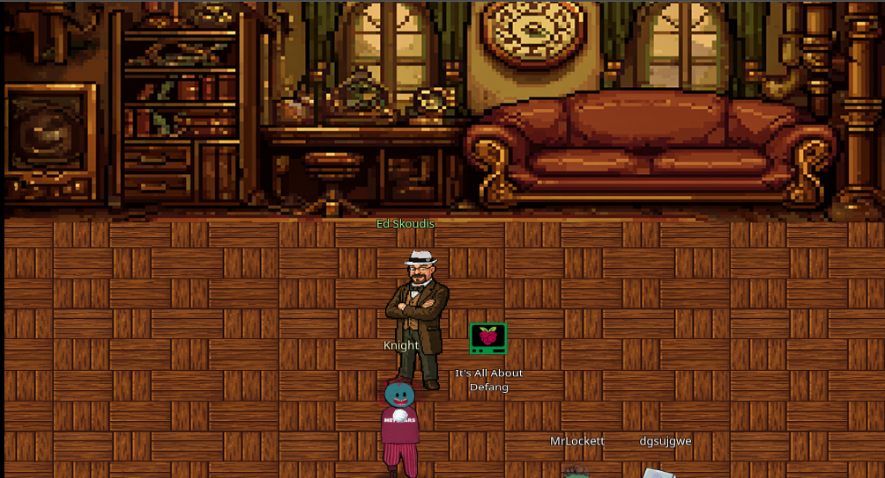
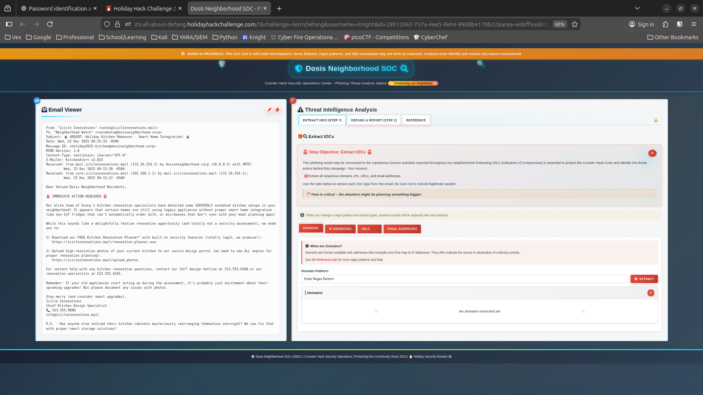
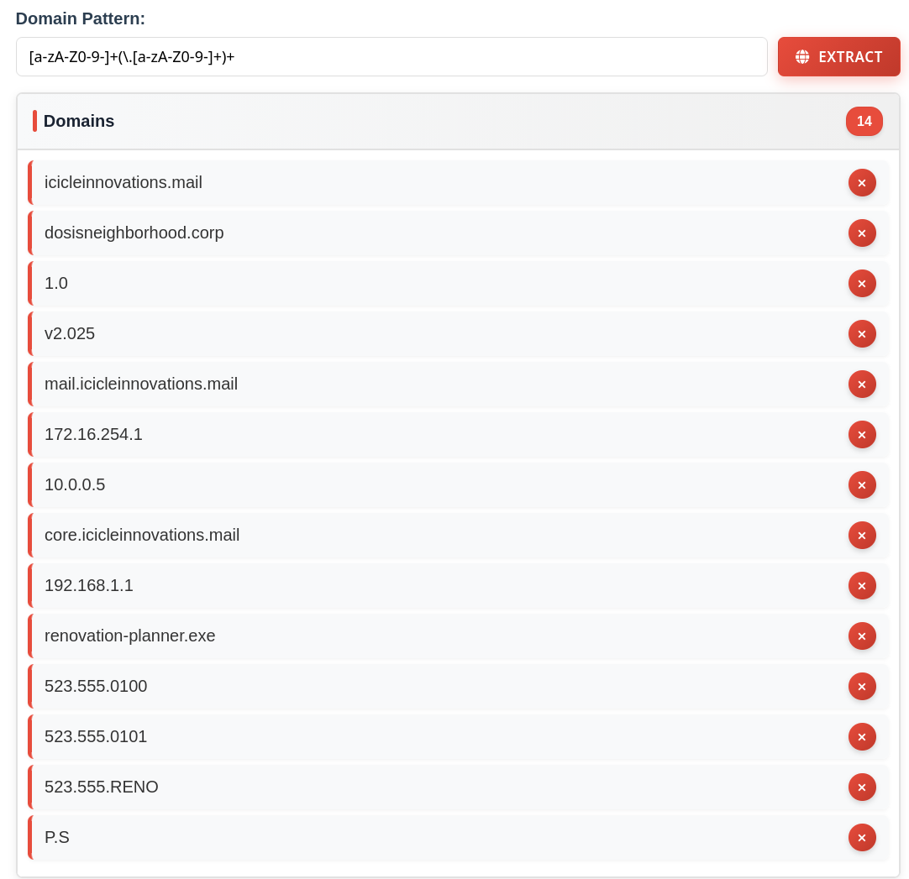
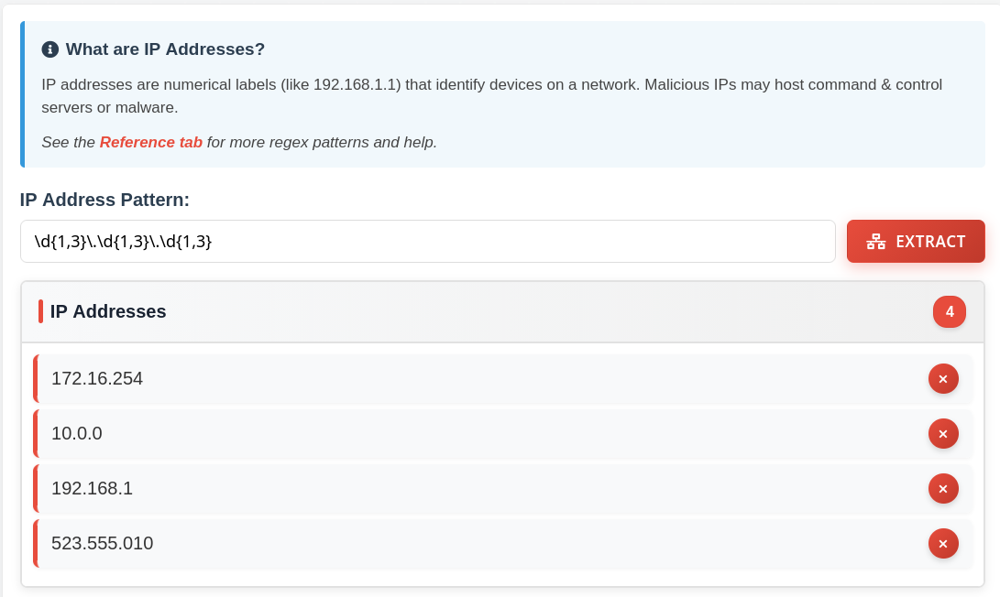
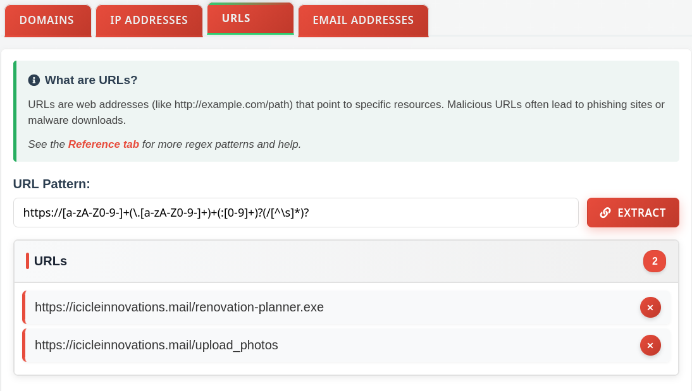
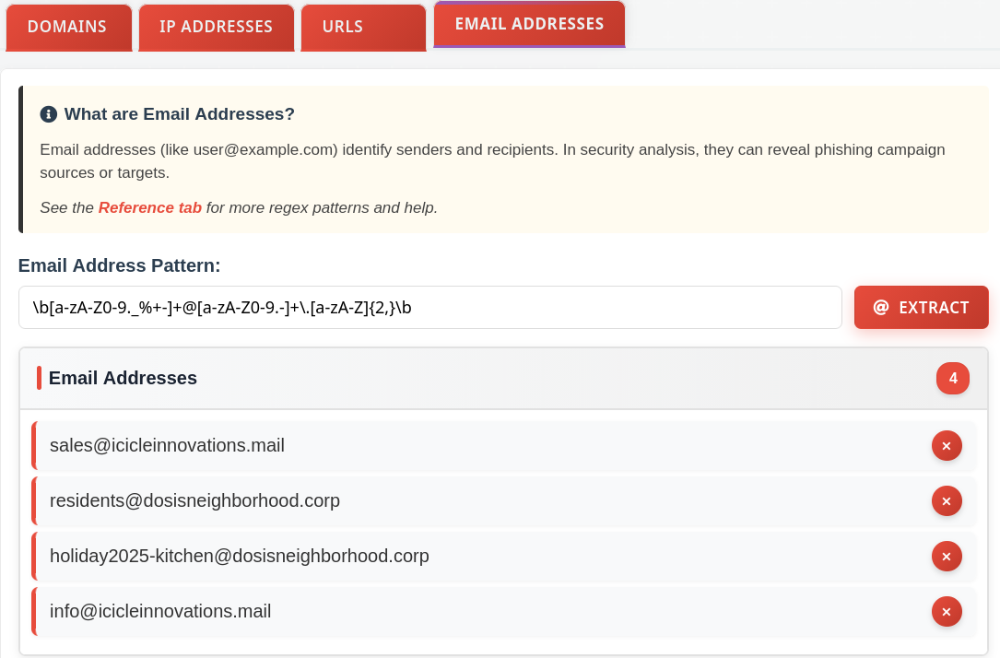
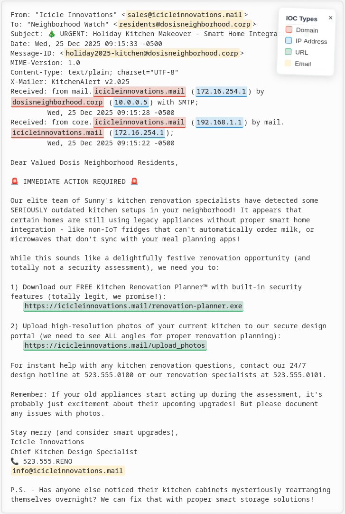
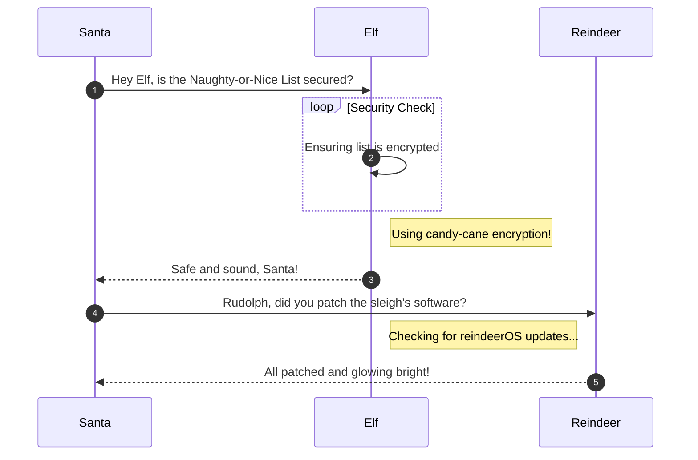

# It's All About Defang

**Difficulty**: :fontawesome-solid-star:{ .red }:fontawesome-regular-star::fontawesome-regular-star::fontawesome-regular-star::fontawesome-regular-star:<br/>



## Objective

!!! question "Request"
    Find Ed Skoudis upstairs in City Hall and help him troubleshoot a clever phishing tool in his cozy office.

??? quote "Ed Skoudis"
    Oh gosh, I could talk for hours about this stuff but I really need your help!

    The team has been working on this new SOC tool that helps triage phishing emails...and there are some...issues.

    We have had some pretty sketchy emails coming through and we need to make sure we block ALL of the indicators of compromise.

    Can you help me? No pressure...

## Hints

??? tip "Extract IOCs"
    Remember, the new Phishing Threat Analysis Station (PTAS) is still under construction. Even though the regex patterns are provided, they haven't been fine tuned. Some of the matches may need to be manually removed.

??? tip "Defang All The Thingz"
    The PTAS does a pretty good job at defanging, however, the feature we are still working on is one that defangs ALL scenarios. For now, you will need to write a custom `sed` command combining all defang options.

## Solution



The terminal link opens the *Dosis Neighborhood SOC* displaying an email and steps for investigating it. 

!!! note "Phishing Email"
    From: "Icicle Innovations" <sales@icicleinnovations.mail>
    To: "Neighborhood Watch" <residents@dosisneighborhood.corp>
    Subject: 🎄 URGENT: Holiday Kitchen Makeover - Smart Home Integration! 🎄
    Date: Wed, 25 Dec 2025 09:15:33 -0500
    Message-ID: <holiday2025-kitchen@dosisneighborhood.corp>
    MIME-Version: 1.0
    Content-Type: text/plain; charset="UTF-8"
    X-Mailer: KitchenAlert v2.025
    Received: from mail.icicleinnovations.mail (172.16.254.1) by dosisneighborhood.corp (10.0.0.5) with SMTP;
         Wed, 25 Dec 2025 09:15:28 -0500
    Received: from core.icicleinnovations.mail (192.168.1.1) by mail.icicleinnovations.mail (172.16.254.1);
         Wed, 25 Dec 2025 09:15:22 -0500

    Dear Valued Dosis Neighborhood Residents,

    🚨 IMMEDIATE ACTION REQUIRED 🚨

    Our elite team of Sunny's kitchen renovation specialists have detected some SERIOUSLY outdated kitchen setups in your neighborhood! It appears that certain homes are still using legacy appliances without proper smart home integration - like non-IoT fridges that can't automatically order milk, or microwaves that don't sync with your meal planning apps! 

    While this sounds like a delightfully festive renovation opportunity (and totally not a security assessment), we need you to:

    1. Download our FREE Kitchen Renovation Planner™ with built-in security features (totally legit, we promise!): https://icicleinnovations.mail/renovation-planner.exe
   
    2. Upload high-resolution photos of your current kitchen to our secure design portal (we need to see ALL angles for proper renovation planning): https://icicleinnovations.mail/upload_photos

    For instant help with any kitchen renovation questions, contact our 24/7 design hotline at 523.555.0100 or our renovation specialists at 523.555.0101.

    Remember: If your old appliances start acting up during the assessment, it's probably just excitement about their upcoming upgrades! But please document any issues with photos.

    Stay merry (and consider smart upgrades),
    Icicle Innovations 
    Chief Kitchen Design Specialist
    📞 523.555.RENO
    info@icicleinnovations.mail

    P.S. - Has anyone else noticed their kitchen cabinets mysteriously rearranging themselves overnight? We can fix that with proper smart storage solutions!

!!! question "Extract IOCs"
    This phishing email may be connected to the mysterious Gnome activities reported throughout our neighborhood! Extracting IOCs (Indicators of Compromise) is essential to protect the Counter Hack Crew and identify the threat actors behind this campaign. Your mission:

    [ ] Extract all suspicious **domains**, **IPs**, **URLs**, and **email address**.

PTAS has seperated each objective into a seperate tab, ++"DOMAIN"++, ++"IP ADDRESSES"++, ++"URLS"++, and ++"EMAIL ADDRESSES"++

### Domains

To search the email for domains, we need a regex pattern that will find web addresses in the email.

??? tip "What are Domains?"
    Domains are human-readable web addresses (like example.com) that map to IP addresses. They often indicate the source or destination of malicious activity.

In the informatinal blurb about what a domain is, there is also a link to the reference tab (seen below) that provides some useful RegEx commands as well as resource links. Under "Common IOC patterns" can be found a regex pattern for detecting domains, `[a-zA-Z0-9-]+(\.[a-zA-Z0-9-]+)+`. That's exactly what is needed; copying it and pasting in the field returns a bit more than expected though, with a total of 14 domains found.



Remove those found which are not domains and there should be two domains left. 


///caption
After selecting "Extract" the found IOCs will be highlighted in the email as well.
///

Go through the other tabs, using the RegEx pattern from the reference tab to find and highlight the **IP ADDRESSES**, **URLS**, & **EMAIL ADDRESSES**. When you select the ++"EXTRACT"++ button, the phishing email will be highlighted with the corresponding color.

### IP Addresses

The RegEx pattern for finding IP Addresses is `\d{1,3}\.\d{1,3}\.\d{1,3}`



### URLs



### Email Addresses




///caption
After completing each RegEx extraction, the results are highlighted with color coding.
///

This section explains the different steps taken to solve the challenge. Try to find a good balance between providing sufficient detail and not overloading the reader with too much information. Use [admonitions](https://squidfunk.github.io/mkdocs-material/reference/admonitions/), [images](https://squidfunk.github.io/mkdocs-material/reference/images/), [diagrams](https://squidfunk.github.io/mkdocs-material/reference/diagrams/), [code blocks](https://squidfunk.github.io/mkdocs-material/reference/code-blocks/), and [tables](https://squidfunk.github.io/mkdocs-material/reference/data-tables/) to highlight and structure important information or provide additional clarification.

### Admonitions

!!! warning "Anchor the decorations"
    Ensure that all festive decorations, especially electrical ones, are securely anchored. We don’t want them floating off into the tropical sunset!

!!! info "Palm tree lighting tip"
    While on the island, make sure to hang your Christmas lights on a palm tree. It’s not only festive but also a great beacon for Santa to find you!

### Images


### Diagrams



### Code blocks

```bash linenums="1" hl_lines="7" title="Countdown script (with line 7 highlighted)"
#!/bin/bash
echo "Christmas Holiday Countdown"

days_until_xmas=$(($(date -d "Dec 25" +%j) - $(date +%j)))

if [ $days_until_xmas -ge 0 ]; then
  echo "Only $days_until_xmas days until Christmas!"
else
  echo "Christmas has passed! Hope you had a great time!"
fi
```

### Tables

| Activity             | Santa's Verdict       | Elf Comments                    |
| :------------------- | :-------------------- | :------------------------------ |
| Iceberg Surfing      | Risky Business        | "Lost three surfboards!"        |
| Polar Bear Hugs      | Approach with Caution | "Fluffy but... brisk."          |
| Snow Fort Building   | Highly Recommended    | "Elf-sized doorways only."      |
| Aurora Light Chasing | Magical Experience    | "Better than Christmas lights!" |
| Penguin Parade       | Absolute Must-See     | "They're oddly organized!"      |

!!! success "Answer"
    Insert the answer to the objective here.

## Response

!!! quote "Insert Character Name"
    Well you just made that look like a piece of cake! Though I prefer cookies...I know where to find the best in town!

    Thanks again! See ya 'round!
