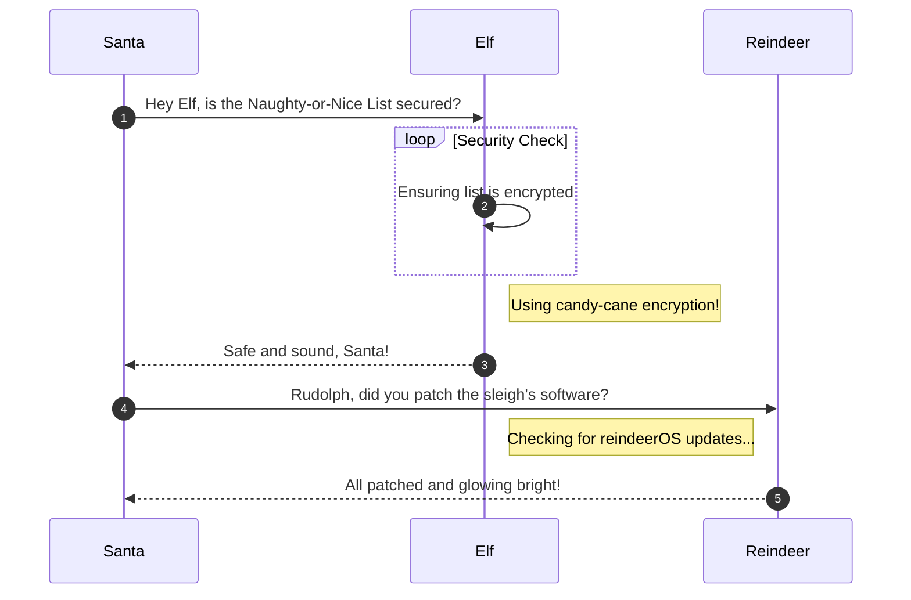

# It's All About Defang

**Difficulty**: :fontawesome-solid-star:{ .red }:fontawesome-regular-star::fontawesome-regular-star::fontawesome-regular-star::fontawesome-regular-star:<br/>


## Objective

!!! question "Request"
    Find Ed Skoudis upstairs in City Hall and help him troubleshoot a clever phishing tool in his cozy office.

??? quote "Ed Skoudis"
    Oh gosh, I could talk for hours about this stuff but I really need your help!

    The team has been working on this new SOC tool that helps triage phishing emails...and there are some...issues.

    We have had some pretty sketchy emails coming through and we need to make sure we block ALL of the indicators of compromise.

    Can you help me? No pressure...

## Hints

??? tip "Extract IOCs"
    Remember, the new Phishing Threat Analysis Station (PTAS) is still under construction. Even though the regex patterns are provided, they haven't been fine tuned. Some of the matches may need to be manually removed.

??? tip "Defang All The Thingz"
    The PTAS does a pretty good job at defanging, however, the feature we are still working on is one that defangs ALL scenarios. For now, you will need to write a custom `sed` command combining all defang options.

## Solution


This section explains the different steps taken to solve the challenge. Try to find a good balance between providing sufficient detail and not overloading the reader with too much information. Use [admonitions](https://squidfunk.github.io/mkdocs-material/reference/admonitions/), [images](https://squidfunk.github.io/mkdocs-material/reference/images/), [diagrams](https://squidfunk.github.io/mkdocs-material/reference/diagrams/), [code blocks](https://squidfunk.github.io/mkdocs-material/reference/code-blocks/), and [tables](https://squidfunk.github.io/mkdocs-material/reference/data-tables/) to highlight and structure important information or provide additional clarification.

### Admonitions

!!! warning "Anchor the decorations"
    Ensure that all festive decorations, especially electrical ones, are securely anchored. We don’t want them floating off into the tropical sunset!

!!! info "Palm tree lighting tip"
    While on the island, make sure to hang your Christmas lights on a palm tree. It’s not only festive but also a great beacon for Santa to find you!

### Images


### Diagrams



### Code blocks

```bash linenums="1" hl_lines="7" title="Countdown script (with line 7 highlighted)"
#!/bin/bash
echo "Christmas Holiday Countdown"

days_until_xmas=$(($(date -d "Dec 25" +%j) - $(date +%j)))

if [ $days_until_xmas -ge 0 ]; then
  echo "Only $days_until_xmas days until Christmas!"
else
  echo "Christmas has passed! Hope you had a great time!"
fi
```

### Tables

| Activity             | Santa's Verdict       | Elf Comments                    |
| :------------------- | :-------------------- | :------------------------------ |
| Iceberg Surfing      | Risky Business        | "Lost three surfboards!"        |
| Polar Bear Hugs      | Approach with Caution | "Fluffy but... brisk."          |
| Snow Fort Building   | Highly Recommended    | "Elf-sized doorways only."      |
| Aurora Light Chasing | Magical Experience    | "Better than Christmas lights!" |
| Penguin Parade       | Absolute Must-See     | "They're oddly organized!"      |

!!! success "Answer"
    Insert the answer to the objective here.

## Response

!!! quote "Insert Character Name"
    Well you just made that look like a piece of cake! Though I prefer cookies...I know where to find the best in town!

    Thanks again! See ya 'round!
