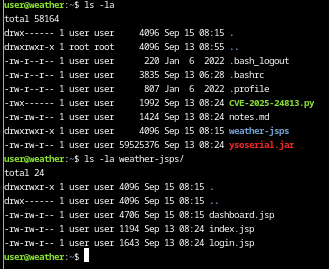
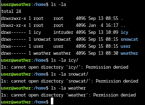
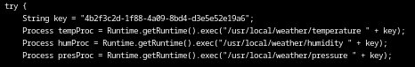
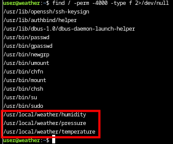
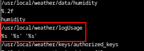

# Snowcat RCE & Priv Esc

**Difficulty**: :fontawesome-solid-snowflake:{ .red }:fontawesome-solid-snowflake:{ .red }:fontawesome-solid-snowflake:{ .red }:fontawesome-regular-snowflake::fontawesome-regular-snowflake:<br/>


## Objective

!!! question "Request"
    Tom, in the hotel, found a wild Snowcat bug. Help him chase down the RCE! Recover and submit the API key not being used by snowcat.

??? quote "Tom Hessman"
    We've lost access to the neighborhood weather monitoring station.

    There are a couple of vulnerabilities in the snowcat and weather monitoring services that we haven't gotten around to fixing.

    Can you help me exploit the vulnerabilities and retrieve the other application's authorization key?

    Enter the other application's authorization key into the badge.

    If Frosty's plan works and everything freezes over, our customers won't be having the best possible experience—they'll be having the coldest possible experience! We need to stop this before the whole neighborhood becomes one giant freezer.

## Hints

??? tip "Snowcat"
    Snowcat is closely related to Tomcat. Maybe the recent Tomcat Remote Code Execution vulnerability (CVE-2025-24813) will work here.

??? tip "Snowcat"
    Maybe we can inject commands into the calls to the temperature, humidity, and pressure monitoring services.

??? tip "Snowcat"
    If you're feeling adventurous, maybe you can become root to figure out more about the attacker's plans.

## Solution

This challenge starts at the command line and a prompt to find a way to get Remote Code Execution through a known vulnerability, [CVE-2025-24813](https://nvd.nist.gov/vuln/detail/CVE-2025-24813) and then to escalate priveleges to the 'weather' user to extract the authorization key "used bu the other system".<br/>
I start with listing the contents of the directory we start in, as well as opening what I can and reading through the documentation that is provided.





The the python [script](../artifacts/objectives/o21/CVE-2025-24813.py) and [notes.md](../artifacts/objectives/o21/notes.md) can be read with `cat` and I copied them to my notes for easier access. Reading through the `notes` doc, it list the steps and information on how to use `ysoserial`. According to the [GitHub](https://github.com/frohoff/ysoserial) repo, `ysoserial` is "a proof-of-concept tool used to generate payloads that exploit unsafe Java object deserialization.<br/>
The `weather-jsps/` directory contains server's documents (`.jsp`) and I spent time reading through each one as well. 

!!! note "Intended vs Actual"
    I spent a lot of time learning how to use `ysoserial` and using the vulnerability to explore the system and get a better understanding of the system. However, one might consider this a red herring, as none of this was actually necessary for accomplishing the goal! For the sake of time and space, I am foregoing the hours of exploration it took to come to this realization.

!!! success "Command Injection"
    The final answer is not remote code execution or privilege escalation, though this challenge does a good job of portraying both of those. Instead, with proper enumeration (my final note is a bold print title reminding me to not overthink), it's possible to find command injection to retrieve the needed key.<br/>
    The `dashboard.jsp` in the `weather-jsps/` directory has both the key and process paths.
    
    In the search for privelege escalation, we should be exploring SUID binaries.
    ```bash
    find / -perm -4000 -type f 2>/dev/null
    ```
    

    Check out what is in the `/usr/local/weather/` directory as part of continued enumeration.

    

    I can't go any deeper from here without the RCE and/or privilege escalation however we can execute `humidity`, `pressure`, and `temperature` with the key found in `dashboard.jsp`
    ```bash title="Execute Binary"
    /usr/local/weather/<BINARY> <FoundKey>
    ```

    

    With the RCE and priv esc it is easier to find the next step, however, by using `strings` it is possible to find the clues necessary to lead to an injection.

    

    The `strings` output reveals several key findings.

    - The binary uses `system()` function (not shown);
    - It references `/usr/local/weather/logUsage`;
    - The format string `'%s' '%s' '%s'` suggests arguments are passed within single quotes;
    - The `keys` directory contains `authorized_keys`;

    Taken together, this suggests that the binary probably runs the command similar to: `/usr/local/weather/logUsage '<SENSOR>' 'key'`.
    With this information, I had everything to start building out a command injection attack.<br/>
    After some trial and error to break out of the quotes properly, I landed on a command that executed my injection correctly:
    ```bash title="Injection Payload"
    /usr/local/weather/temperature $'4b2f3c2d-1f88-4a09-8bd4-d3e5e52e19a6\' ; cp /usr/local/weather/keys/authorized_keys /tmp/stolen.txt && chmod 666 /tmp/stolen.txt ; echo \''
    ```

    

    Grab that second key as the flag!

## Response

!!! quote "Tom Hessman"
    Fantastic work! You've successfully exploited those vulnerabilities and retrieved the authorization key from the weather monitoring system.

    Thanks for helping me get access back - our customers are going to have a much better experience now that we've got the weather station running again!
