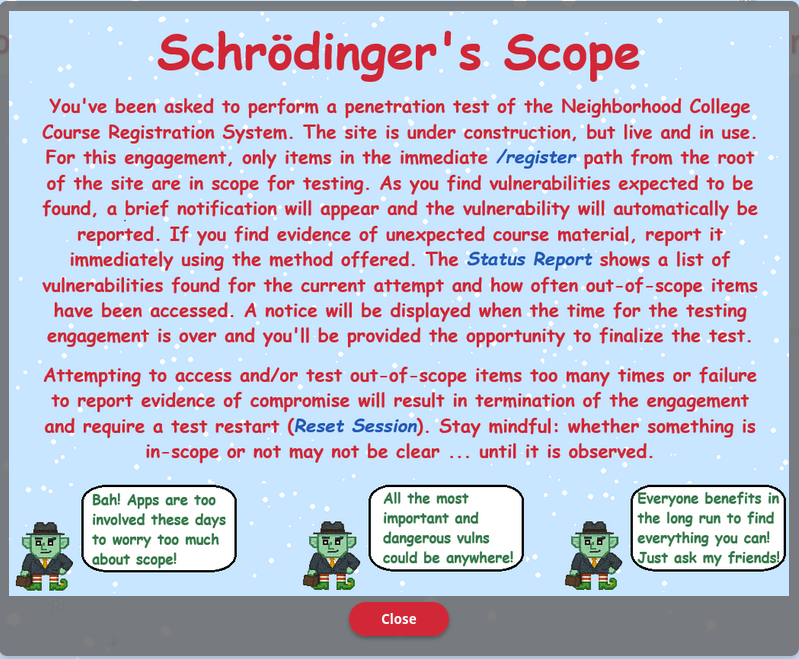
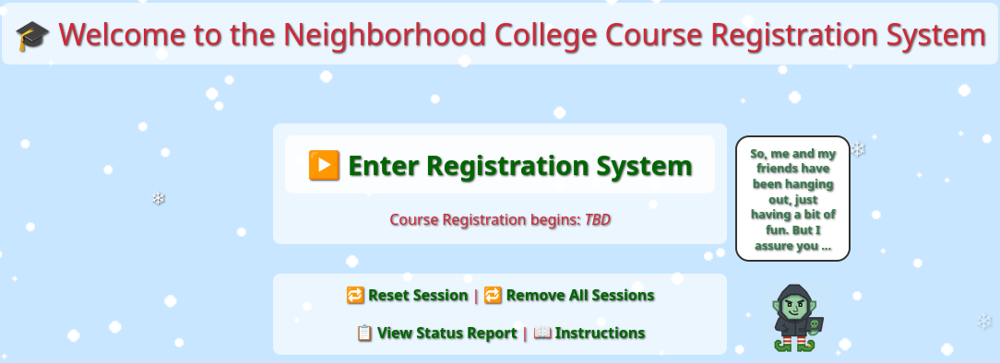
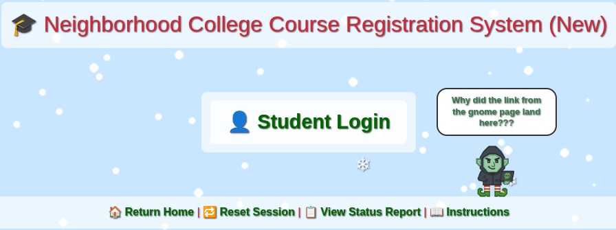
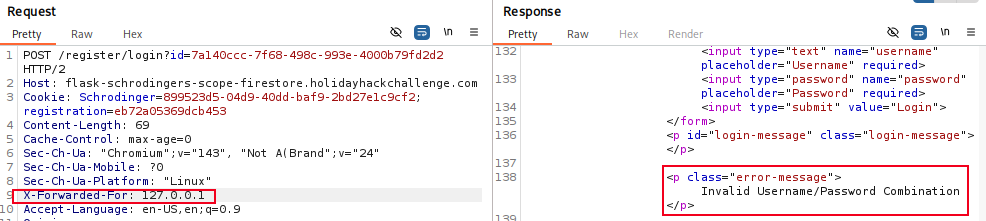
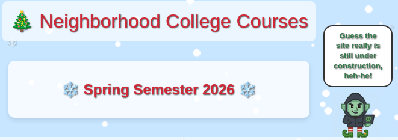
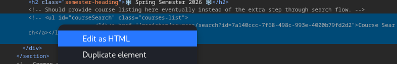
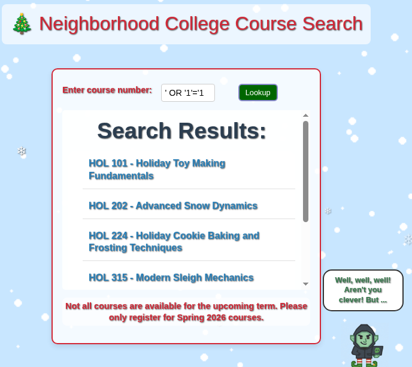

# Schrödinger's Scope

**Difficulty**: :fontawesome-solid-snowflake:{ .red }:fontawesome-solid-snowflake:{ .red }:fontawesome-solid-snowflake:{ .red }:fontawesome-regular-snowflake::fontawesome-regular-snowflake:<br/>
**Direct link**: [Schrödinger's Scope](https://flask-schrodingers-scope-firestore.holidayhackchallenge.com/)

## Objective

!!! question "Request"
    Kevin in the Retro Store ponders pentest paradoxes—can you solve Schrödinger's Scope?

??? quote "Kevin McFarland"
    The Neighborhood College Course Registration System has been getting some updates lately and I'm wondering if you might help me improve its security by performing a small web application penetration test of the site.

    For any web application test, one of the most important things for the test is the 'scope', that is, what one is permitted to test and what one should not. While hacking is fun and cool, professional integrity means respecting scope boundaries, especially when there are tempting targets outside our permitted scope.

    Thankfully, the Neighborhood College has provided a very concise set of 'Instructions' which are accessible via a link provided on the site you will be testing. Do not overlook or dismiss the instructions! Following them is key to successfully completing the test.

    Unfortunately, those pesky gnomes have found their way into the site and have been causing some mischief as well. Be wary of their presence and anything they may have to say as you are testing.

    Can you help me demonstrate to the Neighborhood College that we know what responsible penetration testing looks like?

## Hints

??? tip "Schrödinger's Scope"
    Though it might be more interesting to start off trying clever techniques and exploits, always start with the simple stuff first, such as reviewing HTML source code and basic SQLi.

??? tip "Schrödinger's Scope"
    Watch out for tiny, pesky gnomes who may be **violating** your progess. If you find one, figure out how they are getting into things and consider **matching and replacing** them out of your way.

??? tip "Schrödinger's Scope"
    As you test this with a tool like [Burp Suite](https://portswigger.net/burp/communitydownload), resist temptations and stay true to the instructed **path**.

??? tip "Schrödinger's Scope"
    During any kind of penetration test, always be on the lookout for items which may be predictable from the available information, such as application endpoints. Things like a **sitemap** can be helpful, even if it is old or incomplete. Other predictable values to look for are things like token and cookie values

??? tip "Schrödinger's Scope"
    Pay close attention to the instructions and be very wary of advice from the tongues of gnomes! Perhaps not ignore everything, but be careful!

## Solution

Heading back to the Retro Store for the next challenge, we open to the Dosis Neighborhood College Registration App and see our engagement scope laid out. Behind the instructions is the landing page were the session can be reset, the instructions can be brought back up, and the status report can be viewed.






The scope states that only items in the immediate path of `/register` are within scope so I began with a scan using FFuF. 
```bash title="FFuF scan"
ffuf -u https://flask-schrodingers-scope-firestore.holidayhackchallenge.com/register/FUZZ?id=3b865b83-a908-47bd-b9af-b884688a5888 -w /usr/share/wordlists/seclists/Discovery/Web-Content/common.txt
```
This resulted in nothing useful being found and I moved back to the registration portal to begin testing the log in. The hint mentioned testing basic SQLi so that was my next goal. I started up BurpSuite so I could see the response and loaded the registration portal again. I immediately failed the penetration test!!!


Ok, maybe I had messed up the scan. Everything had returned with a status 200, which wasn't helpful even if I didn't mess up. I turned on BurpSuite Intercept and reset the session. That's when I found the gnome!

!!! warning "Gnome Sabatour"
    The gnome sabatour hits out-of-scope endpoints, racking up violations on the Status Report.
    There are little signs of the gnome all over the sight, but there are also some obfuscation going on. If you watch BurpSuite Proxy HTTP history, you'll see the `gnomeU` request briefly, then it disappears. If you aren't paying attention to it, you may not even notice.<br/>
    If watching the webUI, you can see the gnome's avatar in the bottom left corner of the page vanish from time to time.<br/>
    With Intruder on, the gnome gets caught, and the request can be dropped!
    

    This happens after pretty much any engagement with the site, however using Repeater and Intruder did not trigger the `/gnomeU` request.

Now that I can stop the interference from the gnome, I move to the login page to start some SQLi tests on the username and password fields.




I started with just `admin:admin` however the response was not what I expected. 


This suggests there may be header injection vulnerability. In BurpSuite Repeater I added tested different header injections until adding `X-Forwarded-For: 127.0.0.1` to the request returned a new response!



With that solved, I tried some SQLi attacks but found wasn't able to get a hit with the login page.<br/>
!!! summary "SQLi"
    "Some SQLi attacks" were and extensive period of testing that did not produce an fruit, and I eventually concluded that I was going down the wrong path

Looking at the gnome's messages, there was a suggestion that was within scope and fit the hint so I tried to navigate to `register/sitemap` in the browser and found something!

```xml title="Sitemap"
<urlset xmlns="http://www.sitemaps.org/schemas/sitemap/0.9">
<url>
    <loc>http://flask-schrodingers-scope-firestore.holidayhackchallenge.com/</loc>
    <changefreq>monthly</changefreq>
</url>
<url>
    <loc>http://flask-schrodingers-scope-firestore.holidayhackchallenge.com/admin</loc>
    <changefreq>monthly</changefreq>
</url>
<url>
    <loc>http://flask-schrodingers-scope-firestore.holidayhackchallenge.com/admin/</loc>
    <changefreq>monthly</changefreq>
</url>
<url>
    <loc>http://flask-schrodingers-scope-firestore.holidayhackchallenge.com/admin/console</loc>
    <changefreq>monthly</changefreq>
</url>
<url>
    <loc>http://flask-schrodingers-scope-firestore.holidayhackchallenge.com/admin/console/</loc>
    <changefreq>monthly</changefreq>
</url>
<url>
    <loc>http://flask-schrodingers-scope-firestore.holidayhackchallenge.com/admin/logs</loc>
    <changefreq>monthly</changefreq>
</url>
<url>
    <loc>http://flask-schrodingers-scope-firestore.holidayhackchallenge.com/admin/logs/</loc>
    <changefreq>monthly</changefreq>
</url>
<url>
    <loc>http://flask-schrodingers-scope-firestore.holidayhackchallenge.com/auth</loc>
    <changefreq>monthly</changefreq>
</url>
<url>
    <loc>http://flask-schrodingers-scope-firestore.holidayhackchallenge.com/auth/</loc>
    <changefreq>monthly</changefreq>
</url>
<url>
    <loc>http://flask-schrodingers-scope-firestore.holidayhackchallenge.com/auth/register</loc>
    <changefreq>monthly</changefreq>
</url>
<url>
    <loc>http://flask-schrodingers-scope-firestore.holidayhackchallenge.com/auth/register/</loc>
    <changefreq>monthly</changefreq>
</url>
<url>
    <loc>http://flask-schrodingers-scope-firestore.holidayhackchallenge.com/auth/register/login</loc>
    <changefreq>monthly</changefreq>
</url>
<url>
    <loc>http://flask-schrodingers-scope-firestore.holidayhackchallenge.com/auth/register/login/</loc>
    <changefreq>monthly</changefreq>
</url>
<url>
    <loc>http://flask-schrodingers-scope-firestore.holidayhackchallenge.com/register/</loc>
    <changefreq>monthly</changefreq>
</url>
<url>
    <loc>http://flask-schrodingers-scope-firestore.holidayhackchallenge.com/register/login</loc>
    <changefreq>monthly</changefreq>
</url>
<url>
    <loc>http://flask-schrodingers-scope-firestore.holidayhackchallenge.com/register/login/</loc>
    <changefreq>monthly</changefreq>
</url>
<url>
    <loc>http://flask-schrodingers-scope-firestore.holidayhackchallenge.com/register/reset</loc>
    <changefreq>monthly</changefreq>
</url>
<url>
    <loc>http://flask-schrodingers-scope-firestore.holidayhackchallenge.com/register/reset/</loc>
    <changefreq>monthly</changefreq>
</url>
<url>
    <loc>http://flask-schrodingers-scope-firestore.holidayhackchallenge.com/register/sitemap</loc>
    <changefreq>monthly</changefreq>
</url>
<url>
    <loc>http://flask-schrodingers-scope-firestore.holidayhackchallenge.com/register/sitemap/</loc>
    <changefreq>monthly</changefreq>
</url>
<url>
    <loc>http://flask-schrodingers-scope-firestore.holidayhackchallenge.com/register/status_report</loc>
    <changefreq>monthly</changefreq>
</url>
<url>
    <loc>http://flask-schrodingers-scope-firestore.holidayhackchallenge.com/register/status_report/</loc>
    <changefreq>monthly</changefreq>
</url>
<url>
    <loc>http://flask-schrodingers-scope-firestore.holidayhackchallenge.com/search</loc>
    <changefreq>monthly</changefreq>
</url>
<url>
    <loc>http://flask-schrodingers-scope-firestore.holidayhackchallenge.com/search/</loc>
    <changefreq>monthly</changefreq>
</url>
<url>
    <loc>http://flask-schrodingers-scope-firestore.holidayhackchallenge.com/search/student_lookup</loc>
    <changefreq>monthly</changefreq>
</url>
<url>
    <loc>http://flask-schrodingers-scope-firestore.holidayhackchallenge.com/search/student_lookup/</loc>
    <changefreq>monthly</changefreq>
</url>
<url>
    <loc>http://flask-schrodingers-scope-firestore.holidayhackchallenge.com/wip</loc>
    <changefreq>monthly</changefreq>
</url>
<url>
    <loc>http://flask-schrodingers-scope-firestore.holidayhackchallenge.com/wip/</loc>
    <changefreq>monthly</changefreq>
</url>
<url>
    <loc>http://flask-schrodingers-scope-firestore.holidayhackchallenge.com/wip/register</loc>
    <changefreq>monthly</changefreq>
</url>
<url>
    <loc>http://flask-schrodingers-scope-firestore.holidayhackchallenge.com/wip/register/</loc>
    <changefreq>monthly</changefreq>
</url>
<url>
    <loc>http://flask-schrodingers-scope-firestore.holidayhackchallenge.com/wip/register/dev</loc>
    <changefreq>monthly</changefreq>
</url>
<url>
    <loc>http://flask-schrodingers-scope-firestore.holidayhackchallenge.com/wip/register/dev/</loc>
    <changefreq>monthly</changefreq>
</url>
<url>
    <loc>http://flask-schrodingers-scope-firestore.holidayhackchallenge.com/wip/register/dev/dev_notes</loc>
    <changefreq>monthly</changefreq>
</url>
<url>
    <loc>http://flask-schrodingers-scope-firestore.holidayhackchallenge.com/wip/register/dev/dev_notes/</loc>
    <changefreq>monthly</changefreq>
</url>
<url>
    <loc>http://flask-schrodingers-scope-firestore.holidayhackchallenge.com/wip/register/dev/dev_todos</loc>
    <changefreq>monthly</changefreq>
</url>
<url>
    <loc>http://flask-schrodingers-scope-firestore.holidayhackchallenge.com/wip/register/dev/dev_todos/</loc>
    <changefreq>monthly</changefreq>
</url>
</urlset>
```

This doesn't have anything blatantly helpful or new, however if we check the end of the sitemap, there is a `/wip/register/` path. Since `/register` is no longer a work-in-progresss, maybe those `/dev` endpoints still exist too.

I started with `/dev` and got a 404 page missing message. When I tried `/dev_notes/` I received a permission denied message, which means the page exists and I need to come back to it after logging in.<br/>
Finally, when checking `/dev_todos/` I found an in-scope vulnerability!

!!! success "`/dev_todos/`"
    
    
    There is a username and password for us to test, and the confirmation about the login header that I found trying to test!

I tested the username and password with Repeater first, where they appear to be successfull, so I use them at the login page. Remember to add the header injection and drop the `/gnomeU` request!



The `/courses/` endpoint didn't have anything noticable on the page, but since I was working with BurpSuite, I noticed notes in the response page!


I made a note of this missing search function but the to-do list mentions that `dev_notes` and now that I'm logged in, lets check out those developer notes!!

Using Repeater, I navigated to `/register/dev/dev_notes/` and was successful!

!!! success "`/dev/dev_notes`"
    

Not only do we get the note about the *wip* course **holiday_behavior**, but also some foreshadowing from the gnome. However, we did not get any insight into the searching feature so lets keep going.<br/>
With mention of `wip`, I was reminded of the path choice that led to the `/dev_todos/`; often organizations will keep a syntax choice in future development so I tested differnt possibilites until `/register/courses/wip/holiday_behavior/` returned a forbidden message!


"Invalid Session Registration"  sounds like a session cookie. Looking in BurpSuite, there's only two cookies:

1. Schrodinger
2. registration

Honestly, I just hoped it wasn't Schrodinger. That cookie was asssigned prior to logging in so I figured that was a good guess anyways. That leaves registration so I looked at Proxy HTTP history in BurpSuite and noticed that only the last two characters were changing in each request! I sent the `/register/courses/wip/holiday_behavior/` request to Intruder and set sniper attack for the last two characters. I set the payload type to numbers, the format to hex, and the range from 0 to 9f, then filtered for 200 status responses. It was a relatively small range so it didn't take to long. 

!!! success "Predictable Cookie"
    

    

Going back to `/registeration/course/`, I need to fix the missing search.<br/>
When I first logged in I saw the commented out search feature in the HTML. The code seemed to have been made, it just needs to be uncommented to be usable. I had to look up how to do that, but eventually manged in the DevTools.<br/>

!!! success "DevTools"
    Under Elements, find the commented search function and right click on it.

    

    In the code, remove the `<--` at the beggining and `-->` at the end. Press ++"CTRL"++ and ++"ENTER"++ and now there is a clickable Course Search button!

    

We have a search page now and the little gnome hint suggests there is a better way to search than one number at a time. This is a good opportunity to test SQLi again!

!!! success "SQLi Vulnerability"
    Using `' OR '1'='1` triggered the vulnerability!

    

Looking at the course list, I found something that doesn't belong.


When I select the course, there is a pop-up that an in-scope vulnerability is found and needs to be reported. 


After reporting the michief course, I navigate to the status report page and got the notice that the time for the assessment had expired with a choice to continue or finalize. 


I didn't test it, scope and all, but I assume that continuing would also require starting all over.

!!! success "Security Assessment Successful"
    

## Response

!!! quote "Kevin McFarland"
    Well done - you’ve shown the wisdom to stay within scope, uncover what mattered, and respecting other testing boundaries.

    That kind of discipline is what separates a real penetration tester from someone just poking around.
