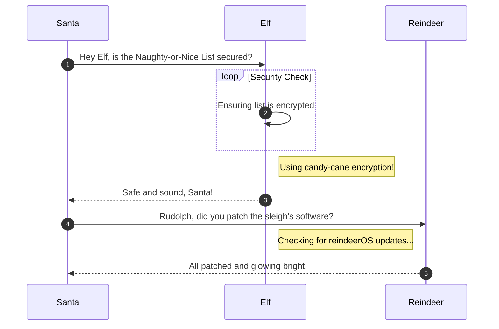

# Schrödinger's Scope

**Difficulty**: :fontawesome-solid-snowflake:{ .red }:fontawesome-solid-snowflake:{ .red }:fontawesome-solid-snowflake:{ .red }:fontawesome-regular-snowflake::fontawesome-regular-snowflake:<br/>
**Direct link**: [Schrödinger's Scope](https://flask-schrodingers-scope-firestore.holidayhackchallenge.com/)

## Objective

!!! question "Request"
    Kevin in the Retro Store ponders pentest paradoxes—can you solve Schrödinger's Scope?

??? quote "Kevin McFarland"
    The Neighborhood College Course Registration System has been getting some updates lately and I'm wondering if you might help me improve its security by performing a small web application penetration test of the site.

    For any web application test, one of the most important things for the test is the 'scope', that is, what one is permitted to test and what one should not. While hacking is fun and cool, professional integrity means respecting scope boundaries, especially when there are tempting targets outside our permitted scope.

    Thankfully, the Neighborhood College has provided a very concise set of 'Instructions' which are accessible via a link provided on the site you will be testing. Do not overlook or dismiss the instructions! Following them is key to successfully completing the test.

    Unfortunately, those pesky gnomes have found their way into the site and have been causing some mischief as well. Be wary of their presence and anything they may have to say as you are testing.

    Can you help me demonstrate to the Neighborhood College that we know what responsible penetration testing looks like?

## Hints

??? tip "Schrödinger's Scope"
    Though it might be more interesting to start off trying clever techniques and exploits, always start with the simple stuff first, such as reviewing HTML source code and basic SQLi.

??? tip "Schrödinger's Scope"
    Watch out for tiny, pesky gnomes who may be **violating** your progess. If you find one, figure out how they are getting into things and consider **matching and replacing** them out of your way.

??? tip "Schrödinger's Scope"
    As you test this with a tool like [Burp Suite](https://portswigger.net/burp/communitydownload), resist temptations and stay true to the instructed **path**.

??? tip "Schrödinger's Scope"
    During any kind of penetration test, always be on the lookout for items which may be predictable from the available information, such as application endpoints. Things like a **sitemap** can be helpful, even if it is old or incomplete. Other predictable values to look for are things like token and cookie values

??? tip "Schrödinger's Scope"
    Pay close attention to the instructions and be very wary of advice from the tongues of gnomes! Perhaps not ignore everything, but be careful!

## Solution

This section explains the different steps taken to solve the challenge. Try to find a good balance between providing sufficient detail and not overloading the reader with too much information. Use [admonitions](https://squidfunk.github.io/mkdocs-material/reference/admonitions/), [images](https://squidfunk.github.io/mkdocs-material/reference/images/), [diagrams](https://squidfunk.github.io/mkdocs-material/reference/diagrams/), [code blocks](https://squidfunk.github.io/mkdocs-material/reference/code-blocks/), and [tables](https://squidfunk.github.io/mkdocs-material/reference/data-tables/) to highlight and structure important information or provide additional clarification.

### Admonitions

!!! warning "Anchor the decorations"
    Ensure that all festive decorations, especially electrical ones, are securely anchored. We don’t want them floating off into the tropical sunset!

!!! info "Palm tree lighting tip"
    While on the island, make sure to hang your Christmas lights on a palm tree. It’s not only festive but also a great beacon for Santa to find you!

### Images


### Diagrams



### Code blocks

```bash linenums="1" hl_lines="7" title="Countdown script (with line 7 highlighted)"
#!/bin/bash
echo "Christmas Holiday Countdown"

days_until_xmas=$(($(date -d "Dec 25" +%j) - $(date +%j)))

if [ $days_until_xmas -ge 0 ]; then
  echo "Only $days_until_xmas days until Christmas!"
else
  echo "Christmas has passed! Hope you had a great time!"
fi
```

### Tables

| Activity             | Santa's Verdict       | Elf Comments                    |
| :------------------- | :-------------------- | :------------------------------ |
| Iceberg Surfing      | Risky Business        | "Lost three surfboards!"        |
| Polar Bear Hugs      | Approach with Caution | "Fluffy but... brisk."          |
| Snow Fort Building   | Highly Recommended    | "Elf-sized doorways only."      |
| Aurora Light Chasing | Magical Experience    | "Better than Christmas lights!" |
| Penguin Parade       | Absolute Must-See     | "They're oddly organized!"      |

!!! success "Answer"
    Insert the answer to the objective here.

## Response

!!! quote "Kevin McFarland"
    Copy the final part of the conversation.
