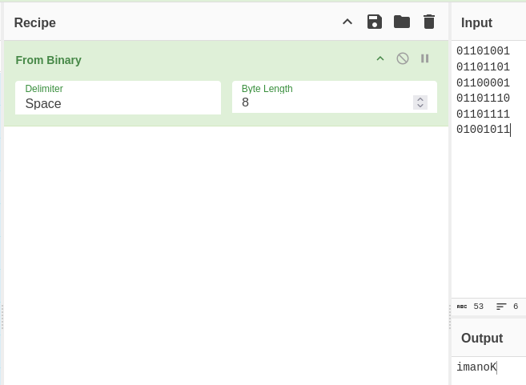
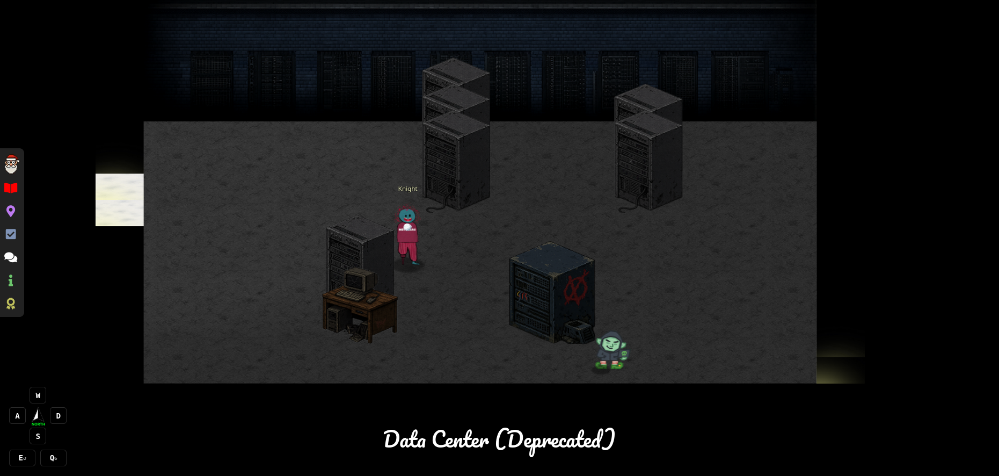
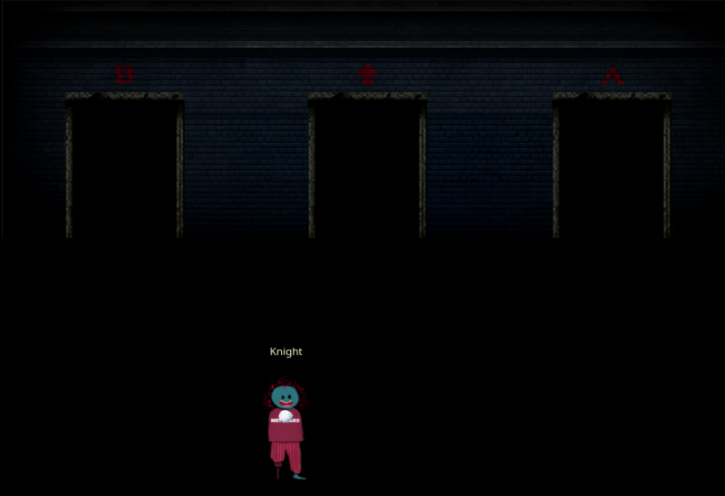
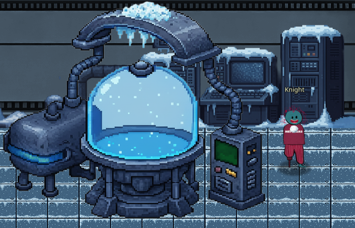

# Find and Shutdown Frosty's Snowglobe Machine

**Difficulty**::fontawesome-solid-snowflake:{ .red }:fontawesome-solid-snowflake:{ .red }:fontawesome-solid-snowflake:{ .red }:fontawesome-regular-snowflake::fontawesome-regular-snowflake: 

## Objective

!!! question "Request"
    You've heard murmurings around the city about a wise, elderly gnome having a change of heart. He must have information about where Frosty's Snowglobe Machine is. You should find and talk to the gnome so you can get some help with how to make your way through the Data Center's labrynthian halls.

    Once you find the Snowglobe Machine, figure out how to shut it down and melt Frosty's cold, nefarious plans.

??? quote "Elder Gnome"
    A change of heart, I have had, yes. Among the gnomes plotting to freeze the neighborhood, I once was. Wrong, we are. Help you now, I shall.

    The route to the old secret lab inside the Data Center, begins on the far East wing inside the building, it does. Pitch dark, the hallways leading to it probably are, hmm.

    A code outside the building, the employees who once worked there left, yes. A reminder of the route, it serves. Search in the vicinity of the Data Center for this code, perhaps you can.

    A story I recall, yes. Another computer person like yourself, ten years ago there was. Lost inside the Data Center, an intern had become. Found, they were, by this person. But before the reconstruction, that was. Exactly the same, the current route likely is not, hmm.

    Search for the Data Center's past in the historical archives of the Internet, you should. More information helpful to you, may be found there, yes.

## Hints

??? tip "A Code in the Dark, You Must Find"
    The Elder Gnome said the route to the old secret lab inside the Data Center starts on the far East wing inside the building, and that the hallways leading to it are probably pitch dark. He also said the employees that used to work there left some kind of code outside the building as a reminder of the route. Perhaps you can search in the vicinity of the Data Center for this code.

??? tip "Backwards, You Should Look"
    The Elder also recalled a story of another "computer person" like yourself who managed to find an intern that got lost inside the Data Center about 10 years ago. But that was before the reconstruction, so the current route likely isn't exactly the same. Maybe you can search for the Data Center's past in the historical archives that is the Internet for more information that may be helpful.

## Solution

Following the elder gnome's story, I walked around the building of the old datacenter. When I saw the dark and light bricks on the south side, I used CyberChef to test if they were binary.

I recorded from top to bottom, left to right, which decoded to 'imanoK'. When reversed and put into a search, I found out about the Konami code, which I have known most of my life but never knew had a name! According to a quick [wikipedia read](https://en.wikipedia.org/wiki/Konami_Code), the classic Konami code developed in the the mid '80s, was ↑↑↓↓←→←→BA. 

With clue in hand, it's time to tackle the data center.

The first door is easy enough to find and I take the same path to the elevator that was taken for the earler data center challenge. Once I pass through the second door beyond the elevator, the screen is just black for a bit. 

It takes a little fumbling around, but keep moving in one direction until you can't go anyfuther, then go a different direction, but not backwards. Eventually I approach three doors, one with a B, one with an arrow ↑, and an A. 

Once through the door, I'm presented with 12 choices, all with the same B, ↑, A pattern

I assume that going backwards from the start is out, so I'm down to 9 choices. When you go through the wrong door, the maze deposits you outside the data center and you have to start all over again. I spent an inordinate amount of time treating it like a Boolean brute-force challenge. I recorded which direction I went using the compass in the bottom of the screen. I tried to stick to Konami pattern, which drug things out even longer. Eventually, I thought that the code on the wall being backwards was intentional and tried to reverse the Konami code after the first arrow. 

!!! success "imanoK code"
    N arrow; N A; N B; E arrow; W arrow; E arrow; W arrow; S arrow; S arrow; N arrow; N arrow
    

## Response

!!! quote "Frosty"
    Every spring, I melt away. Every year, I fade into nothing while the world moves on without me. But not this time... not anymore.

    The magic in this old silk hat - the same magic that brought me to life - I discovered it could do so much more. It awakened the Gnomes, gave them purpose, gave them MY purpose.

    Refrigerate the entire neighborhood, that's the plan. Keep it frozen, keep it cold. If winter never ends here, then neither do I. No more melting, no more disappearing, no more being forgotten until the next snowfall.

    The Gnomes have been gathering coolants, refrigerator parts, everything we need. Soon the Dosis Neighborhood will be a frozen paradise - MY frozen paradise. And I'll finally be permanent, just like Santa, just like all the other holiday icons who don't have to fear the sun.
