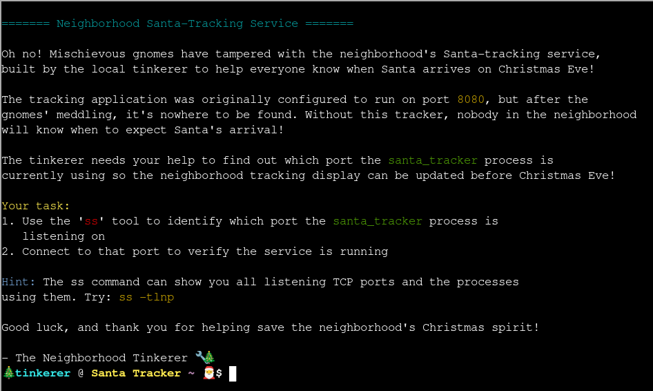
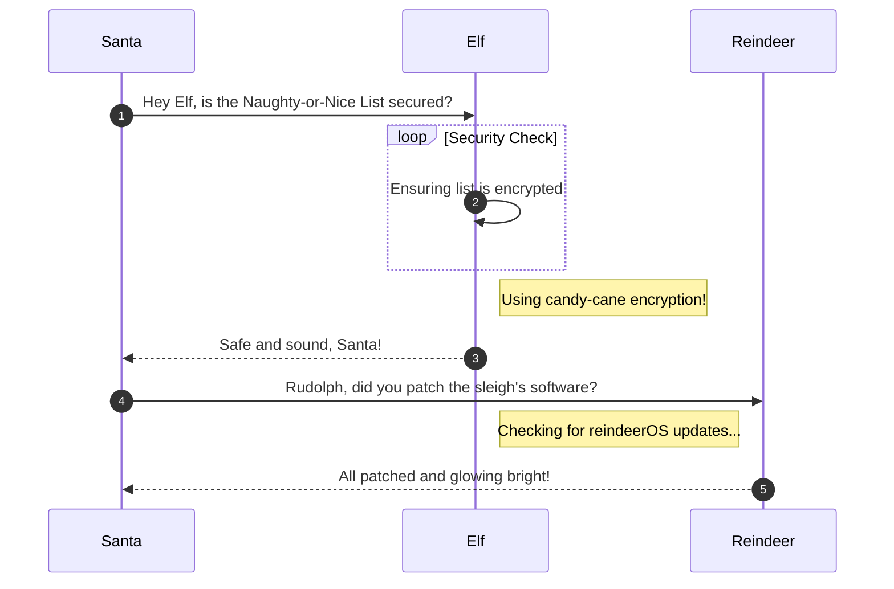

# On the Wire

**Difficulty**: :fontawesome-solid-snowflake:{ .red }:fontawesome-solid-snowflake:{ .red }:fontawesome-solid-snowflake:{ .red }:fontawesome-solid-snowflake:{ .red }:fontawesome-regular-snowflake:<br/>
**Direct link**: [Objective 4 website](https://.../)

## Objective

!!! question "Request"
    Help Evan next to city hall hack this gnome and retrieve the temperature value reported by the I²C device at address 0x3C. The temperature data is XOR-encrypted, so you’ll need to work through each communication stage to uncover the necessary keys. Start with the unencrypted data being transmitted over the 1-wire protocol.

??? quote "Evan"
    So here's the deal - there are some seriously bizarre signals floating around this area.

    Not your typical radio chatter or WiFi noise, but something... different.

    I've been trying to make sense of the patterns, but it's like trying to build a robot hand out of a coffee maker - you need the right approach.

    Think you can help me decode whatever weirdness is being transmitted out there?

    You know what happens to electronics in extreme cold? They fail. All my builds, all my robots, all my weird coffee-maker contraptions—frozen solid. We can't let Frosty turn this place into a permanent deep freeze.

## Hints

??? tip "Protocols"
    **Key concept - Clock vs. Data signals:**

    - Some protocols have separate clock and data lines (like SPI and I2C)
    - For clocked protocols, you need to sample the data line at specific moments defined by the clock
    - The clock signal tells you when to read the data signal

    **For 1-Wire (no separate clock):**

    - Information is encoded in pulse widths (how long the signal stays low or high)
    - Different pulse widths represent different bit values
    - Look for patterns in the timing between transitions

    **For SPI and I2C:**

    - Identify which line is the clock (SCL for I2C, SCK for SPI)
    - Data is typically valid/stable when the clock is in a specific state (high or low)
    - You need to detect clock edges (transitions) and sample data at those moments

    **Technical approach:**

    - Sort frames by timestamp
    - Detect rising edges (0→1) and falling edges (1→0) on the clock line
    - Sample the data line's value at each clock edge

??? tip "On Rails"
    **Stage-by-stage approach**

    *Stage 1*

    1. Connect to the captured wire files or endpoints for the relevant wires.
    2. Collect all frames for the transmission (buffer until inactivity or loop boundary).
    3. Identify protocol from wire names (e.g., `dq` → 1-Wire; `mosi`/`sck` → SPI; `sda`/`scl` → I²C).
    4. Decode the raw signal:
        
        - Pulse-width protocols: locate falling→rising transitions and measure low-pulse width.
        - Clocked protocols: detect clock edges and sample the data line at the specified sampling phase. 
    5. Assemble bits into bytes taking the correct bit order (LSB vs MSB).
    6. Convert bytes to text (printable ASCII or hex as appropriate).
    7. Extract information from the decoded output — it contains the XOR key or other hints for the next stage.
    
    *Stage 2*

    1. Repeat Stage 1 decoding to recover raw bytes (they will appear random).
    2. Apply XOR decryption using the key obtained from the previous stage.
    3. Inspect decrypted output for next-stage keys or target device information.

        - Multiple 7-bit device addresses share the same SDA/SCL lines.
        - START condition: SDA falls while SCL is high. STOP: SDA rises while SCL is high.
        - First byte of a transaction = (7-bit address << 1) | R/W. Extract address with `address = first_byte >> 1`.
        - Identify and decode every device’s transactions; decrypt only the target device’s payload.

        - Print bytes in hex and as ASCII (if printable) — hex patterns reveal structure.
        - Check printable ASCII range (0x20–0x7E) to spot valid text.
        - Verify endianness: swapping LSB/MSB will quickly break readable text.
        - For XOR keys, test short candidate keys and look for common English words.
        - If you connect mid-broadcast, wait for the next loop or detect a reset/loop marker before decoding.

        - Buffering heuristic: treat the stream complete after a short inactivity window (e.g., 500 ms) or after a full broadcast loop.
        - Sort frames by timestamp per wire and collapse consecutive identical levels before decoding to align with the physical waveform.

## Solution

This section explains the different steps taken to solve the challenge. Try to find a good balance between providing sufficient detail and not overloading the reader with too much information. Use [admonitions](https://squidfunk.github.io/mkdocs-material/reference/admonitions/), [images](https://squidfunk.github.io/mkdocs-material/reference/images/), [diagrams](https://squidfunk.github.io/mkdocs-material/reference/diagrams/), [code blocks](https://squidfunk.github.io/mkdocs-material/reference/code-blocks/), and [tables](https://squidfunk.github.io/mkdocs-material/reference/data-tables/) to highlight and structure important information or provide additional clarification.

### Admonitions

!!! warning "Anchor the decorations"
    Ensure that all festive decorations, especially electrical ones, are securely anchored. We don’t want them floating off into the tropical sunset!

!!! info "Palm tree lighting tip"
    While on the island, make sure to hang your Christmas lights on a palm tree. It’s not only festive but also a great beacon for Santa to find you!

### Images



### Diagrams



### Code blocks

```bash linenums="1" hl_lines="7" title="Countdown script (with line 7 highlighted)"
#!/bin/bash
echo "Christmas Holiday Countdown"

days_until_xmas=$(($(date -d "Dec 25" +%j) - $(date +%j)))

if [ $days_until_xmas -ge 0 ]; then
  echo "Only $days_until_xmas days until Christmas!"
else
  echo "Christmas has passed! Hope you had a great time!"
fi
```

### Tables

| Activity             | Santa's Verdict       | Elf Comments                    |
| :------------------- | :-------------------- | :------------------------------ |
| Iceberg Surfing      | Risky Business        | "Lost three surfboards!"        |
| Polar Bear Hugs      | Approach with Caution | "Fluffy but... brisk."          |
| Snow Fort Building   | Highly Recommended    | "Elf-sized doorways only."      |
| Aurora Light Chasing | Magical Experience    | "Better than Christmas lights!" |
| Penguin Parade       | Absolute Must-See     | "They're oddly organized!"      |

!!! success "Answer"
    Insert the answer to the objective here.

## Response

!!! quote "Evan Booth"
    Outstanding! You've successfully built the path to victory - remember, if you're not failing somewhere, adjust your difficulty settings for next year!
