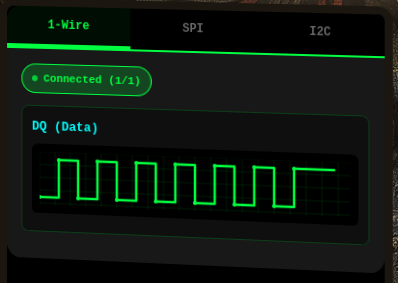
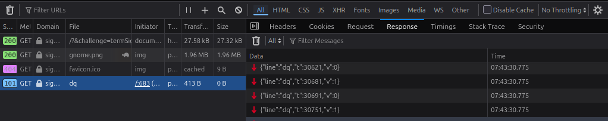
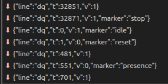
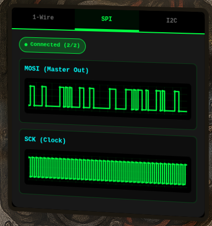
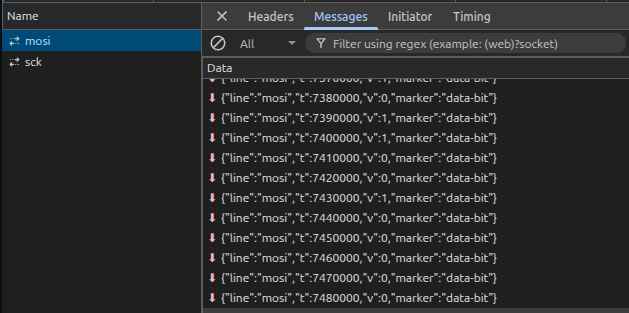
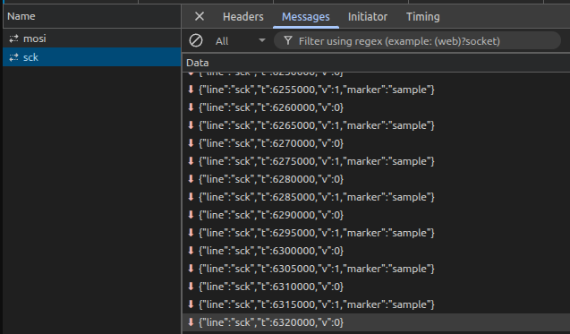
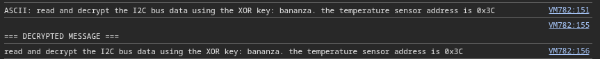

# On the Wire

**Difficulty**: :fontawesome-solid-snowflake:{ .red }:fontawesome-solid-snowflake:{ .red }:fontawesome-solid-snowflake:{ .red }:fontawesome-solid-snowflake:{ .red }:fontawesome-regular-snowflake:<br/>
**Direct link**: [On the Wire](https://signals.holidayhackchallenge.com/)

## Objective

!!! question "Request"
    Help Evan next to city hall hack this gnome and retrieve the temperature value reported by the I²C device at address 0x3C. The temperature data is XOR-encrypted, so you’ll need to work through each communication stage to uncover the necessary keys. Start with the unencrypted data being transmitted over the 1-wire protocol.

??? quote "Evan"
    So here's the deal - there are some seriously bizarre signals floating around this area.

    Not your typical radio chatter or WiFi noise, but something... different.

    I've been trying to make sense of the patterns, but it's like trying to build a robot hand out of a coffee maker - you need the right approach.

    Think you can help me decode whatever weirdness is being transmitted out there?

    You know what happens to electronics in extreme cold? They fail. All my builds, all my robots, all my weird coffee-maker contraptions—frozen solid. We can't let Frosty turn this place into a permanent deep freeze.

## Hints

??? tip "Protocols"
    **Key concept - Clock vs. Data signals:**

    - Some protocols have separate clock and data lines (like SPI and I2C)
    - For clocked protocols, you need to sample the data line at specific moments defined by the clock
    - The clock signal tells you when to read the data signal

    **For 1-Wire (no separate clock):**

    - Information is encoded in pulse widths (how long the signal stays low or high)
    - Different pulse widths represent different bit values
    - Look for patterns in the timing between transitions

    **For SPI and I2C:**

    - Identify which line is the clock (SCL for I2C, SCK for SPI)
    - Data is typically valid/stable when the clock is in a specific state (high or low)
    - You need to detect clock edges (transitions) and sample data at those moments

    **Technical approach:**

    - Sort frames by timestamp
    - Detect rising edges (0→1) and falling edges (1→0) on the clock line
    - Sample the data line's value at each clock edge

??? tip "On Rails"
    **Stage-by-stage approach**

    *Stage 1*

    1. Connect to the captured wire files or endpoints for the relevant wires.
    2. Collect all frames for the transmission (buffer until inactivity or loop boundary).
    3. Identify protocol from wire names (e.g., `dq` → 1-Wire; `mosi`/`sck` → SPI; `sda`/`scl` → I²C).
    4. Decode the raw signal:
        
        - Pulse-width protocols: locate falling→rising transitions and measure low-pulse width.
        - Clocked protocols: detect clock edges and sample the data line at the specified sampling phase. 
    5. Assemble bits into bytes taking the correct bit order (LSB vs MSB).
    6. Convert bytes to text (printable ASCII or hex as appropriate).
    7. Extract information from the decoded output — it contains the XOR key or other hints for the next stage.
    
    *Stage 2*

    1. Repeat Stage 1 decoding to recover raw bytes (they will appear random).
    2. Apply XOR decryption using the key obtained from the previous stage.
    3. Inspect decrypted output for next-stage keys or target device information.

        - Multiple 7-bit device addresses share the same SDA/SCL lines.
        - START condition: SDA falls while SCL is high. STOP: SDA rises while SCL is high.
        - First byte of a transaction = (7-bit address << 1) | R/W. Extract address with `address = first_byte >> 1`.
        - Identify and decode every device’s transactions; decrypt only the target device’s payload.<br/>
        <br/>
        - Print bytes in hex and as ASCII (if printable) — hex patterns reveal structure.
        - Check printable ASCII range (0x20–0x7E) to spot valid text.
        - Verify endianness: swapping LSB/MSB will quickly break readable text.
        - For XOR keys, test short candidate keys and look for common English words.
        - If you connect mid-broadcast, wait for the next loop or detect a reset/loop marker before decoding.
        <br/>
        - Buffering heuristic: treat the stream complete after a short inactivity window (e.g., 500 ms) or after a full broadcast loop.
        - Sort frames by timestamp per wire and collapse consecutive identical levels before decoding to align with the physical waveform.

## Solution


The challenge opens with the gnome above. There is a signal dispaly along with three selections, 1-Wire, SPI, and I2C that can be switched between to see a visual display of the signals. When hovering over the signal display, it is also possible to zoom in.



This challenge has three stages: [1-Wire](#stage-1-1-wire-protocol-decode), [SPI](#stage-2-spi-protocol-decode), and [I²C](#stage-3-i2c-protocol-decoding)

### Stage 1: 1 Wire Protocol Decode

When we open Developer Tools and check the network tab, we see 1-wire communications. 



The wire name `dq` identifies the protocol as 1-wire. Inspecting further by opening the **Messages** tab we can see the JSON messages:

```json title="1-wire"
{line: "dq", t: 30347, v: 1}
```

- `t`: timestamp in microseconds
- `v`: voltage level (0=low, 1=high)


Looking at the messages can reveal a few key points:



- Reset pulse at t=1 with marker "reset"
- Presence pulse follows reset
- Data transmission begins after presence pulse. 

#### Decoding Process

I used this [java script](../artifacts/objectives/o24/decode) by pasting it in the browser console. After pasting the script in the browser console, allow it to collect for a cycle, then call the `decoder.decode()` function.

1. Sort all frames by timestamp
2. Identify falling edges (voltage 1->0)
3. Measure the duration of low pulses (time until next rising edge)
4. Classify pulses:

    - < 15µs = bit `1`
    - 15-100 µs = bit `0`
    - \> 400 µs = reset pulse (skip)

5. Assemble bits into bytes (LSB first)
6. Convert bytes to ASCII text

!!! success "1-Wire Message"
    

    The message gives us the XOR key for decrypting the SPI data!

### Stage 2: SPI Protocol Decode



Start with recon. Switch the bot to SPI and then get the Network information from the DevTools. We can see `mosi` and `sck`




#### Decoding Process

1. Sort MOSI and SCK frames by timestamp
2. Detect clock edges on SCK line:

    - Try rising edges first (0→1 transition)
    - If no valid data, try falling edges (1→0 transition)

3. For each clock edge:

    - Sample the MOSI value at that timestamp
    - Record the bit value

4. Assemble bits into bytes (MSB first for SPI)
5. Apply XOR decryption with key `icy`

!!! success "SPI Decoded"
    This [script](../artifacts/objectives/o24/decrypt-spi) was used to capture and decrypt the `spi` messages with the provided XOR key.

    

    That gave us the next key and target!

### Stage 3: I2C Protocol Decoding

This final stage is more in depth, but starts the same way with recon. 


The WebSocket connections connect to `sda`, which is the data line, and `scl` which is the clock line. There is also a lot more data than Stage [1](#stage-1-1-wire-protocol-decode) or [2](#stage-2-spi-protocol-decode). There are also multiple devices communication on the same bus.

#### Decoding Process

1. Sort SDA and SCL frames by timestamp
2. Detect START conditions:
    - SDA transition 1→0 while SCL is high
3. Detect STOP conditions:
    - SDA transition 0→1 while SCL is high
4. For each transaction (START to STOP):
    - Sample SDA on SCL rising edges
    - First 8 bits = address byte
    - Extract 7-bit address: `address = address_byte >> 1`
    - Remaining bits = data bytes (8 bits + 1 ACK, repeating)
5. Filter transactions for address `0x3C`
6. Collect all data bytes from target device
7. Apply XOR decryption with key `bananza`

The key challenge to this for decoding this was filtering correctly due to the multiple devices (ox48, 0x50, *0x3C*). Once that was figured out, I was able to use the JavaScript [decoder](../artifacts/objectives/o24/decode-i2c) with START/STOP detection and address filtering.

!!! success "I2C Results"
    ```javascript title="I2C Decoded"
    SDA frames: 15633
    VM1142:46 SCL frames: 27555
    VM1142:56 
    === SCANNING FOR I²C TRANSACTIONS ===
    VM1142:70 START at t=2000
    VM1142:70 START at t=410000
    VM1142:70 START at t=998000
    VM1142:70 START at t=1856000
    VM1142:94 
    Processing transaction from t=2000 to t=410000
    VM1142:133   Decoded 37 bits
    VM1142:149   Address: 0x48 (byte: 0x90), Write
    VM1142:164   Data (3 bytes): 0x56 0x54 0x4b
    VM1142:94 
    Processing transaction from t=410000 to t=998000
    VM1142:133   Decoded 55 bits
    VM1142:149   Address: 0x3C (byte: 0x78), Write
    VM1142:164   Data (5 bytes): 0x51 0x53 0x40 0x59 0x5a
    VM1142:94 
    Processing transaction from t=998000 to t=1856000
    VM1142:133   Decoded 82 bits
    VM1142:149   Address: 0x51 (byte: 0xa2), Write
    VM1142:164   Data (8 bytes): 0x53 0x51 0x5f 0x52 0x4e 0x12 0x31 0x03
    VM1142:94 
    Processing transaction from t=1856000 to t=2856000
    VM1142:133   Decoded 73 bits
    VM1142:149   Address: 0x29 (byte: 0x52), Write
    VM1142:164   Data (7 bytes): 0x56 0x54 0x5e 0x41 0x02 0x0f 0x19
    VM1142:102 
    Found 4 valid transactions
    VM1142:176 
    === FILTERING FOR DEVICE 0x3C ===
    VM1142:192 Found 1 transactions for target device 0x3C
    VM1142:197 
    Transaction 1:
    VM1142:198   Type: Write
    VM1142:199   Data: 0x51 0x53 0x40 0x59 0x5a
    VM1142:208 
    === XOR DECRYPTION ===
    VM1142:209 Total encrypted bytes: 5
    VM1142:210 Encrypted data: 0x51 0x53 0x40 0x59 0x5a
    VM1142:211 Using XOR key: "bananza"
    VM1142:214 Key bytes: 0x62 0x61 0x6e 0x61 0x6e 0x7a 0x61
    VM1142:223 
    === DECRYPTED DATA ===
    VM1142:224 Hex: 0x33 0x32 0x2e 0x38 0x34
    VM1142:225 Dec: 51 50 46 56 52
    VM1142:228 ASCII: 32.84
    VM1142:231 
    DECRYPTED MESSAGE:
    VM1142:232 32.84
    VM1142:235 
    TEMPERATURE DATA:
    VM1142:245 Temperature (from text): 32.84
    VM1142:252 16-bit big-endian: 13106
    VM1142:253 16-bit little-endian: 12851
    VM1142:257 First byte as integer: 51
    VM1142:264 16-bit big-endian (signed): 13106
    ```

## Response

!!! quote "Evan Booth"
    Outstanding! You've successfully built the path to victory - remember, if you're not failing somewhere, adjust your difficulty settings for next year!
