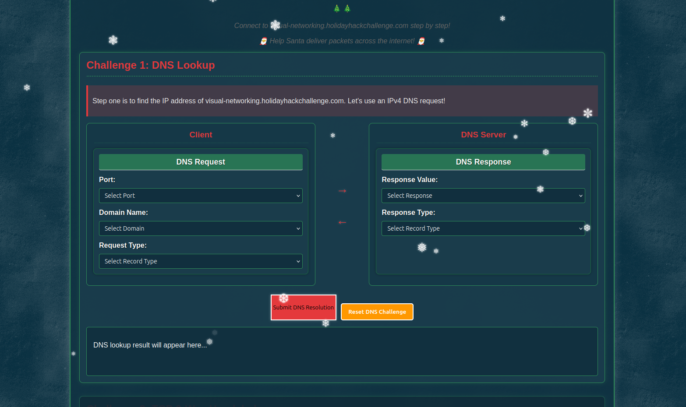
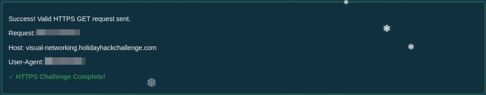

# Visual Networking Thinger

**Difficulty**: :fontawesome-solid-snowflake:{ .red }:fontawesome-regular-snowflake::fontawesome-regular-snowflake::fontawesome-regular-snowflake::fontawesome-regular-snowflake: 
**Direct link**: [Objective5.zip](https://visual-networking.holidayhackchallenge.com)

## Objective

!!! question "Request"
    Skate over to Jared at the frozen pond for some network magic and learn the ropes by the hockey rink.

??? quote "Jared Folkins"
    Santa's got the right idea about giving, and I'm excited to give you a fantastic way to learn networking fundamentals!

    This interactive visualization I've created shows you exactly how packets travel, how protocols work, and why networks behave the way they do.

    It's way better than staring at boring textbooks - you can actually see what's happening!

    Want to dive into some hands-on network exploration?

## Hints

??? tip "Visual Firewall Thinger"
    This terminal has built-in hints!

## Solution

This challenge is an interactive walkthrough. I'll include some screenshots but encourage any readers to use the link above to get your own hands on experience.

### Challenge 1: DNS Lookup

/// caption
Find the IP address
///

We start with DNS lookup, one side representing the Client request with **Port**, **Domain Name**, & **Request Type** drop downs on one side and the other side having the response from the DNS Server containing the drop downs **Response Value** and **Response Type**.

#### Client DNS Request

##### Port Optons:
 - 21
 - 53
 - 69
 - 123

##### Domain Name Options:
 - http://visual-networking.holidayhackchallenge.com
 - visual-networking.holidayhackchallenge.com
 - CNAME holidayhackchallenge.com/

##### Request Type Options:
 - A
 - AAAA
 - TXT
 - MX

#### DNS Server DNS Response

##### Response Value Options:
 - 34.160.145.134
 - https://visual-networking.holidayhackchallenge.com/
 - 2604:7090:483d:e500:5be1:c40f:c36b:5574

##### Response Type Options:
 - A
 - AAAA
 - TXT
 - MX

!!! success
    
    /// caption
    Select the correct options and click Submit DNS Resolution
    ///

### Challenge 2: TCP 3-Way Handshake

Submitting the DNS Resolution answer unlocks the next challenge, a drag-and-drop visual representation of a TCP 3-way handshake. 

The TCP flags avaliable are **URG**, **ACK**, **PUSH**, **RST**, **SYN**, & **FIN**. Drag the correct flag(s) to their respective field to unlock the next challenge.

!!! success
    

### Challenge 3: HTTP GET Request

Challenge 3 is similar to [Challenge 1](#challenge-1-dns-lookup)'s layout with drop down option on the client side.

#### Client Request

##### HTTP Verb:
 - DELETE
 - GET
 - HEAD
 - OPTIONS
 - POST
 - PUT

##### HTTP Version:
 - HTTP/1.0
 - HTTP/1.1
 - HTTP/2

##### Host:

The host is already filled in

##### User-Agent:

The User-Agent must be entered manually

/// caption
Unlock Challange 4
///

### Challenge 4: TLS Handshake

Challenge 4 presents another drag-and-drop interface where a TLS handshake is put together to establish a secure connection.

!!! success
    

### Challenge 5: HTTPS GET Request

The final challenge is a set of drop downs just like [Challenge 3](#challenge-3-http-get-request). 

#### Client HTTPS Request

##### HTTP Verb:
 - DELETE
 - GET
 - HEAD
 - OPTIONS
 - POST
 - PUT

##### HTTP Version:
 - HTTP/1.0
 - HTTP/1.1
 - HTTP/2

!!! success
    

## Success

!!! success "Victory"
    

## Response

!!! quote "Jared Folkins"
    Wonderful! You've mastered those networking basics beautifully.

    Now you can see how all the pieces of the network puzzle fit together - it's truly better to give knowledge than to keep it to yourself!
