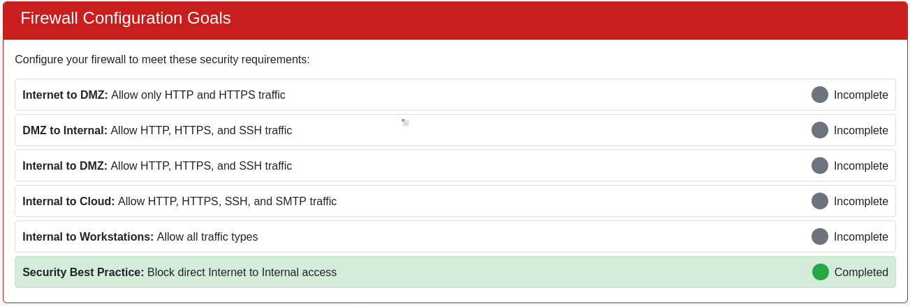
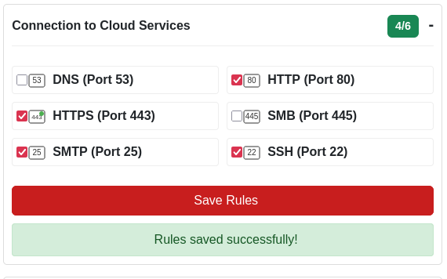
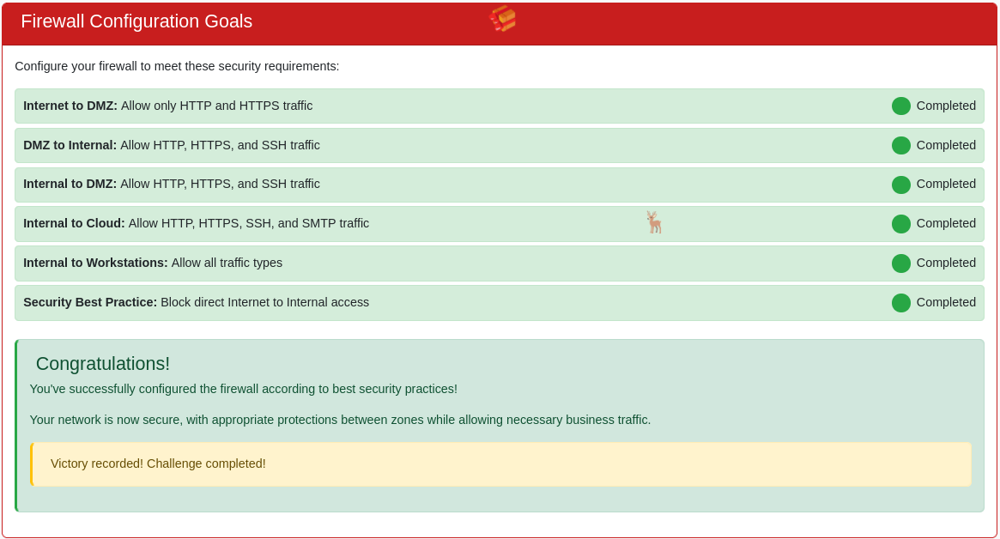

# Visual Firewall Thinger

**Difficulty**: :fontawesome-solid-snowflake:{ .red }:fontawesome-regular-snowflake::fontawesome-regular-snowflake::fontawesome-regular-snowflake::fontawesome-regular-snowflake: 

## Objective

!!! question "Request"
    Find Elgee in the big hotel for a firewall frolic and some techy fun.

??? quote "Chris Elgee"
    Welcome to my little corner of network security! *finger guns*

    I've whipped up something sweeter than my favorite whoopie pie - an interactive firewall simulator that'll teach you more in ten minutes than most textbooks do in ten chapters.

    Don't worry about breaking anything; that's half the fun of learning!

    Ready to dig in?

## Hints

??? tip "Visual Firewall Thinger"
    This terminal has built-in hints!

## Solution

This challenge is similar to the [Visual Networking Thinger](./o5.md) challenge, but focused on the firewall aspect of network security with an interactive firewall simulator. 

/// caption 
The goals and their status are listed on the landing page
///

Below the goals is the interactive network map:

If you are unfamiliar with firewalls or just need a refresher, you can select the **Learn** button at the top of the page for a crash course.

### Internet to DMZ

When clicking on the "Internet" icon, we are presented with 6  options, rules for the firewall, that we need to make and save based on the goals. 
The **Internet to DMZ** goal wants us to Allow HTTP and HTTPS traffic. 

### DMZ to Internal

Click on the DMZ icon to set the firewall rules for the DMZ to Internal network. Looking at the goals, we can see that we need to allow HTTP, HTTPS, and SSH.

### Internal

#### To Cloud

Working our way down the list of goals, we need to allow HTTP, HTTPS, SSH, and SMTP traffic:

#### To Workstations

Finally, we need to allow all traffic to workstations:

!!! success
    
    This simulator quickly and easily illustrates the levels of increasingly laxed rules, the further into a network one moves, as well as the value of layers of protection a firewall provides.

## Response

!!! quote "Chris Elgee"
    *finger guns* Nice work! You've mastered those firewall fundamentals like a true network security pro.

    Now that was way more fun than sitting through another boring lecture, wasn't it?