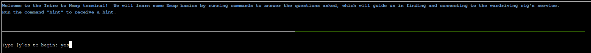
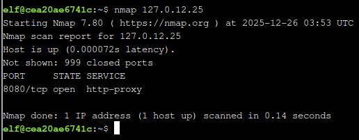
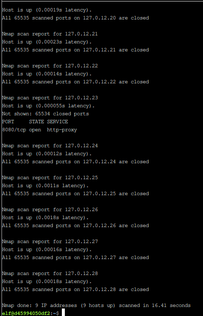
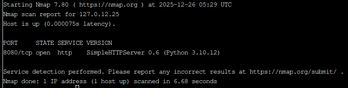

# Intro to Nmap

**Difficulty**: :fontawesome-solid-snowflake:{ .red }:fontawesome-regular-snowflake::fontawesome-regular-snowflake::fontawesome-regular-snowflake::fontawesome-regular-snowflake: 

## Objective

!!! question "Request"
    Meet Eric in the hotel parking lot for Nmap know-how and scanning secrets. Help him connect to the wardriving rig on his motorcycle!

??? quote "Eric Pursley"
    Speaking of tools, let me introduce you to one of the most essential weapons in any pentester's arsenal: Nmap.

    It's like having X-ray vision for networks, and I've set up a perfect environment for you to learn the fundamentals.

    Help me find and connect to the wardriving rig's service on my motorcycle!

## Hints

??? tip "Ncat Documentation"
    You may also want to check out the [Ncat Guide](https://nmap.org/ncat/guide/).

??? tip "Nmap Documentation"
    Nmap is pretty straightforward to use for basic port scans. Check out its [documentation](https://nmap.org/book/man.html)!

## Solution

This challenge starts with a terminal prompt guiding us to find and connect to the wardriving rig. We can start by typing 'yes'. 

1) When run without any options, nmap performs a TCP port scan of the top 1000 ports. Run a default nmap scan of 127.0.12.25 and see which port is open.

2) Sometimes the top 1000 ports are not enough. Run an nmap scan of all TCP ports on 127.0.12.25 and see which port is open.

3) Nmap can also scan a range of IP addresses.  Scan the range 127.0.12.20 - 127.0.12.28 and see which has a port open.

4) Nmap has a version detection engine, to help determine what services are running on a given port. What service is running on 127.0.12.25 TCP port 8080?

5) Sometimes you just want to interact with a port, which is a perfect job for Ncat!  Use the ncat tool to connect to TCP port 24601 on 127.0.12.25 and view the banner returned.

!!! success
    If you are not already familiar with the tools `nmap` and `nc`, open the documentation and read through it as you go through the questions. 

## Response

!!! quote "Eric Pursley"
    Excellent work! You've got the Nmap fundamentals down - that X-ray vision is going to serve you well in future challenges.

    Now you're ready to scan networks like a seasoned pentester!