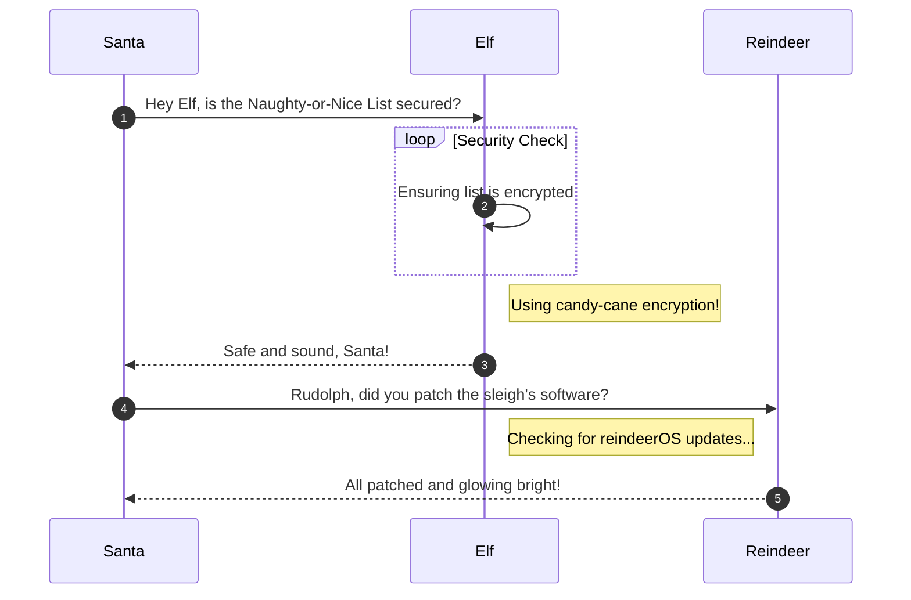

# Blob Storage Challenge in the Neighborhood

**Difficulty**: :fontawesome-solid-snowflake:{ .red }:fontawesome-regular-snowflake::fontawesome-regular-snowflake::fontawesome-regular-snowflake::fontawesome-regular-snowflake:<br/>
**Direct link**: [Objective6.zip](https://.../)

## Objective

!!! question "Request"
    Help the Goose Grace near the pond find which Azure Storage account has been misconfigured to allow public blob access by analyzing the export file.

??? quote "Grace"
    HONK!!! HONK!!!!

    The Neighborhood HOA uses Azure storage accounts for various IT operations.

    You've been asked to audit their storage security configuration to ensure no sensitive data is publicly accessible.

    Recent security reports suggest some storage accounts might have public blob access enabled, creating potential data exposure risks.

## Hints

??? tip "Blob Storage Challenge in the Neighborhood"
    This terminal has built-in hints!

## Solution

This challenge is a guided walkthrough terminal that opens with prompts for working with Azure cli.


### Admonitions

!!! warning "Anchor the decorations"
    Ensure that all festive decorations, especially electrical ones, are securely anchored. We don’t want them floating off into the tropical sunset!

!!! info "Palm tree lighting tip"
    While on the island, make sure to hang your Christmas lights on a palm tree. It’s not only festive but also a great beacon for Santa to find you!

### Images


### Diagrams



### Code blocks

```bash linenums="1" hl_lines="7" title="Countdown script (with line 7 highlighted)"
#!/bin/bash
echo "Christmas Holiday Countdown"

days_until_xmas=$(($(date -d "Dec 25" +%j) - $(date +%j)))

if [ $days_until_xmas -ge 0 ]; then
  echo "Only $days_until_xmas days until Christmas!"
else
  echo "Christmas has passed! Hope you had a great time!"
fi
```

### Tables

| Activity             | Santa's Verdict       | Elf Comments                    |
| :------------------- | :-------------------- | :------------------------------ |
| Iceberg Surfing      | Risky Business        | "Lost three surfboards!"        |
| Polar Bear Hugs      | Approach with Caution | "Fluffy but... brisk."          |
| Snow Fort Building   | Highly Recommended    | "Elf-sized doorways only."      |
| Aurora Light Chasing | Magical Experience    | "Better than Christmas lights!" |
| Penguin Parade       | Absolute Must-See     | "They're oddly organized!"      |

!!! success "Answer"
    Insert the answer to the objective here.

## Response

!!! quote "Insert Character Name"
    Copy the final part of the conversation.
