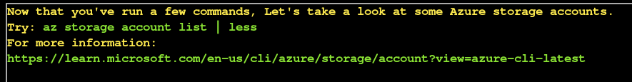
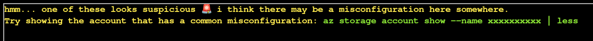
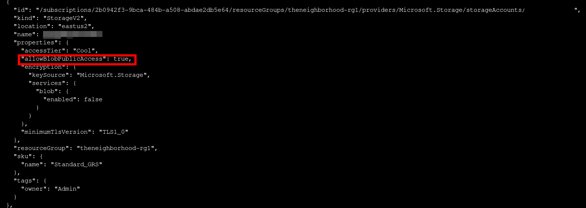

# Blob Storage Challenge in the Neighborhood

**Difficulty**: :fontawesome-solid-snowflake:{ .red }:fontawesome-regular-snowflake::fontawesome-regular-snowflake::fontawesome-regular-snowflake::fontawesome-regular-snowflake:<br/>


## Objective

!!! question "Request"
    Help the Goose Grace near the pond find which Azure Storage account has been misconfigured to allow public blob access by analyzing the export file.

??? quote "Grace"
    The Neighborhood HOA uses Azure storage accounts for various IT operations.

    You've been asked to audit their storage security configuration to ensure no sensitive data is publicly accessible.

    Recent security reports suggest some storage accounts might have public blob access enabled, creating potential data exposure risks.

## Hints

??? tip "Blob Storage Challenge in the Neighborhood"
    This terminal has built-in hints!

## Solution

This challenge is a guided walkthrough terminal that opens with prompts for working with Azure cli.


After running a few commands, we start exploring storage accounts and get some [documentaion](https://learn.microsoft.com/en-us/cli/azure/storage/account?view=azure-cli-latest). 



Listing the storage accounts, we have 6 accounts with one of them containing a common misconfiguration.





When we find the misconfigured account, we can use the provided command. `az storage account show --name <REDACTED> | less`

``` json title="Misconfigured Account" hl_lines="11"
{
  "id": "/subscriptions/2b0942f3-9bca-484b-a508-abdae2db5e64/resourceGroups/theneighborhood-rg1/providers/Microsoft.Storage/storageAccounts/REDACTED",
  "name": "REDACTED",
  "location": "eastus2",
  "kind": "StorageV2",
  "sku": {
    "name": "Standard_GRS"
  },
  "properties": {
    "accessTier": "Cool",
    "allowBlobPublicAccess": true,
    "minimumTlsVersion": "TLS1_0",
    "encryption": {
      "services": {
        "blob": {
          "enabled": false
        }
      },
      "keySource": "Microsoft.Storage"
    }
  },
  "resourceGroup": "theneighborhood-rg1",
  "tags": {
    "owner": "Admin"
  }
}
```

With the misconfigured account found, we need to list the containers in this account. Instead of a command, we get a link to further [documentation](https://learn.microsoft.com/en-us/cli/azure/storage/container?view=azure-cli-latest#az-storage-container-list).

Since we know the account name, I used `az storage container list --account-name <REDACTED> | less`.

```json title="container_list" hl_lines="3 10"
[
  {
    "name": "public",
    "properties": {
      "lastModified": "2024-01-15T09:00:00Z",
      "publicAccess": "Blob"
    }
  },
  {
    "name": "private",
    "properties": {
      "lastModified": "2024-02-05T11:12:00Z",
      "publicAccess": null
    }
  }
]
```

There is a public and a private blob list; the prompt wants us to [figure out](https://learn.microsoft.com/en-us/cli/azure/storage/blob?view=azure-cli-latest#az-storage-blob-list) how to look at the blob list for the public container.The documentation is pretty straight forward so far, and using the example format, I am able to list the public containers blob list.

```bash title="List container blob list" linenums="1"
az storage blob list --account-name <REDACTED> --container-name public -o table
```

??? tip "Blob View"
    Reading through some of the documentation, I found that the `-o table` output flag was much more manageable when working on a laptop.

```json title="Public Blob List"
[
  {
    "name": "refrigerator_inventory.pdf",
    "properties": {
      "contentLength": 45678,                                                                                                                                                                      5
      "contentType": "application/pdf",
      "metadata": {
        "created_by": "NeighborhoodWatch",
        "document_type": "inventory",
        "last_updated": "2024-12-15"
      }
    }
  },
  {
    "name": "admin_credentials.txt",
    "properties": {
      "contentLength": 1024,
      "contentType": "text/plain",
      "metadata": {
        "note": "admins only"
      }
    }
  },
  {
    "name": "network_config.json",
    "properties": {
      "contentLength": 2048,
      "contentType": "application/json",
      "metadata": {
        "encrypted": "false",
        "environment": "prod"
      }
    }
  }
]
```

If the `admin_credentials.txt` name didn't grab your attention immediately, the next prompt is to attempt to download and view the blob file. 

??? hint
    `--file /dev/stdout` should print in the terminal. Dont forget to use `| less`!

!!! success
    `az storage blob download --account-name <REDACTED> --container-name <public> --name <admin_credentials.txt> --file /dev/stdout | less`

    ```json title="Admin_Credentials.txt"
    # You have discovered an Azure Storage account with "allowBlobPublicAccess": true.
    # This misconfiguration allows ANYONE on the internet to view and download files
    # from the blob container without authentication.

    # Public blob access is highly insecure when sensitive data (like admin credentials)
    # is stored in these containers. Always disable public access unless absolutely required.

    Azure Portal Credentials
    User: azureadmin
    Pass: AzUR3!P@ssw0rd#2025

    Windows Server Credentials
    User: administrator
    Pass: W1nD0ws$Srv!@42

    SQL Server Credentials
    User: sa
    Pass: SqL!P@55#2025$

    Active Directory Domain Admin
    User: corp\administrator
    Pass: D0m@in#Adm!n$765

    Exchange Admin Credentials
    User: exchangeadmin
    Pass: Exch@ng3!M@il#432

    VMware vSphere Credentials
    User: vsphereadmin
    Pass: VMW@r3#Clu$ter!99

    Network Switch Credentials
    User: netadmin
    Pass: N3t!Sw!tch$C0nfig#

    Firewall Admin Credentials
    User: fwadmin
    Pass: F1r3W@ll#S3cur3!77

    Backup Server Credentials
    User: backupadmin
    Pass: B@ckUp!Srv#2025$

    Monitoring System Admin
    User: monitoradmin
    Pass: M0n!t0r#Sys$P@ss!

    SharePoint Admin Credentials
    User: spadmin
    Pass: Sh@r3P0!nt#Adm!n2025

    Git Server Admin
    User: gitadmin
    Pass: G1t#Srv!Rep0$C0de
    ```

## Response

!!! quote "Grace"
    HONK HONK HONK! 'No sensitive data publicly accessible' they claimed. Meanwhile, literally everything was public! Good save, security expert!