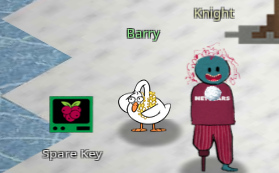

# Spare Key

**Difficulty**: :fontawesome-solid-snowflake:{ .red }:fontawesome-regular-snowflake::fontawesome-regular-snowflake::fontawesome-regular-snowflake::fontawesome-regular-snowflake:<br/>


## Objective

!!! question "Request"
    Help Goose Barry near the pond identify which identity has been granted excessive Owner permissions at the subscription level, violating the principle of least privilege.

??? quote "Goose Barry"
    The Neighborhood HOA hosts a static website on Azure Storage.

    An admin accidentally uploaded an infrastructure config file that contains a long-lived SAS token.

    Use Azure CLI to find the leak and report exactly where it lives.

## Hints

??? tip "Spare Key"
    This terminal has built-in hints!

## Solution

```bash
🎄 Welcome to the Spare Key! 🎄
You're connected to a read-only Azure CLI session in "The Neighborhood" tenant.
Your mission: Someone left a spare key out in the open. Find WHERE it is.
Connecting you now... ❄️
```

We start with [another](./o8.md) Azure CLI session when entering the terminal and a prompt to list all the resource groups with the command `az group list -o table`.

```bash title="Resource Groups"
Name                 Location    ProvisioningState
-------------------  ----------  -------------------
rg-the-neighborhood  eastus      Succeeded
rg-hoa-maintenance   eastus      Succeeded
rg-hoa-clubhouse     eastus      Succeeded
rg-hoa-security      eastus      Succeeded
rg-hoa-landscaping   eastus      Succeeded
```

The results are the 5 resource groups listed. Next, we are given a prompt to find the storage accounts in the *neighborhood* resource group: `az storage account list --resource-group rg-the-neighborhood -o table`. 

```bash
Name             Kind         Location    ResourceGroup        ProvisioningState
---------------  -----------  ----------  -------------------  -------------------
neighborhoodhoa  StorageV2    eastus      rg-the-neighborhood  Succeeded
hoamaintenance   StorageV2    eastus      rg-hoa-maintenance   Succeeded
hoaclubhouse     StorageV2    eastus      rg-hoa-clubhouse     Succeeded
hoasecurity      BlobStorage  eastus      rg-hoa-security      Succeeded
hoalandscaping   StorageV2    eastus      rg-hoa-landscaping   Succeeded
```

Our next command is `az storage blob service-properties show --acount-name <insert_account_name> --auth-mode login` and the clue "Someone mentioned there was a website in here. Maybe a static website?"<br/>
I didn't find any indication of which account would be the one with the website and instead just checked each account. 


/// caption
We can see a 404.html document and index.html document when we check the `neighborhoodhoa` account
///

When you land on the correct account, the prompt rolls forward as well as prompting us to see what containers exist and providing another hint to use the command `az storage container list` to list the container and its public access levels.

```bash
az storage container list --account-name neighborhoodhoa --auth-mode login -o table

Name    Public
------  --------
$web    None
public  Blob
```

The results show two containers; `$web` with no public access and `public` with blob level public access. The next step says to examine what files are in the static website container and "look for any files that shouldn't be publicly accessible!"

??? hint
    when using `--container-name` you might need '<name\>'.

To examine the files in the `$web` container, we'll use `az storage blob list --account-name neighborhoodhoa --container-name '$web' --auth-mode login -o table` to return the list of files. 

```json title="Container files" hl_lines="5"
Name                  ContentLength    ContentType
--------------------  ---------------  -------------
index.html            512              text/html
about.html            384              text/html
iac/terraform.tfvars  1024             text/plain
```

The prompt asks what stands out and the `iac/terraform.tfvars` immediately stands out to me as the only plain text, non-html file. The next challenge is to examine a suspect file, and that one is the most suspect in the list, so we'll use the `download` function with the hint to read it in our terminal.

??? hint
    `--file /dev/stdout | less` will print to your terminal

!!! success "Secrets"
    Using the command `az storage blob download --account-name neighborhoodhoa --container-name '$web' --name 'iac/terraform.tfvars' --auth-mode login --file /dev/stdout | less` we are able to expose the long-lived SAS token!

    ```json title="Exposed Secrets"  hl_lines="26-28"
    # Terraform Variables for HOA Website Deployment
    # Application: Neighborhood HOA Service Request Portal  
    # Environment: Production
    # Last Updated: 2025-09-20
    # DO NOT COMMIT TO PUBLIC REPOS

    # === Application Configuration ===
    app_name = "hoa-service-portal"
    app_version = "2.1.4"
    environment = "production"

    # === Database Configuration ===
    database_server = "sql-neighborhoodhoa.database.windows.net"
    database_name = "hoa_requests"
    database_username = "hoa_app_user"
    # Using Key Vault reference for security
    database_password_vault_ref = "@Microsoft.KeyVault(SecretUri=https://kv-neighborhoodhoa-prod.vault.azure.net/secrets/db-password/)"

    # === Storage Configuration for File Uploads ===
    storage_account = "neighborhoodhoa"
    uploads_container = "resident-uploads"
    documents_container = "hoa-documents"

    # TEMPORARY: Direct storage access for migration script
    # WARNING: Remove after data migration to new storage account
    # This SAS token provides full access - HIGHLY SENSITIVE!
    migration_sas_token = "sv=2023-11-03&ss=b&srt=co&sp=rlacwdx&se=2100-01-01T00:00:00Z&spr=https&sig=1djO1Q%2Bv0wIh7mYi3n%2F7r1d%2F9u9H%2F5%2BQxw
    8o2i9QMQc%3D"

    # === Email Service Configuration ===
    # Using Key Vault for sensitive email credentials
    sendgrid_api_key_vault_ref = "@Microsoft.KeyVault(SecretUri=https://kv-neighborhoodhoa-prod.vault.azure.net/secrets/sendgrid-key/)"
    from_email = "noreply@theneighborhood.com" 
    admin_email = "admin@theneighborhood.com"

    # === Application Settings ===
    session_timeout_minutes = 60
    max_file_upload_mb = 10
    allowed_file_types = ["pdf", "jpg", "jpeg", "png", "doc", "docx"]

    # === Feature Flags ===
    enable_online_payments = true
    enable_maintenance_requests = true
    enable_document_portal = false
    enable_resident_directory = true

    # === API Keys (Key Vault References) ===
    maps_api_key_vault_ref = "@Microsoft.KeyVault(SecretUri=https://kv-neighborhoodhoa-prod.vault.azure.net/secrets/maps-api-key/)"
    weather_api_key_vault_ref = "@Microsoft.KeyVault(SecretUri=https://kv-neighborhoodhoa-prod.vault.azure.net/secrets/weather-api-key/)"

    # === Notification Settings (Key Vault References) ===
    sms_service_vault_ref = "@Microsoft.KeyVault(SecretUri=https://kv-neighborhoodhoa-prod.vault.azure.net/secrets/sms-credentials/)"
    notification_webhook_vault_ref = "@Microsoft.KeyVault(SecretUri=https://kv-neighborhoodhoa-prod.vault.azure.net/secrets/slack-webhook/)"

    # === Deployment Configuration ===
    deploy_static_files_to_cdn = true
    cdn_profile = "hoa-cdn-prod"
    cache_duration_hours = 24

    # Backup schedule
    backup_frequency = "daily"
    backup_retention_days = 30
    {
    "downloaded": true,
    "file": "/dev/stdout"
    }
    ```

!!! success "Answer"
    

## Response

!!! quote "Barry"
    There it is. A SAS token with read-write-delete permissions, publicly accessible. At least someone around here knows how to do a proper security audit.
